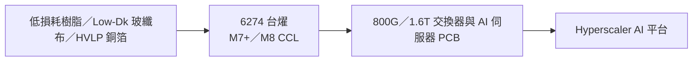

---
title: "6274_台燿（市）"
ticker: "6274.TW"
market: TW
exchange: TPEX
sector: CCL 覆銅板
tags:
  - 產業/PCB
  - 公司/台燿
  - 技術/CCL
  - 供應鏈/AI伺服器PCB
  - 環節/CCL材料
  - 產業/AI伺服器
updated: 2026-09-19
aliases:
  - TUC
  - Taiwan Union Technology
  - 台燿科技
related_companies:
  - "[[2383_台光電（市）]]"
  - "[[6213_聯茂（市）]]"
image_status: "待補來源圖"
---

# 6274_台燿（市）

## 基本資料

台燿科技（Taiwan Union Technology，TUC），台系 CCL 第二大，專注 M7+ 高速 CCL，全球伺服器/交換機 CCL 市占 20%+。主要產品為 M7/M8 等級高速 CCL，供應 800G/1.6T 交換機與 Amazon Trainium 系列。AI 訂單溢出效應下，台光電（EMC）產能吃緊，TUC 成為第二來源受惠廠。

主要資料來源：[[報告_HSBC_CCL展望2026_27_20260413]]（HSBC，2026-04-13）、[[報告_GS_台灣CCL_PCB_20260418]]（Goldman Sachs，2026-04-18）。

## 核心技術／競爭優勢

- M7+ 高速 CCL 市占 20%+，800G Switch + AI 伺服器材料主要供應商之一
- Amazon Trainium 3 為 2026/2027 主要成長驅動
- 2Q26 擴產 13%（滿載運作），2027E 擴產 46% YoY——積極跟進 EMC
- 產品路線：M8（LK）為主力，開發中 M8.5/M9（TU-953Q，Q-glass 驗證中）

## 圖片/架構圖

`[待補來源圖]` 需官方 IR CCL 或高速板材料產品圖佐證，現有研究筆記不足以支撐產品示意圖。

圖解：台燿位於低損耗樹脂、玻纖布與 HVLP 銅箔整合後的 CCL 環節，向下游 AI 伺服器與高速交換器 PCB 供料；圖示為供應鏈位置示意，非特定客戶訂單。

## EPS 預估

| 年度 | HSBC（2026-04-13） | GS 3/20（2026-03-20） | GS 4/18（2026-04-18） | 備註 |
|------|-------------------|----------------------|----------------------|------|
| 2025A | NT$（原始數值待核對）.14 | NT$（原始數值待核對）.13 | NT$（原始數值待核對）.13 | — |
| 2026E | NT$（原始數值待核對）.93 | NT$（原始數值待核對）.35 | NT$（原始數值待核對）.10 | GS 4/18 最高（2H26 再漲假設） |
| 2027E | NT$（原始數值待核對）.28 | NT$（原始數值待核對）.96 | NT$（原始數值待核對）.28 | GS 2027E 差距大 |

## 目標價與評等

| 券商 | 報告日 | 評等 | 目標價 | 評價基礎 | 來源 |
|------|--------|------|--------|----------|------|
| HSBC | 2026-04-13 | Buy | NT$1,020 | 23x 2027E EPS NT$（原始數值待核對）.28 | [[報告_HSBC_CCL展望2026_27_20260413]] |
| Goldman Sachs | 2026-03-20 | Buy | NT$1,015 | 22x 4Q26-3Q27E EPS | [[報告_GS_CCL_PCB_20260320]] |
| Goldman Sachs | 2026-04-18 | Buy | NT$1,165 | 22x 4Q26-3Q27E EPS（上調） | [[報告_GS_台灣CCL_PCB_20260418]] |
| Nomura | 2026-06-30 | Buy（維持） | NT$2,115（舊 NT$1,710） | AI PCB 供給瓶頸之一；price hike 持續 | [[報告_Nomura_亞洲AI半導體_20260630]] |

## 供應鏈位置

- 上游：HVLP3-4 銅箔（三井、古河）、Low Dk 玻布
- 下游：PCB 廠→ AWS Trainium、800G Switch CSP
- 競爭者：台光電（EMC，M8-M9 技術更高）、聯茂（ITEQ，M6-M7 技術較低）
- 所屬供應鏈：[[供應鏈_AI伺服器PCB]]

## 近期營運與研究更新

### 2026-09-17 Morgan Stanley CPO／CCL 更新

- Morgan Stanley 判斷 CPO 對高階 CCL 的需求破壞較可能是長期議題；2026–2028 年仍受成本、製造良率、可靠度、維修性與散熱限制，暫不改變高階 CCL 供需偏緊的基本論點。
- 報告提及台燿股價因 CPO 疑慮回落，但未下修台燿獲利估計；此為產業與券商觀點，不等於台燿已取得特定 CPO／CCL 訂單。

來源：[[報告_MorganStanley_CCL與CPO_20260917]]（Morgan Stanley，2026-09-17）。
## 來源

- [[報告_HSBC_CCL展望2026_27_20260413]]（HSBC，2026-04-13）
- [[報告_GS_台灣CCL_PCB_20260418]]（Goldman Sachs，2026-04-18）
- [[報告_GS_CCL_PCB_20260320]]（Goldman Sachs，2026-03-20）

- [[260730_gs_TUC]]（Goldman Sachs，2026-07-30；泰國產能提前爬坡、M7/M8 佔比與 2028 年擴產）

### 2026-07-30 Goldman Sachs 更新

- 泰國新產能由原估 9 月提前至 7 月中爬坡，預期 3Q26 起提升高階 AI 伺服器市占；2028 年台灣／中國與泰國合計新增約 195 萬張，為公司展望與券商整理，信心：中。
- M7/M8 營收占比由 2Q 的 36% 升至 39%；M8+ 正進行多個 GPU、AI CPU、ASIC 專案認證，價格與產品組合仍是主要觀察點。
- GS 目標價 NT$3,010、2026E EPS NT$38.63，屬 estimate，未視為已確認訂單或出貨。

- [[1307387]]（2026-06-30）
- [[260717_gs_CCL]]（2026-07-17）
- [[260729_gs_CCL]]（2026-07-29）
- [[260729_ml_TUC]]（2026-07-29）
- [[260805_gs_PCB-CCL]]（2026-08-05）
- [[Daiwa-6274 20260727]]（2026-07-27）
- [[JPM_PCB__CCL_and_Substra_2026-09-01_5431668(1)]]（2026-09-01）
- [[memo_AI半導體_top_picks_UMC_ABF_MLCC_ASIC_20260601]]（2026-06-01）
- [[台燿(6274,UG,B_買進)-CTBC250610]]（2025-06-10）
- [[報告_GoldmanSachs_台灣PCB_CCL_20260907]]（2026-09-07）
- [[報告_JPM_亞洲PCB_CCL_載板_20260410]]（2026-04-10）
- [[報告_MorganStanley_AI隱形基礎建設_20260913]]（2026-09-13）
- [[報告_MorganStanley_CCL與CPO_20260917]]（2026-09-17）
- [[報告_MorganStanley_CPO與高階CCL_20260917]]（2026-09-17）
- [[報告_Nomura_亞洲AI半導體_20260630]]（2026-06-30）
- [[報告_富邦_AIPCB鑽孔瓶頸_20260701]]（2026-07-01）
- [[報告_銀河證券_PCB_CCL_AI深度_20260812]]（2026-08-12）

## 相關頁面

- [[分析_2026-08_AI算力CPO與高階PCB報告更新]]
- [[分析_2026-08_ABF_CCL與AI互連更新]]
- [[分析_2026H2 PCB缺料與AI供應鏈]]
- [[技術_矽微粉]]
- [[時程_2026Q3Q4_AI網通與硬體催化劑]]
- [[5434_崇越（市）]]
- [[技術_CCL]]
- [[技術_PCB]]

### 2026-07 BofA 更新

- 2Q26 即使受到 NT$270M 存貨跌價影響，毛利率仍可達 31% 以上（排除影響）；泰國新產能 7 月中後提前爬坡。
- 2028／2029 年預計再增加每月 1.5M／0.45M 張產能，總產能達 5.3M／5.75M 張；800G／1.6T 光模組採用 M8 CCL 的需求預期自 4Q26–1Q27 放量，屬 BofA estimate，信心：中。
- BofA 2026-07-29 維持 Buy、目標價 NT$2,600，以 30.5x P/E 評價；產能擴張速度與供需緊張下的漲價轉嫁是主要觀察點。

### 來源補充

- [[260729_ml_TUC]]（BofA Securities，2026-07-29）

### 2026-08-23 券商更新

- [[Daiwa-6274 20260727]]：泰國新產能自 2026 年 8 月中逐步增加，Trainium3 可能成為主要應用；Daiwa 維持 Buy、目標價 NT$2,320，屬 estimate。
- [[260717_gs_CCL]]、[[260729_gs_CCL]]：高階 M7+ CCL 供需缺口與 2H26 漲價延續，台燿與台光電的價格傳導及泰國爬坡速度是主要觀察項目。

### 2026-09 Morgan Stanley 更新

- [[報告_MorganStanley_AI隱形基礎建設_20260913]]首次給予 Overweight、目標價 NT$2,700，估 2026／2027／2028E EPS 為 NT$40.17／94.43／156.68；高階 M7+ 產品組合與泰國擴產是主要假設，均屬券商 estimate。
- 報告稱台燿於 1H25 取得 AWS Trainium 供應鏈認證、Trainium2 起開始供貨；AI／網通需求、玻纖布與 HVLP 銅箔供給、AWS 專案份額仍為需驗證風險。

### 2026-09 JPM Rubin Ultra 材料觀察

- Rubin Ultra／NVL576 switch tray 可能採 M10／PTFE hybrid，以兼顧低損耗、機械支撐與鑽孔；純 PTFE／全 glass-less 仍受壓合、強度與製程經驗限制。
- JPM 未提供台燿的 NVL576 份額或訂單，材料路線與 PTFE TAM 均屬券商 scenario estimate，需以客戶認證與出貨驗證。
