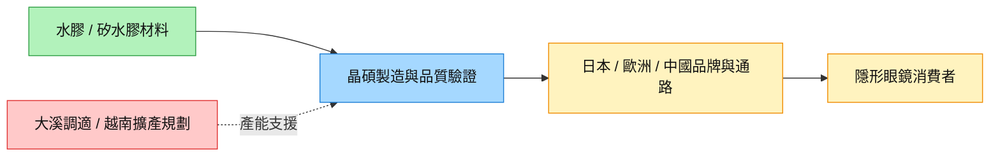

# 6491_晶碩（市）

## 基本資料

晶碩是隱形眼鏡製造商，產品包括水膠彩片、矽水膠日拋／透片與高階光學產品，透過代工與海外通路服務日本、歐洲、中國及其他市場。2026 年成長由日本代工需求、歐洲高階產品與產品組合改善推動；大溪新產能調適及越南水膠廠是產能觀察點。富邦 2026-10-07 報告記錄 3Q26 營收 22.47 億元，年增 19%、季增 6.3%；客戶並未具名。來源：[[報告_富邦_晶碩營運動能無虞_20261007]]。

證交所新上市公司資料確認 2019-10-07 上市，代號 6491。

## 核心技術／競爭優勢

- **多材料／品項製造**：水膠、矽水膠及彩片組合，可承接日拋、透片等不同市場需求；製程一致性與品質認證是量產門檻。
- **專業分工與通路黏著**：富邦觀察日本客戶擴大出貨量及品項，訂閱／會員制支持重複需求；這是券商需求判斷，未揭露單一客戶市占。
- **規模與產品組合**：高階光學與矽水膠出貨可抵銷部分成本壓力，但新廠調適期仍會限制規模效益，不能直接假設擴產即提高毛利。

## 產品與應用

| 產品／服務 | 應用 | 相關客戶／下游 |
|---|---|---|
| 水膠彩片 | 美瞳／彩色隱形眼鏡 | 日本通路代工客戶，未具名 |
| 矽水膠日拋、透片 | 視力矯正與日常配戴 | 日本及中國客戶，未具名 |
| 高階光學產品 | 高階視力矯正產品 | 歐洲客戶，未具名 |
| 越南水膠產能（規劃） | 海外供應擴充 | 主要供應中國與東南亞需求 |

## 圖片 / 架構圖

![[報告_富邦_晶碩營運動能無虞_20261007_p04_revenue_eps.png]]

圖說：富邦以季營收與 EPS 說明營運趨勢；2026Q3／Q4 EPS 為預估，圖中的歷史與模型數值須按原報告 p.3–4 分開閱讀。（2026-10-07）

圖說：製造端透過品牌與通路接觸終端需求；新增產能仍需良率、認證與訂單配合。

## EPS 記錄

| 季度 | EPS（元） | YoY | 備註 |
|---|---:|---|---|
| 1Q26A | 6.06 | — | 富邦 p.3 歷史欄 |
| 2Q26A | 7.08 | — | 包含一次性收益；不宜直接與後續季度比較本業成長 |

## EPS 預估

| 年度 | 富邦（報告日：2026-10-07） |
|---|---:|
| 2026E | 26.75 |
| 2027E | 30.66 |
| 2028E | 36.60 |

以上為券商 estimate／中信心。3Q26／4Q26 EPS 估 6.75／6.97；2027 年營收估 98.74 億元、毛利率 53.2%。

> [!warning] 來源內部口徑差異
> p.1 評等修正框列舊 EPS 26.78、新 EPS 30.66，並註明新目標價改採 FY27；p.2 同年度修正表則為 2026E 26.78→26.75、2027E 30.64→30.66。不可解讀為 2027 年獲利上修 14.5%；估值基期切換與預估修正應分開。

## 目標價與評等

| 券商 | 報告日 | 評等 | 目標價 | 評價基礎 | 來源 |
|---|---|---|---:|---|---|
| 富邦 | 2026-10-07 | 買進 | 460 元（原 428） | 15x FY27 EPS；estimate／中信心 | [[報告_富邦_晶碩營運動能無虞_20261007]] |

## 時間軸（催化劑）

| 時間 | 事件 | 類型 | 重要性 | 備註 |
|---|---|---|---|---|
| 2026Q4 | 日本拉貨與歐洲高階產品逐步放量（預估） | 放量 | ⭐⭐ | 富邦預估；大溪新產能仍調適 |
| 2027 | 越南水膠月產能規劃 1,000 萬片 | 放量 | ⭐⭐⭐ | 報告轉述規劃／中信心，非現有產能 |
| 2028 | 越南水膠月產能規劃 2,000 萬片 | 放量 | ⭐⭐⭐ | 同上；進一步上調擴產僅為富邦 thesis |

共同追蹤：[[時程_2026-2028十月券商催化劑]]。

## 供應鏈位置

- 上游為聚合物／包裝材料，下游為隱形眼鏡品牌與通路；本份來源未提供可辨識公司名。
- 海外代工與高階產品組合是接單端；大溪、越南廠調適是供給端，應分別追蹤。
- 所屬供應鏈：[[供應鏈_醫療器材]]。

## 相關公司

| 公司 | 關係 | 說明 |
|---|---|---|
| 未具名海外品牌／通路 | 代工客戶 | 本份來源未具名，related_companies 保留空陣列 |

## 風險與注意事項

> [!warning] 成本與產能風險
> - PP 材料價格、夏季電費與匯率會影響毛利；高階產品組合只能部分抵銷。
> - 大溪廠新產能調適與越南廠爬坡可能延後產量貢獻；產能上修不是已公告計畫。
> - 日本代工需求及海外通路拓展若不如預期，擴產可能增加固定成本負擔。

## 來源

- [[報告_富邦_晶碩營運動能無虞_20261007]] — 富邦投顧，2026-10-07。
- [證交所新上市公司資料](https://www.twse.com.tw/rwd/zh/company/newlisting?response=html) — 2026-10-08 查閱；6491 上市日期。
