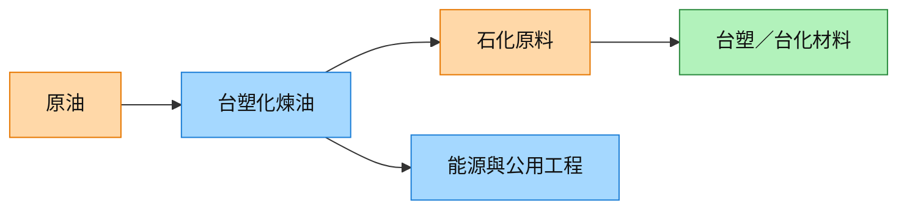

# 6505_台塑化（市）

## 基本資料

台塑化是台塑集團的煉油、石化與能源公司，與台塑、台化共同投資麥寮六輕。CTBC 2026-07-17 追蹤油價、煉油利差、歲修與股利收益，並將其視為石化景氣回溫下的循環修復標的。

## 核心技術／競爭優勢

- 麥寮大型煉油與石化一體化基地。
- 原油採購、煉油、石化產品的垂直整合。
- 集團內能源與化學品協同，降低單一產品波動。

## 產品與應用

| 產品／服務 | 應用 | 供應鏈位置 |
|---|---|---|
| 煉油產品 | 燃料與工業能源 | 能源上游 |
| 石化原料 | 塑膠、化纖、化學材料 | [[1326_台化（市）]] 上游／集團協同 |
| 發電與公用工程 | 麥寮園區能源 | 工業能源 |

## 圖片 / 架構圖

圖說：台塑化位於台塑集團煉油—石化—材料鏈的能源與原料端。

## 時間軸

| 時間 | 事件 | 類型 | 重要性 | 備註 |
|---|---|---|---|---|
| 2026Q3 | 歲修完成後產能恢復 | 營運修復 | ⭐⭐ | CTBC 2026-07-17 展望 |

→ 跨公司比較詳見 [[時程_2026記憶體與AI催化劑]]

## 供應鏈位置

- 上游：原油與能源；下游／集團：[[1326_台化（市）]]、台塑（公司頁尚未建立）。
- 供應鏈：[[供應鏈_AI伺服器PCB]] 僅為材料轉型的間接觀察主線，未確認直接供貨。

## 相關公司

| 公司 | 關係 | 說明 |
|---|---|---|
| [[1326_台化（市）]] | 集團／下游 | 台塑化股利與權益法收益來源之一 |
| 台塑（公司頁尚未建立） | 集團關係 | 麥寮石化垂直整合夥伴 |

> [!warning] 風險與注意事項
> - 煉油利差、油價與歲修造成獲利高度循環。
> - 中國新增產能與地緣政治可能壓縮產品價差。

## 來源

- [[台塑化(6505 ,OW_增加持股 ) -CTBC260717]] — 中國信託證券投資顧問，2026-07-17
