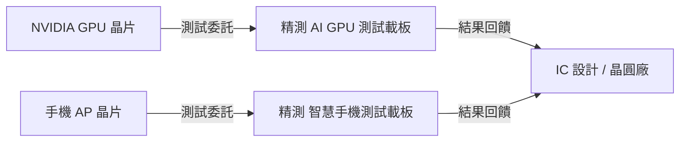

# 6510_精測（市）

## 基本資料

精測電子（6510 TT）是台灣測試介面（Test Interface）領域的重要廠商，主力產品為 IC 測試載板（Test Socket / Burn-in Board）與探針卡（Probe Card）。核心應用涵蓋 AI GPU 測試載板、智慧手機 AP、遊戲顯卡 GPU、PMIC、SSD Controller 等。

公司受惠 AI GPU 測試需求爆發：2025 年 AI GPU 與遊戲顯卡出貨帶動測試載板量增，FY2025 EPS 預估 27.63 元（YoY +77.8%）；FY2026 更多專案（次世代 AI GPU、AMD 遊戲顯卡、AI ASIC）同步發酵，EPS 上修至 37.71 元。

主要客戶：美系 GPU 大廠（NVIDIA）、台系 IC 設計客戶（智慧手機 AP）、美系通訊客戶、SSD/PMIC 廠商。

資料來源：[[報告_中信_精測6510_20250902]]（2025-09-02，中信投顧，郭珮儒）

## 核心技術／競爭優勢

- **AI GPU 測試載板市佔與客戶黏著**：與美系 GPU 大廠（NVIDIA）長期穩定合作，交期與技術服務受肯定，下一代平台市佔有望提升
- **多元產品組合**：HPC、APR（光學）、Gerber、PMIC、SSD Controller、Others，依季節/景氣分散集中風險
- **AI 智慧製造降費**：公司推動 AI 製造，費用控管超越原先假設，帶動 2026 EPS 顯著上修
- **探針卡佈局**：積極參與次世代 AI GPU 探針卡平台驗證，有望在 HPC 領域持續擴大份額

## 產品與應用

| 產品 / 服務 | 應用 | 相關客戶 / 下游 |
|-------------|------|-----------------|
| AI GPU 測試載板 | AI GPU / ASIC 測試 | [[NVDA.US(nvidia)]]、AMD |
| 遊戲顯卡 GPU 測試載板 | 遊戲 GPU 測試 | NVIDIA（GeForce 系列） |
| 智慧手機 AP 測試載板 | SoC 測試 | 台系 IC 設計廠 |
| 通訊 PCB 組裝板 | 美系通訊客戶組裝 | 美系通訊廠（新切入）|
| PMIC / SSD Controller 測試載板 | 電源/儲存 IC 測試 | 廣泛 IC 廠商 |

## 圖片 / 架構圖

![[citi 6510_001.png]]

> Citi 2026Q2 報告圖表，對應精測 AI／HPC 高毛利訂單占比提升與測試介面需求。

`[待補來源圖]` 需官方 IR 測試插座或燒機板產品實拍佐證；上方為自製測試流程示意圖。

> 測試載板為晶片出廠測試的關鍵工具，精測為 AI GPU 測試載板的主要供應商之一。

## EPS 記錄

| 季度 | EPS (元) | YoY | 備註 |
|------|---------|-----|------|
| 1Q25 | 6.74 | +1,480% | AI GPU 拉動 |
| 2Q25 | 6.57 | +221.9% | |
| 3Q25(F) | 7.36 | +126.2% | AI GPU + 手機旺季 |
| 4Q25(F) | 6.95 | -29.2% | 傳統淡季 |

## EPS 預估

| 年度 | 中信投顧 EPS（報告日：2025-09-02） | 備註 |
|------|-----------------------------------|------|
| 2025F | 27.63 | +77.8% YoY |
| 2026F | 37.71 | +36.5% YoY（費用控管上修） |

## 目標價與評等

| 券商 | 報告發布日 | 評等 | 目標價 | 評價基礎 | 來源 |
|------|------------|------|--------|----------|------|
| 中信投顧 | 2025-09-02 | 增加持股 | 1,330 元 | 35x 2026F EPS | [[報告_中信_精測6510_20250902]] |

## 時間軸

| 時間 | 事件 | 類型 | 重要性 | 備註 |
|------|------|------|--------|------|
| 2026H1 | 次世代 AI GPU（B300 → Rubin）+ AI ASIC 進入量產 | 放量 | ⭐⭐⭐ | 測試載板出貨上行 |
| 2026H2 | 手機 AP 旺季 + 次世代遊戲顯卡 GPU 放量 | 放量 | ⭐⭐ | 多項專案同步發酵 |

## 供應鏈位置

- 客戶：[[NVDA.US(nvidia)]]（AI GPU/ASIC 測試）、台系 IC 設計廠（手機 AP）
- 競爭對手：Enplas、Sensata 等日韓測試介面廠
- 所屬供應鏈：[[供應鏈_半導體測試設備]]

## 相關公司

| 公司 | 關係 | 說明 |
|------|------|------|
| [[NVDA.US(nvidia)]] | 主要客戶 | AI GPU / ASIC 測試載板最大需求來源 |

> [!warning] 風險與注意事項
> - **市場份額流失風險**：AI GPU 測試載板競爭加劇，次世代平台認證失利將影響市佔
> - **需求集中**：NVIDIA GPU 為最大需求來源，AI 需求轉弱直接衝擊
> - **匯率影響**：台幣升值壓縮以美元計算的測試費用收益
> - **終端需求放緩**：消費電子（手機、遊戲）景氣若走弱影響非 AI 段動能

## 來源

### CTBC 2Q26 更新（2026-07-30）

- 2Q26 單季 EPS 15.02 元；2026E／2027E EPS 65.7／125.1 元，因市場氣氛轉保守將目標價調至 NT$4,500，維持買進。以上為券商 estimate。
- 來源：[[精測(6510,B_買進)-CTBC260730]]

## Citi 2Q26 更新（2026-07-28）

- 2Q26 淨利 NT$494mn，季增 44%、年增 129%；毛利率 57.5%，AI／HPC 訂單占比由 1Q26 的 45% 升至 56%。
- Citi 關注 AI GPU／ASIC 測試板 ramp、探針卡 total solution 與產能擴張；維持 Buy、目標價 NT$4,900。
- 目標價以 40 倍 2027E EPS 計算，反映 2nm／3nm 測試、高階 AI GPU／ASIC 專案與 All-in-House 垂直整合優勢；但屬高風險波動標的。

來源：[[報告_Citi_中華精測6510_2Q26_20260729]]。

- [[報告_中信_精測6510_20250902]]（2025-09-02，中信投顧，郭珮儒）

## 相關頁面

- [[6223_旺矽（櫃）]]
- [[供應鏈_AI伺服器散熱]]
- [[時程_2026記憶體與AI催化劑]]
