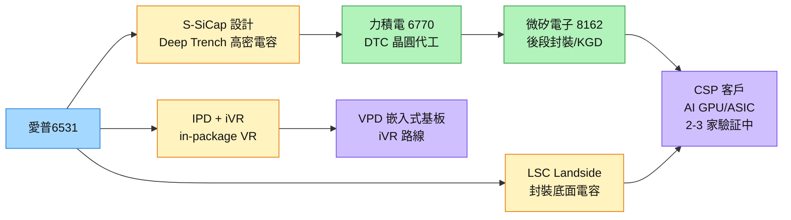

# 6531_愛普（市）

## CTBC 2026-08-07 更新

- 2Q26 營收 NT$23.6 億、EPS NT$4.18；IoTRAM 與 S-SiCap 量產出貨推動成長。
- 報告稱 IPD 已於 2Q26 量產，需求能見度延伸至 2028；IPC 可能受銅鑼廠遷廠而使 3Q26 認列遞延，皆為公司／券商說法。
- 中信投顧估 2026E／2027E EPS NT$19.67／35.75，維持買進、目標價 NT$1,430；屬券商 estimate。

來源：[[報告_CTBC_愛普_20260807]]（2026-08-07）。

## 基本資料

愛普（6531 TT）以 IP 授權起家，近年切入**矽電容（SiCap）設計**，成為台股中最直接的矽電容設計代表廠。核心產品線：
- **S-SiCap（Silicon Capacitor）：** Deep Trench 電容設計，提供超高電容密度（>100nF/mm²），用於 AI 晶片電源完整性
- **LSC（Landside Capacitor）：** 封裝底面的矽電容模組
- **IPD 整合（Integrated Passive Device）：** 結合電容/電感，可實現 in-package iVR（電壓調節）

目前有 **2-3 家 CSP（雲端服務商）驗証中**，預估放量週期 2-3 年。是台股矽電容結構性缺口中設計端最直接受惠標的。

資料來源：[[報告_先進封裝技術發展方向_20260722]]（定錨產業筆記，2026-07-22）

## 核心技術／競爭優勢

- **設計差異化：** 以 IP 設計能力切入 SiCap，不需自建 fab，Fabless 商業模式——高毛利、低資本支出。
- **iVR 整合路線：** S-SiCap + IPD 可作為 in-package iVR 解決方案，符合 VPD 四條路線中的「嵌入式基板」和「iVR」方向（詳見 [[技術_垂直供電VPD]]）。
- **CSP 驗証進行中：** 2-3 家 CSP 驗証代表下一代 GPU/ASIC 平台有意採用，一旦 win，每一代 AI 晶片都是長期重複訂單。
- **與力積電（6770）合作：** 力積電提供 DTC 晶圓代工，形成台股 SiCap 設計（愛普）＋代工（力積電）垂直組合。

## 產品與應用

| 產品 / 服務 | 應用 | 相關客戶 / 下游 |
|-------------|------|-----------------|
| S-SiCap 矽電容 | AI GPU/ASIC 電源完整性，深溝槽高密度電容 | CSP（驗証中，2-3 家）|
| LSC Landside Capacitor | 封裝底面電容，替代 MLCC | 先進封裝 OSAT |
| IPD 整合 iVR 模組 | In-package 電壓調節，VPD 路線 | 雲端 AI 晶片設計廠 |

## 圖片 / 架構圖

圖說：愛普在台股 SiCap 生態的角色是設計端，委託力積電代工、微矽電子後段，最終供 CSP 客戶。

## 時間軸

| 時間 | 事件 | 類型 | 重要性 | 備註 |
|------|------|------|--------|------|
| 2026 | CSP 2-3 家驗証進行中 | 里程碑 | ⭐⭐⭐ | 驗証 win = 長線訂單確認點 |
| 2027-2028 | 預估放量週期 | 放量 | ⭐⭐⭐ | 從驗証到量産約 2-3 年週期 |
| 2026 MS 估計 | 結構性缺口 57%/16%/11% | 總體催化劑 | ⭐⭐ | MS 估 2026/27/28 供給缺口 |

## 供應鏈位置

- 設計（Fabless）：SiCap IP 設計、DTC Layout
- 製造：[[6770_力積電（市）]]（DTC Foundry）
- 後段：8162_微矽電子（市）（KGD 封裝測試）
- 終端：CSP AI 晶片（NVIDIA、Google、Amazon 等驗証中）

國際競爭：三星電機（MLCC 大廠跨入 SiCap）、Murata SiCap、IDG

## 相關公司

| 公司 | 關係 | 說明 |
|------|------|------|
| [[6770_力積電（市）]] | 代工夥伴 | DTC SiCap 晶圓代工 |
| 8162_微矽電子（市） | 後段夥伴 | KGD/封裝測試 |
| [[2330_台積電（市）]] | 潛在路線 | SoIC 整合 SiCap 若採用台積 process |

> [!warning] 風險與注意事項
> - **驗証 win 不確定：** 2-3 家 CSP 驗証代表潛在，但能否轉換為量産訂單仍有不確定性（設計問題、競爭報價、客戶內部方案切換）。
> - **放量週期 2-3 年：** 短線業績催化劑不強，屬中長線佈局標的，股價可能在驗証期間波動。
> - **三星電機競爭：** 三星電機擁有 MLCC 製造能力，若切入 DTC SiCap 量産，將帶來規模競爭。
> - **結構性供不應求數字來自 MS：** 57%/16%/11% 缺口為摩根士丹利估計，可能因量産加速縮小。

## 相關技術頁

- [[技術_矽電容]] — SiCap 技術總覽、DTC 結構、供應鏈全圖
- [[技術_垂直供電VPD]] — VPD 四條路線，愛普 iVR 路線定位

## 來源

- [[報告_先進封裝技術發展方向_20260722]] — 定錨產業筆記講座，2026-07-22

## 相關頁面

- [[時程_2026記憶體與AI催化劑]]
- [[6920_恆勁科技（市）]]

## Morgan Stanley 2026-07-30 更新

- 2026 年 6 月淨利 NT$3.27 億元、EPS NT$2.01，年增約 785%；淨利率 40.3%，高於 1Q26 的 32.2%。
- Morgan Stanley 維持 Overweight、目標價 NT$1,555，認為 S-SiCap 結構性供給短缺與 VHM／邊緣 AI 是主要成長驅動；目標價與供需判斷屬券商 estimate。
- 矽電容定價能力改善是正面訊號，但 CSP 驗證轉量產的時間仍長，需追蹤客戶認證與產能放量。

來源：[[ms 6531]]（Morgan Stanley，2026-07-30）。

## 本次 ingest 更新（Morgan Stanley，2026-08-16）

- 舊記憶體產業報告仍將愛普列為偏好標的，主因 SiCap 業務；此為 Morgan Stanley thesis，不等同已確認訂單或固定量產時程。

新增來源：[[報告_MorganStanley_舊記憶體_20260816]]。
