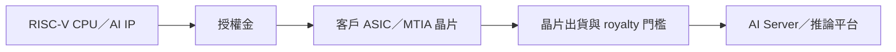

# 6533_晶心科（市）

## 基本資料

晶心科（6533，Andes Technology）是 RISC-V CPU／AI 加速器 IP 設計公司，營收主要來自 IP 授權金、權利金與相關服務。中信投顧 2026-09-18 報告指出，2Q26 營收約 NT$5.70 億、授權金 NT$4.20 億，6 月單月營收 NT$3.70 億創高，主要來自 Meta 多個 MTIA 專案簽約；後續成長取決於客戶晶片出貨與 royalty 門檻跨越。

## 核心技術／競爭優勢

- **RISC-V CPU IP**：以可授權 CPU 核心與平台 IP 切入客戶自研晶片，降低客戶自建處理器核心的設計負擔。
- **AI／伺服器 ASIC 延伸**：Meta MTIA 400（Iris）等 AI Server 晶片專案提高單一客戶 IP 複用與長期權利金潛力。
- **授權金與 royalty 模型**：前期以 license fee 認列，客戶晶片出貨並達特定門檻後才逐步貢獻 royalty，收入節奏具遞延特性。
- **組織與產品重整**：美國團隊縮編並把部分 IP 與顧問能力轉回台灣，降低費用基期；80 系列目標為 60 系列 2–3 倍效能，聚焦伺服器應用。

## 產品與應用

| 產品／服務 | 應用 | 相關客戶／下游 |
|---|---|---|
| RISC-V CPU IP | SoC、邊緣運算與客製晶片 | IC 設計公司與系統客戶 |
| MTIA 相關 IP／專案 | AI Server 推論與資料中心 ASIC | [[META.US(meta)]] |
| 80 系列伺服器處理器／加速器 IP | 高效能伺服器與 AI 推論 | CSP／ASIC 客戶，名稱待揭露 |
| 開發工具與平台支援 | 客戶晶片設計、驗證與量產導入 | 授權客戶 |

## 圖片 / 架構圖

圖說：晶心科的商業模式由 IP 授權、客戶 ASIC 設計導入與晶片出貨後 royalty 串接；實際收入認列取決於客戶量產與出貨門檻。來源：[[報告_CTBC_晶心科_20260918]]。

## EPS 記錄

| 期間 | EPS | 營收 | 備註 |
|---|---:|---:|---|
| 2Q26 | -NT$1.18 | NT$5.70 億 | 調整後 EPS；費用含組織重整一次性影響 |

## EPS 預估

| 年度 | 中信投顧 EPS（報告日：2026-09-18） | 備註 |
|---|---:|---|
| 2026E | NT$0.67 | 券商 estimate；以費用下降與專案認列為前提 |
| 2027E | NT$10.81 | 券商 estimate；需由 royalty 與客戶出貨驗證 |

## 目標價與評等

| 券商 | 報告發布日 | 評等 | 目標價 | 評價基礎 | 來源 |
|---|---|---|---:|---|---|
| 中信投顧 | 2026-09-18 | 增加持股（Overweight） | NT$287 | 2026／2027 平均 EPS NT$5.74 × 50 倍 PER | [[報告_CTBC_晶心科_20260918]] |

## 時間軸

| 時間 | 事件 | 類型 | 重要性 | 備註 |
|---|---|---|---|---|
| 2026H2 | 組織重整後費用基期下降，挑戰全年損益兩平 | 財務／驗證 | ⭐⭐⭐ | 公司目標與券商估計 |
| 2026H2–2027 | Meta MTIA 400（Iris）及後續第 5／6 代專案驗證 | ASIC／出貨 | ⭐⭐⭐ | 專案已簽約轉述，量產與 royalty 待確認 |
| 2026–2027 | 80 系列伺服器產品路線推進 | 技術下線 | ⭐⭐ | 公司／券商 roadmap |

跨公司催化劑詳見 [[時程_2026Q3Q4_AI網通與硬體催化劑]]。

## 供應鏈位置

- **所屬供應鏈**：[[供應鏈_先進封裝載板]]；公司位於 AI ASIC／伺服器晶片的 IP 設計與授權環節。
- **下游**：AI Server、CSP 自研 ASIC 與推論平台；[[META.US(meta)]] 為本批報告明確揭露的合作客戶。
- **協作環節**：晶圓代工、先進封裝、記憶體與伺服器系統整合商，但本批未揭露具名供應商。

## 相關公司

| 公司 | 關係 | 說明 |
|---|---|---|
| [[META.US(meta)]] | 客戶／下游 | 多個 MTIA 專案，包含 MTIA 400（Iris）；量產與 royalty 認列待驗證 |

> [!warning] 風險與注意事項
> - 授權金一次性認列與 royalty 出貨門檻會造成季度波動，2Q26 費用與一次性重整已使調整後 EPS 為負。
> - Meta／MTIA 專案雖已由報告轉述簽約，但量產規模、出貨時間與實際 royalty 仍未完全揭露，不應直接等同長期營收。
> - 80 系列效能與伺服器市場切入仍屬產品 roadmap；費用控制、匯率與客戶集中是主要風險。

## 來源

- [[報告_CTBC_晶心科_20260918]]（中信投顧，2026-09-18）。
- 官方掛牌資訊：晶心科於 2017-03-14 於臺灣證券交易所上市；市場狀態依證交所公司資料確認。

## 相關頁面

- [[技術_AI推論與ASIC平台]]
