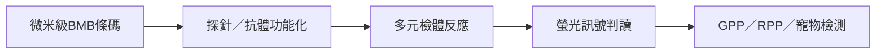

# 6598_瑞磁生物（櫃）

## 基本資料

瑞磁生物（Applied BioCode，6598.TWO）開發以微米級數位生物條碼（Barcoded Magnetic Beads, BMB）為核心的多元檢測平台，服務人用與寵物用體外診斷。產品包括 GPP 腸胃道檢測、RPP 呼吸道檢測、試劑耗材與 MDx3000 自動化檢測機台。

## 核心技術與產品

- BMB 以不同條碼搭配分子探針或抗體，可在單一檢體同步偵測多種病原體、DNA、RNA 或蛋白質。
- 2026 年 1H 營收年增 81.1%；寵物檢測年增 122%，人用檢測年增 50%（中信投顧，2026-07-30）。
- IDEXX 自 2017 年起與瑞磁有技術授權與供貨合作；本頁將其視為來源揭露的客戶關係，非新增訂單承諾。

## 圖片 / 架構圖

## 券商觀點與財務

- 中信投顧 2026-07-30 維持買進，目標價 NT$35；2026E／2027E 營收 NT$833M／1,017M、調整後 EPS NT$0.49／1.43，屬券商 estimate，信心：中。
- Henry Schein 通路合作有助切入美國醫院與診所；HealthTrack 預計 4Q26 完成 UTM 一致性驗證，2027 年訂單貢獻仍屬公司／券商展望。

## 風險與注意事項

1. 美國醫療保險給付政策變化。
2. 原料供應與大型客戶導入時程。
3. 客戶集中與檢測產品認證風險。

## 來源

- [[ABC-KY(6598,B_買進)-CTBC260730]]（中信投顧，2026-07-30）
