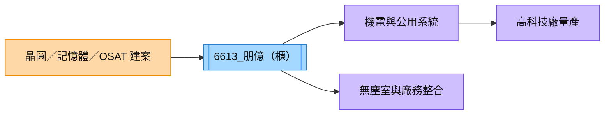

# 6613_朋億（櫃）

## 基本資料

朋億提供高科技廠房的廠務工程、機電整合與建廠服務，受惠於晶圓廠、記憶體與封裝測試廠擴建。其營收認列與專案組合高度連動客戶建案時程，AI 資料中心與半導體資本支出是主要成長驅動。

## 核心技術／競爭優勢

- 高科技廠房機電、無塵室與公用系統整合能力。
- 能承接晶圓、記憶體與 OSAT 的大型建廠專案。
- 專案管理與既有客戶認證形成切換成本，但不同區域／客戶專案毛利率差異大。

## 產品與應用

| 服務 | 應用 | 相關客戶 / 下游 |
|---|---|---|
| 廠務工程 | 晶圓廠與記憶體廠 | [[2330_台積電（市）]] 等晶圓廠 |
| 機電與公用系統 | 高科技廠房 | 記憶體、OSAT |
| 建案整合 | AI 與半導體擴產 | 台系／美系客戶 |

## 圖片 / 架構圖

圖說：朋億位於半導體與封裝廠資本支出的工程整合層，建案消耗速度直接影響營收認列。

## 券商觀點

CTBC（2026-08-20）以 2Q26 營收約 NT$37.9 億元、毛利率約 24% 為基礎，估 2026E／2027E 營收約 NT$138／166 億元、2027E EPS 約 26.3 元，並以 2027E EPS 17 倍給予目標價 NT$450、維持買進；中國新建案毛利率約 10–15% 屬報告估計。

## 時間軸

| 時間 | 事件 | 類型 | 備註 |
|---|---|---|---|
| 2026H2 | 記憶體與 OSAT 建案持續認列 | 放量 | CTBC 估計 |
| 2027 | 美系記憶體、台系 OSAT 專案擴大 | 放量 | 受建案時程影響 |

## 供應鏈位置

- 上游：工程材料、機電設備與廠務系統供應商。
- 下游：晶圓廠、記憶體廠與 OSAT。
- 主要研究連結：[[供應鏈_先進封裝載板]]、[[2330_台積電（市）]]。

> [!warning] 風險與注意事項
> - 中國新建案占比提高可能壓低整體毛利率。
> - 大型專案結案與認列時點會造成季度波動。

## 來源

- [[朋億(6613,B_買進)-CTBC260820]] — CTBC，2026-08-20

## 相關頁面

- [[時程_2026記憶體與AI催化劑]]
