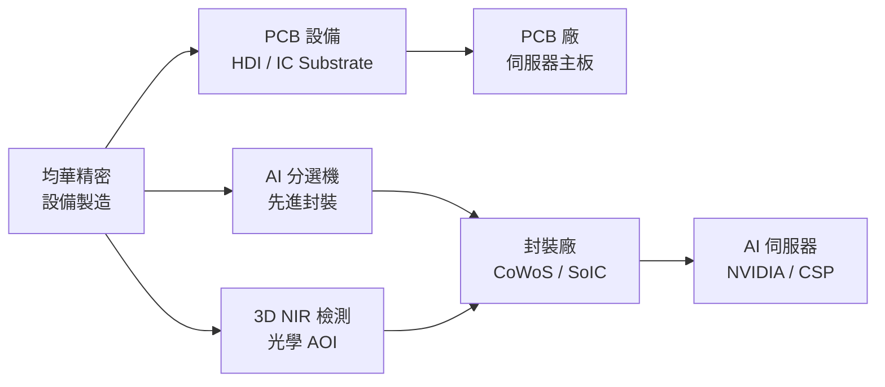

# 6640_均華精密（市）

## 基本資料

均華精密（6640.TW）為台灣半導體及 PCB 設備製造商，核心業務從 PCB 設備出發，近年快速切入先進封裝設備與 AI 基礎設施設備領域。為 G2C 聯盟（以股權建立信任基礎）的主要成員，已取得 NVIDIA Partner 認證（2021年）及台積電認可，顯示技術地位在 AI 時代大幅提升。

**主要產品／服務**：
- **AI 分選機與檢測設備**：針對高密度 AI 晶片的良率檢測，含 3D NIR、NDAOI 等技術
- **PCB 設備**：HDI 板、IC Substrate 製程設備
- **先進封裝設備**：AI 晶片先進封裝製程配套設備
- **Digital Twin / AI 研發工具**：導入 Omniverse 縮短開發時程

**營收驅動**：半導體比重快速提升（2020年4% → 2026Q1 50%）；整體 2026Q1 營收 8.3 億元（YoY 近翻倍）。

**核心客戶**：國際封裝大廠、PCB 廠，並已送樣至 NVIDIA 夥伴生態系。

**海外布局**：積極進入新加坡、韓國、美國，2026 年成立美國子公司。

*來源：法說 2026-06-12（均華法說，台積電投資論壇場次，AlphaMemo.ai）。*

---

## 核心技術／競爭優勢

- **G2C 聯盟技術認證壁壘**：G2C 聯盟以股權建立企業間深度信任，與 NVIDIA、台積電等大廠形成長期合作認證關係，進入門檻高；2026 年台積電工藝大會英文新聞稿特別提及 G2C Alliance
- **AI 自用算力研發能力**：公司自有算力用於設備研發，導入 Digital Twin 和 Omniverse 模擬，將開發時程縮短至三個季度以內，這是台灣設備廠中少見的研發方式
- **高毛利組合快速提升**：半導體產品毛利率顯著高於 PCB 段，2026Q1 整體毛利率達 49.8%（歷史新高），長期趨勢向上（2020年 29.7% → 2026Q1 49.8%）
- **3D NIR + NDAOI 檢測技術**：結合 3D 近紅外線與AI光學自動檢測，形成完整 AI 解決方案，已獲國際封裝大廠認證，是目前市場上競爭者難以快速追上的技術組合

---

## 產品與應用

| 產品 / 服務 | 應用 | 相關客戶 / 下游 |
|-------------|------|-----------------|
| AI 分選機 | AI 晶片封裝良率分選 | 國際封裝大廠 |
| 3D NIR / NDAOI 光學檢測 | 先進封裝缺陷檢測 | 半導體封測廠 |
| PCB 設備（HDI / IC Substrate） | 伺服器主板、高密度 PCB 製程 | PCB 廠 |
| Digital Twin 研發平台 | 設備開發加速 | 內部研發工具 |

---

## 圖片 / 架構圖

> 均華從 PCB 設備供應商，轉型為 AI 基礎設施關鍵設備夥伴（G2C Alliance）。

---

## EPS 記錄

| 季度 | EPS (元) | 毛利率 | 備註 |
|------|---------|--------|------|
| 2026Q1 | 5.0 – 5.2（預估） | 49.8% | 歷史新高 |
| 2025 全年 | — | 43.3% | 全年毛利率 |
| 2020 | — | 29.7% | 轉型前基期 |

---

## 時間軸（催化劑）

| 時間 | 事件 | 類型 | 重要性 | 備註 |
|------|------|------|--------|------|
| 2026Q1 | 毛利率 49.8%（歷史新高），半導體比重達 50% | 財報 | ⭐⭐⭐ | 結構轉型完成里程碑 |
| 2026 | 美國子公司成立，購置宿舍 | 海外擴張 | ⭐⭐⭐ | 直接回應美國客戶本土需求 |
| 2026-2027 | 3D NIR / NDAOI 獲國際封裝大廠認證量產 | 放量 | ⭐⭐⭐ | 2027 年抓住契機 |
| 2026 | 屏科園區、新加坡、韓國佈局推進 | 產能 | ⭐⭐ | 多地佈局應對地緣政治風險 |
| 持續 | Digital Twin + AI 模擬縮短開發週期 | 效率 | ⭐⭐ | 強化競爭力壁壘 |

→ 跨公司比較詳見 [[時程_2026_AI算力]]（若存在）

---

## 供應鏈位置

- 上游：設備零組件、特殊材料（散熱用材）
- 下游：PCB 廠、封裝廠（CoWoS / SoIC / Fanout）、AI 伺服器廠
- 所屬供應鏈：[[供應鏈_先進封裝載板]]（設備端上游）
- AI 伺服器應用端：[[供應鏈_AI伺服器PCB]]

---

## 相關公司

| 公司 | 關係 | 說明 |
|------|------|------|
| [[2330_台積電（市）]] | 下游客戶認證方 | 台積電工藝大會認可 G2C Alliance，設備進入台積電生態系 |
| NVIDIA（未直接上游） | 技術認證合作 | G2C 取得 NVIDIA Partner 認證 2021，算力設備整合 |

---

> [!warning] 風險與注意事項
> - **客戶集中與認證高門檻雙刃劍**：G2C 聯盟地位護城河高，但一旦 NVIDIA 或台積電供應鏈調整，替換或擴展其他客戶的速度受限
> - **設備業資本支出循環波動**：半導體設備需求受 CSP 資本支出週期影響，若 AI 伺服器投資放緩，設備廠需求首當其衝
> - **美國設廠成本與人才壓力**：美國子公司設立及運作成本高，台灣工程師海外派駐問題需長期管理
> - **毛利率天花板不確定**：半導體設備毛利率已達 49.8%，進一步提升空間需靠新產品線（如光通訊設備）支撐

---

## 來源

- [[活動_均華法說_20260612]]
