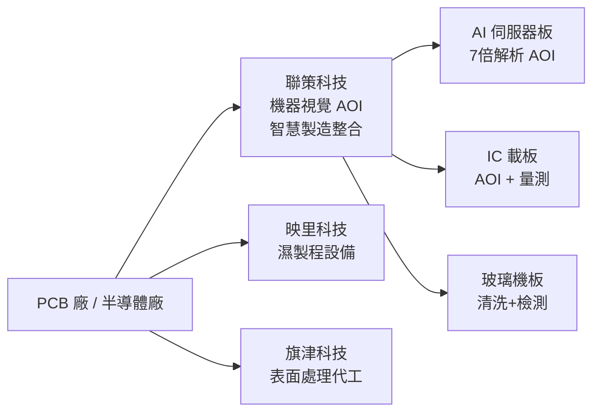

# 6658_聯策（市）

## 基本資料

聯策科技股份有限公司（台股代號 6658，TWSE 上市）是台灣 PCB 及半導體先進封裝應用的智慧製造整合服務商，成立於 2002 年，資本額 NT$3.64 億元，員工超過 320 人，營運總部暨研發中心位於桃園。

三大核心業務：(1) **機器視覺檢測設備**——外觀 AOI（AI 伺服器板、IC 載板、半導體前段）、線路量測設備（2D+3D）；(2) **濕製程設備**（子公司映里科技：IC 載板薄膜穩定、大面積鍍銅、水平清洗線）；(3) **智慧製造解決方案**——IoT 追溯系統（AVRIOT）、在線藥水分析、CCTV AI 人員行為偵測。子公司旗津科技負責電路板表面處理代工。

2025 年營收 NT$20.8 億元，創立新高。2026Q1 EPS 已超越 2021 年全年，獲利能力顯著躍升。主要受益於 AI 伺服器板、IC 載板及 HDI 升級帶動的設備需求。

資料來源：[[活動_聯策法說_20260624]]（2026-06-24 法說）

## 核心技術／競爭優勢

- **代理 + 自製雙軌能力**：業界少數同時擁有設備代理與自主製造能力的公司；從 2002 年代理日本光學檢查機起步，逐步深耕自主技術
- **AI Server 板 7 倍解析度 AOI**：AI 伺服器板線路 AOI 解析度從早期 25 倍 → 18 倍 → 現提升至 **7 倍解析度**；光學+AI 缺陷分析整合，達到工業領域最高精度
- **玻璃基板清洗與檢測完整能力**：參與 A-plus 計畫（工研院），擁有玻璃機板清洗（蒸汽二流體、工商系統）+ 金屬化 + 表面缺陷 AOI 全製程技術；孔徑屏幕量測具先行優勢
- **智慧製造整合（AVRIOT）**：IoT 資料收集 + AI 數據分析 + 製程參數預測 + CCTV AI 人員行為偵測，形成系統整合護城河

## 產品與應用

| 產品 / 服務 | 應用 | 相關客戶 / 下游 |
|-------------|------|-----------------|
| AI 伺服器板 AOI / AVI | AI Server 板線路及外觀檢測 | AI 伺服器板廠 |
| IC 載板 AOI（多功能檢查機）| 載板內層 + 外觀 + 出貨前 | IC 載板廠 |
| 玻璃機板 AOI + 清洗設備 | 先進封裝玻璃中介層 | IC 載板廠（含玻璃機板）|
| 水平濕製程清洗線（映里科技）| IC 載板薄膜穩定、鎳鈀金鍍 | 電路板廠 |
| 表面處理代工（旗津科技）| 電路板表面處理 | 電路板廠 |
| AVRIOT 智慧工廠系統 | IoT + AI 製程追溯與管控 | 電路板 / 半導體廠 |
| 光模組封裝 AOI + 對位檢測 | 光模組封裝外觀及對位 | 光模組廠（規劃中）|
| 節能鼓風機（30–40% 節電）| 電路板集塵及成型機 | 電路板廠 |

## 圖片 / 架構圖

> 自製 產品結構示意圖；來源：[[活動_聯策法說_20260624]]

## EPS 記錄

| 年度 / 季度 | 財務指標 | 備註 |
|------------|---------|------|
| 2025 全年 | 營收 NT$20.8 億元（創立新高） | YoY 成長；超越 2024 |
| 2026Q1 | EPS 超越 2021 全年 | 具體數字法說未明確揭露 |

- 2026Q1 毛利率改善，產能提升後數字持續優化
- 股利：三年平均 NT$1.22 元/股，維持穩健現金股利政策

## 時間軸

| 時間 | 事件 | 類型 | 重要性 | 備註 |
|------|------|------|--------|------|
| 2026-06-24 | 法說；宣告 26Q3 開始出貨 Fountain Shelter 訂單 | 訂單 | ⭐⭐⭐ | 已取得訂單 |
| 2026Q3 | Fountain Shelter 訂單開始出貨 | 出貨 | ⭐⭐⭐ | 新應用突破 |
| 2026 下半年 | Q2 以後 AI Server + 載板需求擴大帶動 | 業績 | ⭐⭐ | 法說表示 Q2 應更好 |
| 2026–2027 | APM 材料缺貨，今年底至後年訂單客戶急確認 | 產業 | ⭐⭐⭐ | 供需緊張信號 |
| 未來 5–10 年 | AI 伺服器/高階 PCB/IC 載板需求明確急迫 | 展望 | ⭐⭐⭐ | 聯策法說明確定位 |

## 供應鏈位置

- 提供 PCB 製程設備與智慧製造解決方案給電路板廠及半導體廠
- [[供應鏈_AI伺服器PCB]]：AI 伺服器板檢測設備供應鏈核心參與者
- [[供應鏈_先進封裝載板]]：IC 載板及玻璃基板檢測設備
- 泰國曼谷、印度清奈、中國（崑山、東莞、秦皇島、淮安）全球服務網絡

## 相關公司

| 公司 | 關係 | 說明 |
|------|------|------|
| 映里科技（子公司）| 子公司 | 水平濕製程設備製造 |
| 旗津科技（子公司）| 子公司 | 電路板表面處理代工 |

> [!warning] 風險與注意事項
> - **營收規模仍小**：2025 全年 20.8 億元，資本額僅 3.64 億，若大訂單延遲影響季度業績波動大
> - **客戶集中於電路板 / 半導體廠**：若 AI 伺服器板或 IC 載板投資放緩，設備需求將直接受壓
> - **中國競爭**：中國廠商可能以低價搶進同類 AOI 設備市場，侵蝕市佔
> - **技術驗證期風險**：玻璃機板、光模組封裝等新技術仍在驗證送認，尚未大量貢獻營收

## 來源

- [[活動_聯策法說_20260624]]（2026-06-24，聯策科技法說；總經理 陳識翔 / 董事長 林文彬）
