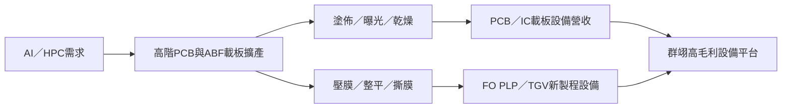

# 6664_群翊（市）

## 基本資料

群翊工業，台灣 PCB 及基板乾式製程設備專業廠，主要產品為**板對板（PCB/基板）自動化乾式製程設備**，以及**PLP（Panel Level Package，面板級封裝）設備**。客戶群包括台灣、日本、韓國主要 PCB 廠與 ABF 載板廠（包括欣興、南電等）。近年受惠 AI 伺服器 ABF 載板需求大幅擴增，以及 PLP（面板級封裝）新製程商機。

公司年報揭露的核心技術主軸為塗佈、乾燥、曝光、壓膜及自動化，產品應用延伸至 PCB、IC 載板、先進封裝、TGV、顯示器、光電與電子材料。2025 年合併營收 25.74 億元，毛利率 59%，外銷比重約 88%；因此公司本質上是高毛利、專案型、以海外客戶為主的電子製程設備商。

## 核心競爭優勢

- **乾式製程設備利基**：乾式（Dry process）設備在 PCB/基板製程中具有特殊優勢（環保、精度高），技術門檻相對高
- **超高毛利率**：毛利率長期維持 **60%+**，顯示產品的稀缺性與客戶黏著度
- **PLP 設備先機**：PLP（面板級封裝）是次世代半導體封裝技術，群翊在 PLP 設備領域提前布局
- **楊梅二期擴廠**：2028 年楊梅 Phase 2（Class 100 潔淨室）預計落成，大幅提升高階設備產能

## 產品與應用

| 產品／技術 | 應用 | 相關下游 |
|---|---|---|
| 塗佈、曝光與乾燥設備 | PCB 內層、防焊、IC 載板製程 | [[3037_欣興（市）]]、載板廠 |
| 壓膜／整平與撕膜設備 | FO WLP／FO PLP、先進封裝、TGV | 先進封裝與玻璃基板廠 |
| 自動化整線 | CIM、SECS/GEM、機械手臂、CCD 視覺整合 | PCB、載板與半導體客戶 |

## EPS 預估

| 年度 | EPS（NT$）| 來源 | 備註 |
|------|----------|------|------|
| 2025F | 16.19 | CTBC Sep 2025 | ABF 需求開始加速 |
| 2026F | **19.04** | CTBC Sep 2025 | PLP 設備新增貢獻 |

## 目標價與評等

| 券商 | 報告日 | 評等 | 目標價 | 評價基礎 | 來源 |
|------|--------|------|--------|---------|------|
| 中信投顧（CTBC）| 2025-09-15 | 買進（B）| NT$324 | — | 報告_CTBC_群翊6664_B_20250915 |

## 圖片 / 架構圖

> 圖說：群翊位於 AI 伺服器與先進封裝擴產所需的塗佈、乾燥、壓膜及自動化設備環節；本圖為依公司年報與官方產品分類整理的供應鏈架構。

## 時間軸

| 時間 | 事件 | 類型 | 重要性 | 備註 |
|------|------|------|--------|------|
| 2025-09-15 | CTBC Buy TP 324元，EPS 2025F 16.19 / 2026F 19.04 | 評等 | ⭐⭐⭐ | 乾式製程設備 + PLP 潛力 |
| 2026 | PLP 設備訂單放量 | 業務 | ⭐⭐⭐ | 面板級封裝新市場 |
| 2028 | 楊梅二期 Class 100 潔淨室落成 | 產能 | ⭐⭐⭐ | 高階基板設備產能大幅提升 |

## 財務特點

- **毛利率 60%+**：遠高於 PCB 設備業平均（20-30%），反映技術壁壘
- **設備廠特性**：收入波動性較強，訂單週期影響大
- **2025 年實績**：營收 25.74 億元、毛利率 59%、營業利益 10.20 億元、EPS 15.06 元；2024 年 EPS 16.97 元含較高業外匯兌收益，2025 年本業 EPS 13.51 元高於前一年 12.72 元（fact；來源：2026 法說資料）。

## 供應鏈位置

- **下游（直接）**：欣興（Unimicron）、南電（Nan Ya PCB）、日本 ABF 載板廠、韓國 SEMCO 等
- **所屬供應鏈**：[[供應鏈_先進封裝載板]]（設備環節）

## 相關公司

| 公司 | 關係 | 說明 |
|------|------|------|
| [[3037_欣興（市）]] | 下游客戶 | ABF 載板設備主要採購方之一 |

## 風險與注意事項

- ABF 載板需求放緩（AI capex 週期下行）影響設備採購
- PLP 商業化時程推遲
- 客戶集中度風險（下游幾家 ABF 廠集中）

## 來源

- 報告_CTBC_群翊6664_B_20250915（中信投顧，2025-09-15；買進 TP 324，乾式製程設備、PLP 布局、毛利率 60%+）
- [[114年股東常會年報]]（群翊工業，2026-04-14 刊印；公司年報）
