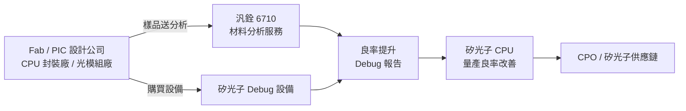

# 6710_汎銓（市）

## 基本資料
汎銓科技（6710）是台灣少數具備埃米世代（<2nm）半導體材料分析能力的高階實驗室服務公司，同時進入矽光子（Silicon Photonics）Debug 設備市場。核心業務分三大主軸：①埃米世代製程分析（TEM/APT 樣品製備，含 High-NA 光阻、Low-K 材料）、②AI 專區服務（與 Tier 1 AI 公司長期合作的矽光子 CPU Debug 實驗室）、③矽光子 Debug 設備銷售與專利授權。

主要客戶為 Fab（≥4 家，涵蓋 110nm/90nm/65nm 矽光子製程）、PIC 設計公司（含 Tier 1 AI 公司）、CPU 封裝廠（CPO/光引擎 FA 分析）、光模組系統廠。全球佈局台灣（本部）、大陸上海、美國、日本、韓國，海外業績 1-5 月近倍增，年底海外比率目標 38-40%。

成長動能：①AI 專區擴展（第三期 2026 年 7 月啟動）、②矽光子 Debug 設備年底首台出貨（標準配備 NT$6,000 萬/台）、③海外市場大陸/美國/日本同步放量。

資料來源：[[活動_汎銓法說_20260612]]（2026-06-12）、[[活動_汎銓法說_20260616]]（2026-06-16）

## 核心技術／競爭優勢
- **埃米世代分析技術領先**：已進入 2nm 以下製程分析，具備完整樣品製備能力（TEM/APT），並持有低溫 ALD 導電膠保護膜、原子層導電膜等三項保護樣品完整性的關鍵專利，確保 High-NA 光阻、Low-K 材料分析不失真
- **矽光子 IR-OM 感測器多國專利**：IR-OM 影像感測器（光損偵測裝置）已取得台灣、美國、日本、韓國四大半導體地區專利，另有 2 個區域專利即將取得；CLAIM 範圍涵蓋 100nm-6000nm，對應矽光子 1310nm/1550nm 波段，形成矽光子 Debug 核心護城河
- **三軌並行商業模式**：①場內持續分析服務（固定成本結構已確立）、②Debug 設備銷售（NT$6,000 萬/台標準配備，毛利率高於公司平均）、③設備公司授權合作（按台數抽取費用），多元化收益來源降低單一業務波動
- **Tier 1 AI 公司深度合作**：AI 專區已擴展至第二期，2026 年 7 月啟動第三期，與 Tier 1 AI 公司緊密合作建立 RD 分析平台，掌握 CPU 良率問題第一手資訊，同業難以複製的客戶黏著度
- **固定成本結構 + 高利潤彈性**：全年成本固定於 NT$2.1 億（2026），業績超過 NT$2.8 億時毛利率即回到 40%；每增台設備業績（NT$6,000 萬）幾乎全部轉為利潤

## 產品與應用

| 產品 / 服務 | 應用 | 相關客戶 / 下游 |
|-------------|------|-----------------|
| 埃米世代製程分析（樣品製備） | 2nm 以下半導體製程 TEM/APT 分析 | Fab（≥4 家，矽光子製程）、PIC 設計公司 |
| AI 專區服務 | 矽光子 CPU 良率 Debug、參數確認、Datasheet 建立 | Tier 1 AI 公司（RD 產線）、CPU 封裝廠 |
| 矽光子 Debug 設備（第一代） | CPU 良率提升、光路 Debug、PIC FA 分析 | Fab、PIC 設計公司、CPO 封裝廠、光模組系統廠 |
| IR-OM 光損偵測裝置（可授權） | 矽光子導光元件定位、漏光點抓取 | 設備商（專利授權）、量產線 |
| 低溫 ALD 保護膜（專利） | High-NA 光阻、Low-K 材料樣品保護 | Fab、OSAT |

## 圖片 / 架構圖

> 汎銓扮演矽光子 CPU 量產良率提升的關鍵分析與設備角色，上游服務 Fab/PIC 公司，下游連結 CPO 與矽光子量產生態系。

## 時間軸（催化劑）

| 時間 | 事件 | 類型 | 重要性 | 備註 |
|------|------|------|--------|------|
| 2026-06-30 | AI 專區第三期硬體完備 | 擴產 | ⭐⭐⭐ | 第三期 7 月第一週客戶進駐；年底前洽談第四期 |
| 2026-07 至 08 | 上海實驗室進駐設備、擴大業績 | 海外放量 | ⭐⭐⭐ | 海外月業績目標快速邁向 NT$1 億 |
| 2026-09 | Debug 設備提供首批客戶試用 | 新品試用 | ⭐⭐⭐ | 客戶急需，八月場內調校、九月客戶驗收 |
| 2026 Q4 | Debug 設備正式向法人/媒體展示 | 商業化里程碑 | ⭐⭐⭐ | 年底前首台出貨；NT$6,000 萬/台，若賣 10 台=NT$6 億 |
| 2026 年底 | 矽光子 AI 業務達 NT$2,000 萬 | 業務成長 | ⭐⭐ | 占年底海外比率 38-40% 的一部分 |
| 2027 | Debug 設備與專利授權顯著成長 | 成長動能 | ⭐⭐⭐ | 毛利率目標提升至常態 40%；大陸市場大幅成長 |

> 06/12 vs 06/16 差異：06/12 著重矽光子客戶群說明與 Debug 設備定位；06/16 補充大陸市場格局、成本結構與設備毛利細節

## 供應鏈位置
- **矽光子 Debug**：CPO / 矽光子 CPU 良率分析設備 → [[供應鏈_CPO]]
- **埃米世代分析**：先進製程材料分析服務，服務台灣/中國 Tier 1 Fab
- 上游（採購）：載台（MPI 等）、光學偵測元件、IR 感測器組件
- 下游（服務對象）：Fab（矽光子製程）、PIC 設計公司、CPU 封裝廠、光模組系統廠、設備商（授權合作）

## 相關公司

| 公司 | 關係 | 說明 |
|------|------|------|
| Tier 1 AI 公司（未揭露） | 客戶 / 合作夥伴 | AI 專區長期合作，三期以上擴展；提供矽光子 CPU Debug 分析服務 |
| 矽光子 Fab（≥4 家，未揭露） | 客戶 / 下游 | 涵蓋 110nm/90nm/65nm 矽光子製程；晶圓廠委案 Debug 分析 |
| 設備商（授權對象） | 合作 / 授權 | IR-OM 裝置專利依銷售台數抽取費用；歡迎所有矽光子相關設備商授權合作 |

> [!warning] 風險與注意事項
> - **矽光子量產時程風險**：若矽光子量產延後（市場普遍擔憂延後 1-2 年），設備銷售業績將推遲；但公司認為量產延誤反而增加 Debug 分析需求（利多角度）
> - **客戶集中與地緣政治**：大陸為目前主要獲利來源（台灣區域稅後虧損，美日年底損益兩平），若大陸業務受中美科技管制衝擊，整體獲利將顯著下滑
> - **設備商業化早期風險**：Debug 設備年底才推出首台，商業化模式（銷售 vs. 授權）仍在建立；客戶驗收結果與實際購置意願存在不確定性
> - **競爭者與價格壓力**：大陸競爭者眾多（主軸 FARA，材料分析比重較低）；台灣同業亦有在大陸布局；競爭者售價約汎銓的六七折，汎銓堅守高階市場但需維持技術差距

## CPO Insertion 3 光通量檢測角色

SRS 研究報告確認，汎銓在 CPO Insertion 3（OE Die Level Test）中扮演**光通量檢測設備（漏光偵測與精準定位）**供應商角色，與光焱科技（未建頁）並列為此環節的光通量檢測設備廠。

這與汎銓在法說中說明的「矽光子 IR-OM 感測器」業務直接對應——IR-OM 光損偵測裝置可用於 CPO 製程中的漏光點定位與精準定位，從材料分析服務延伸至量產線設備供應。

| Insertion | 汎銓角色 | 設備 |
|-----------|----------|------|
| Insertion 3 | 光通量檢測 / 漏光偵測與精準定位 | IR-OM 光損偵測裝置（含光焱，未建頁）|

## 來源
- [[活動_汎銓法說_20260612]]（2026-06-12 法說，主題：矽光子客戶群說明、Debug 設備定位、AI 專區）
- [[活動_汎銓法說_20260616]]（2026-06-16 法說，主題：財務結構、成本分析、大陸市場、設備商業化細節）
- [[光測試期中產業報告]]（SRS 期中，2026-07-01）：確認 Insertion 3 光通量檢測設備角色
