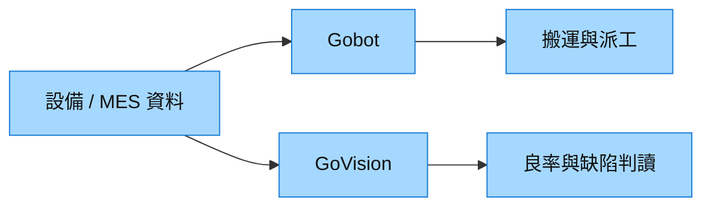

# 6739_竹陞科技（櫃）

## 基本資料
竹陞科技提供 Gobot、GoVision、AIoT 與 Edge AI 智慧製造方案，將設備、MES、影像與製程資料接入工廠流程。來源稱 2026 年 1–8 月營收 9.3 億元、年增 97%，先進封裝與 OSAT 營收占比由 44% 升至 48%，訂單能見度至 2Q27。來源：[[memo_國泰證期_竹陞科技CallMemo_20260909]]。

## 核心技術／競爭優勢
- 可不中斷產線地跨設備、跨品牌介接資料與控制系統。
- 標準平台搭配客製模組，驗證後可複製至更多站點及廠區。
- Gobot 處理自動搬運與控制；GoVision 連結缺陷影像、良率與製程參數。

## 產品與應用
| 產品／服務 | 應用 | 下游 |
|---|---|---|
| Gobot | 設備／物料搬運、AMR、機械手臂 | 晶圓廠與封測廠 |
| GoVision | 缺陷分類、良率與製程分析 | 先進封裝與 OSAT |
| AIoT／Edge AI | 設備連線與即時控制 | 智慧工廠 |

## 圖片 / 架構圖

圖說：平台把設備資料分別導向自動化搬運與影像／良率處理，再複製至跨廠區應用。

## 時間軸（催化劑）
| 時間 | 事件 | 類型 | 重要性 | 備註 |
|---|---|---|---|---|
| 2026Q3 | 營收估季增 21%–24% | 放量 | ⭐⭐ | 公司展望 |
| 2026 年底 | 規劃推出 LLM 功能 | 技術下線 | ⭐⭐ | 待產品落地確認 |
| 2027Q2 前 | 訂單能見度 | 放量 | ⭐⭐⭐ | 不等於已認列營收 |

## 供應鏈位置
- 智慧製造整合商，連結 [[供應鏈_工業自動化]] 與 [[供應鏈_先進封裝載板]] 的資料、搬運與良率需求。

## 相關公司
| 公司 | 關係 | 說明 |
|---|---|---|
| — | — | 本次來源未具名揭露可連結的公司關係。 |

> [!warning] 風險與注意事項
> - 訂單能見度仍取決於設備交付、軟體驗收與客戶量產進度。
> - 海外擴張受資安、在地服務與客戶建廠節奏制約。

## 來源
- [[memo_國泰證期_竹陞科技CallMemo_20260909]] — 國泰證期研究部，2026-09-09
