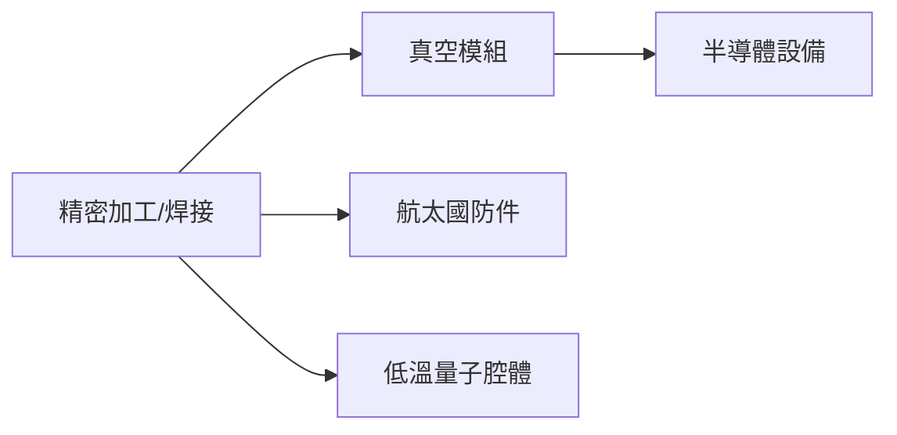

# 6829_千附精密（市）

## 基本資料
千附精密提供半導體設備精密模組、真空腔體與航太／國防結構件。2026-08-26 法說逐字稿稱 H1 營收年增約 32%、稅後獲利年增約 86%，半導體比重逾 40%；數據與客戶擴產描述屬 AI 轉錄，信心中。

## 核心技術／競爭優勢
- 真空、潔淨與精密焊接製程能力。
- 半導體、航太國防雙市場分散終端。
- ASML、Lam、Applied Materials 等設備鏈合作經驗，客戶認證門檻高。

## 產品與應用
|產品|應用|下游|
|---|---|---|
|真空腔體／模組|晶圓製程設備|[[ASML.NL(asml)]]、[[LRCX.US(lam_research)]]|
|國防精密件|PAC-3、航太|Lockheed Martin（未建頁）|
|低溫腔體|量子運算研究|客戶驗證中|

## 圖片 / 架構圖

## 時間軸
|時間|事件|類型|重要性|
|---|---|---|---|
|2026Q4|嘉義廠使用執照目標|擴產|⭐⭐|
|2027|半導體營收占比提升|放量|⭐⭐|

## 供應鏈位置
- 上游：金屬材料與精密加工設備。
- 下游：半導體設備、國防與量子研究；所屬主題：[[供應鏈_半導體測試設備]]。

## 相關公司
|公司|關係|說明|
|---|---|---|
|[[ASML.NL(asml)]]|設備客戶鏈|法說點名供應鏈合作|
|[[LRCX.US(lam_research)]]|設備客戶鏈|法說點名供應鏈合作|

> [!warning] 風險與注意事項
> - 量子低溫腔體仍在設計變更與客戶驗證，訂單量不可視為已確定。
> - 半導體設備客戶集中且受資本支出週期影響。

## 來源
- [[活動_千附精密法說_20260826]]（AlphaMemo.ai，2026-08-26）
