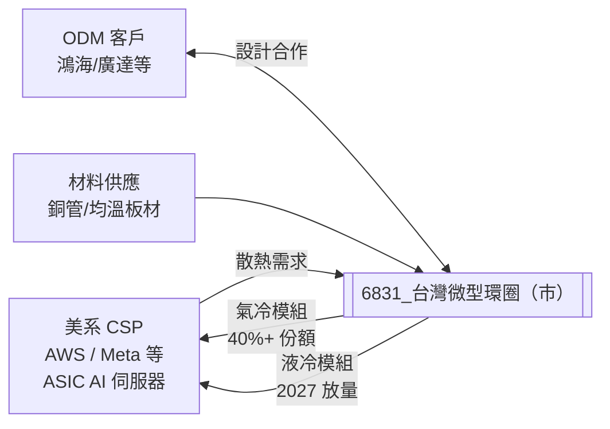

# 6831_台灣微型環圈（市）

## 基本資料

台灣微型環圈（Taiwan Microloops），台灣散熱模組廠，主力產品為氣冷（熱管 Heat Pipe / 均溫板 Vapor Chamber）及液冷模組，目前定位為 AI ASIC 伺服器的關鍵散熱夥伴。公司與其核心 ODM 客戶深度合作，負責 ASIC AI 伺服器的氣冷與液冷解決方案，正在從氣冷為主轉向液冷（2027 年開始），帶動 ASP 大幅提升。

主要股東：趙氏家族（Chao family）持股 20%。市值約 USD 1.32B（2026-07-22），流通股約 6,800 萬股。

**主要資料來源**：[[報告_Daiwa_TaiwanMicroloops_20260722]]（Daiwa，2026-07-22）。

## 核心技術／競爭優勢

- **ASIC AI 伺服器散熱主要夥伴**：與核心 ODM 客戶深度合作，切入 ASIC AI 伺服器散熱供應鏈；氣冷訂單份額已超過主要美系 CSP 的 40%+
- **液冷轉型 2027 啟動**：目前以氣冷為主，2027 年起 ASIC 液冷訂單開始放量，ASP 顯著提升
- **TDP 升級帶動毛利率提升**：台灣散熱解決方案毛利率因 TDP（熱設計功耗）持續升級而上升趨勢；2026E GM 26%，2027E 28%，2028E 30%
- **EPS CAGR 139.7%（2026-28E）**：Daiwa 預估 2026-28E 複合成長達 140%，PEG（2026-28E）僅 0.29x

## 產品與應用

| 產品 / 服務 | 類型 | 應用 | 主要客戶 |
|-------------|------|------|---------|
| 氣冷散熱模組（Vapor Chamber / Heat Pipe）| 氣冷 | ASIC AI 伺服器、訓練卡 | 美系 CSP（通過 ODM 供貨）|
| 液冷散熱模組 | 液冷 | 高功耗 ASIC / Next-gen GPU | 美系 CSP（2027 放量）|
| 熱管模組（Thermal module）| 通用 | 一般伺服器 / 工作站 | ODM |

**AI 關鍵專案（Key ASIC project）收入預估（Daiwa）**：
- 2026E：TWD 2,520m
- 2027E：TWD 6,804m
- 2028E：TWD 15,750m

## 圖片 / 架構圖

> 微型環圈透過核心 ODM 客戶切入 ASIC AI 伺服器供應鏈；2026 年氣冷份額已 40%+，2027 年液冷轉型為主要成長驅動。

## EPS 記錄

| 年度 | 營收（TWDm） | 淨利（TWDm） | EPS（TWD）| YoY | 備註 |
|------|------------|------------|----------|-----|------|
| 2021A | 1,524 | 46 | 1.22 | — | — |
| 2022A | 1,608 | 87 | 2.22 | +82% | — |
| 2023A | 1,642 | 103 | 2.03 | -9% | — |
| 2024A | 2,005 | 106 | 1.80 | -11% | — |
| 2025A | 3,703 | 301 | 4.94 | +175% | 熱管業務起量 |
| 1Q26A | 854 | 45 | 0.66 | +50.7% YoY | — |
| 2Q26E（Daiwa）| 1,047 | 74 | 1.09 | +0.6% YoY | 2Q 初步營收 TWD 1,047m；遠低於 BBG 共識 1,436m |

## EPS 預估

| 年度 | Daiwa（2026-07-22） | BBG 共識 | Daiwa vs BBG | 備註 |
|------|---------------------|---------|-------------|------|
| 2026E | TWD 15.07 | TWD 15.19（估）| -0.8% | 2Q 保守、3-4Q 大幅放量 |
| 2027E | TWD 37.53 | — | +17.9% | Daiwa 較 BBG 樂觀 18% |
| 2028E | TWD 86.58 | — | +0.2% | — |

> **3Q26E 是關鍵轉折**：Daiwa 預估 3Q26E 營收 TWD 2,400m（+129% QoQ），主因美系 CSP 的 ASIC 散熱專案在 3Q 開始大量出貨；4Q26E TWD 3,105m（+29% QoQ）。

## 目標價與評等

| 券商 | 報告日 | 評等 | 目標價 | 評價基礎 | 來源 |
|------|--------|------|--------|----------|------|
| Daiwa | 2026-07-22 | Buy（1）（維持） | TWD 1,325（前 1,150） | 40x 1-year-forward EPS；PEG 0.29x（2026-28E） | [[報告_Daiwa_TaiwanMicroloops_20260722]] |

> 上漲空間：+108.7%（vs 當時股價 TWD 635）。股價 7 月 MTD 已修正 -27%，Daiwa 視為逢低加碼機會，基本面未改變。

## 時間軸

| 時間 | 事件 | 類型 | 重要性 | 備註 |
|------|------|------|--------|------|
| 2026-06-18 | Daiwa 首評（Initiation）| 首評 | ⭐⭐⭐ | 初始 TP 1,150 |
| 2026-07（MTD）| 股價修正 -27%（市場波動 + 獲利了結）| 股價 | ⭐⭐ | Daiwa 認為基本面未改變 |
| 2026-Q2（初步）| 2Q26 初步營收 TWD 1,047m（+22.5% QoQ）| 財務 | ⭐⭐ | 低於 BBG 共識 1,436m；2Q 非主要關注季度 |
| 2026-Q3E | 3Q26E 營收 TWD 2,400m（+129% QoQ）| 業績爆發 | ⭐⭐⭐ | 美系 CSP ASIC 專案大量出貨 |
| 2026-Q4E | 4Q26E 營收 TWD 3,105m（+29% QoQ）| 持續成長 | ⭐⭐⭐ | 全年 TWD 7.4B |
| 2026-08-中 | 2Q26 財報發布 | 財報 | ⭐⭐⭐ | 正式 EPS 確認 |
| 2027E | 液冷訂單放量，ASP 顯著提升 | 業務轉型 | ⭐⭐⭐ | Air-cooling → Liquid-cooling；EPS 27E TWD 37.53 |
| 2027E | 氣冷業務延伸至 Switch 及新客戶 | 擴張 | ⭐⭐ | 多客戶策略 |

## 供應鏈位置

- **上游**：銅管、均溫板原材料、液冷工質
- **核心位置**：ASIC AI 伺服器散熱模組，ODM 合作設計，直接供 CSP 使用
- **下游**：美系 CSP（AWS / Meta 等）的 ASIC AI 伺服器整機廠（通過 ODM）
- **競爭者**：其他台系散熱廠（超眾、雙鴻、奇鋐等）

## 相關公司

| 公司 | 關係 | 說明 |
|------|------|------|
| 美系 ODM 客戶 | 核心夥伴 | 鴻海 / 廣達等（ASIC 伺服器設計組裝）|
| 美系 CSP | 終端客戶（間接）| AWS / Meta（ASIC AI 伺服器用途）|

> [!warning] 下行風險
> 1. AI 伺服器需求成長低於預期
> 2. ASIC AI 伺服器發展進度落後（主要風險，Daiwa 明確列示）
> 3. 液冷訂單落地時程延誤（原計 2027 大幅貢獻）
> 4. 競爭廠商切入核心 ODM 客戶供應鏈

## 來源

- [[報告_Daiwa_TaiwanMicroloops_20260722]]（Daiwa，2026-07-22；Buy TP 1,325、基本面分析、EPS 模型、ASIC 專案收入、液冷轉型）

## 相關頁面

- [[分析_2026-08記憶體_AI需求與液冷ASIC更新]]
- [[時程_2026記憶體與AI催化劑]]
- 技術_液冷散熱
- [[供應鏈_AI伺服器散熱]]

## 2026-07-28／2026-07-22 Daiwa 更新

- 2026–2028 年營收維持至少逐年倍增的公司指引；Daiwa 估 2027 年新 CSP 客戶於 2Q27 開始貢獻，並預期冷板取得 NVIDIA RVL，均屬公司展望／券商 estimate。
- 2027E EPS 高於 Bloomberg consensus 18%，12 個月目標價維持 NT$1,325；液冷產能已擴至中國與越南，仍需追蹤客戶驗證與量產。
- 來源：[[daiwa 6831]]（Daiwa，2026-07-28）、[[260722_daiwa_Taiwan Microloops]]（Daiwa，2026-07-22）。

### 2026-08-23 本批 Daiwa 更新

- [[260717_daiwa_microloop]]（2026-07-17）維持 Buy、12 個月目標價 NT$1,150；Daiwa 估 2Q26E EPS NT$1.08、3Q26 營收 NT$2.9bn，均屬券商 estimate。
- [[Daiwa-6831 20260811]]（2026-08-11）指出訂單能見度延伸至 2030、外部組裝夥伴自 8 月支援；日本廠 2027 年月產能目標由 25 台上修至 28 台，中國廠由 4 台增至 5 台，屬公司展望／券商解讀。
- [[Daiwa｜邁科（Microloops  6831 TT）｜2026年7月17日]] 將 ASIC 由氣冷轉液冷、ASP／毛利率改善列為主要 thesis；客戶驗證與量產節奏仍待確認。

來源：[[260717_daiwa_microloop]]、[[Daiwa-6831 20260811]]、[[Daiwa｜邁科（Microloops  6831 TT）｜2026年7月17日]]。
