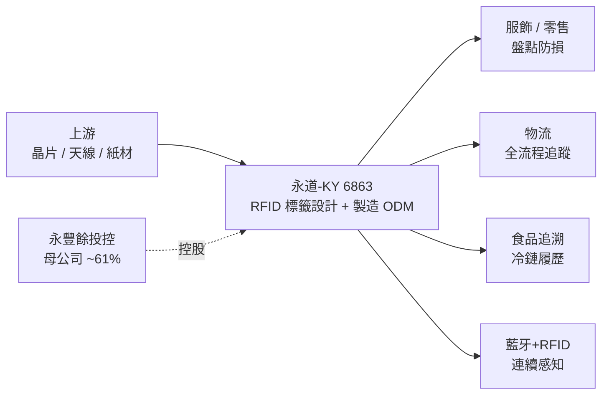

# 6863_永道-KY（市）

## 基本資料

永道-KY（6863 TT，Arizon RFID）是全球最大的被動式 UHF RFID 電子標籤 ODM 廠，2023-03-21 於台灣證交所上市，母公司為永豐餘投控（持股約 61%）。公司專注 RFID 已逾 20 年，是業界少數從頭到尾只做 RFID 的公司；截至 2026 年累計出貨已逾 330 億枚，全球專利佈局逾 800 項，客戶逾 800 家（含 UNIQLO 等零售龍頭）。

主要產品為 RFID inlay／電子標籤與相關軟硬體系統，終端應用橫跨服飾、零售、物流與食品追溯。成長驅動：食品安全追溯強制化（美國 FDA 對 16 種高風險食品要求全流程追溯）、高價值物流全流程追蹤，以及 RFID 結合藍牙／WiFi 的連續感知應用。

生產基地：揚州、台北為主，2025–26 年新增美國休士頓與越南河內兩座生產基地（越南廠 2025-10 完工、2026-02 取得 ARC 認證後出貨快速提升）；並於倫敦、西班牙、東南亞設辦公室就近服務。

資料來源：[[報告_凱基_永道KY_20260921]]（2026-09-21，凱基投顧，林祐熙；增加持股、目標價 135 元）。

## 核心技術／競爭優勢

- **純 RFID 專業 20 年**：從標籤結構到天線、材料的整合開發能力，累計出貨逾 330 億枚、專利逾 800 項，規模與良率領先。
- **冷鏈／食品追溯高讀取率**：2Q26 導入全新標籤結構與材料，於高含水肉品與金屬冷凍櫃環境下（傳統方案辨識率不足 60%）測試讀取率突破 90%，且高堆疊仍維持 90% 以上。
- **全流程物流追蹤**：由節點辨識升級為包裹移動速度、路線、轉運進度的連續追蹤，每十分鐘更新全球狀態並預警異常，並支援自動分類分流。
- **無電池藍牙 + RFID 連續感知**：利用 RFID 接收訊號的微量能源供電藍牙，感測距離由傳統約 10 公尺拉長至約 30 公尺，並可感測光照、濕度、溫度與速度。
- **全球製造布局分散關稅風險**：新增美、越基地優化製造成本與毛利，2026-04 下旬起紙材、天線到晶片全面漲價已全數轉嫁售價。

## 產品與應用

| 產品 / 服務 | 應用 | 相關客戶 / 下游 |
|-------------|------|-----------------|
| UHF RFID 電子標籤（inlay） | 服飾／零售盤點與防損 | UNIQLO 等品牌零售 |
| 冷鏈／食品追溯標籤 | 高風險食品全流程履歷（FDA 16 類） | 大型通路商、食品業 |
| 高價值物流追蹤標籤與系統 | 包裹全流程追蹤、自動分類 | 物流／快遞業者 |
| 藍牙 + RFID 連續感知標籤 | 門店即時感知、數位產品護照、碳足跡 | 美系零售（500→4,600 門店） |

## 圖片 / 架構圖

> 圖說：永道-KY 位於 RFID 產業鏈中游（標籤設計與製造 ODM），上游為晶片、天線與紙材，下游依終端別分為服飾／零售、物流、食品追溯與新興的藍牙感知應用；母公司永豐餘投控持股約 61%。（來源：[[報告_凱基_永道KY_20260921]]，2026-09-21）

## EPS 記錄

| 季度 | EPS (元) | 備註 |
|------|---------|------|
| 2Q26 | 1.32 | 毛利率回升至 24.6%（QoQ +5.3ppt）；營收 15.3 億（QoQ +31.8%） |
| 1Q26 | 0.61 | 關稅成本影響、毛利率較低 |

（1H26 與 1H25 毛利率年減 6.7ppt，主因 1Q25 尚無關稅問題；平均銷售天數由 130 天降至 95 天。來源：[[報告_凱基_永道KY_20260921]]）

## 目標價與評等

| 券商 | 報告發布日 | 評等 | 目標價 | 評價基礎 | 來源 |
|------|------------|------|--------|----------|------|
| 凱基 | 2026-09-21 | 增加持股 | NT$135 | 18x 2026–27 平均 EPS | [[報告_凱基_永道KY_20260921]] |

> 凱基表示正檢視財務模型；報告以 2026-09-21 收盤 98.3 元為基準（信心中，估值/EPS 屬券商 estimate）。

## 時間軸

| 時間 | 事件 | 類型 | 重要性 | 備註 |
|------|------|------|--------|------|
| 2026-02 | 越南河內廠取得 ARC 認證 | 產能 | ⭐⭐ | 認證後當地出貨快速提升 |
| 2026-04 下旬 | 原物料（紙材/天線/晶片）全面漲價 | 成本 | ⭐⭐ | 已全數轉嫁售價、反映於 2Q26 |
| 2026Q2 | 冷鏈標籤讀取率突破 90% | 技術下線 | ⭐⭐ | 食品追溯強制化的關鍵門檻 |
| 2026 年底 | 藍牙 RFID 門店由 500 擴至 4,600 家 | 放量 | ⭐⭐ | 中長期方向，短期不貢獻爆量營收 |
| 2027 | 物流業務年增最快、零售次之 | 放量 | ⭐⭐ | 服飾仍為絕對量最大 |

> RFID 為獨立主題，暫無對應跨公司時程頁；催化劑先記錄於本頁。

## 供應鏈位置

- 上游：RFID 晶片、天線、紙材等原物料（2026-04 起全面漲價）。
- 下游：服飾／零售品牌、物流業者、食品通路商；新興藍牙感知應用擴散至美系大型零售門店。
- 主題：被動式 UHF RFID 電子標籤 ODM（全球市占領先）；目前非本庫 AI 供應鏈追蹤主軸，暫無 `供應鏈_XXX` 對應頁。

## 相關公司

| 公司 | 關係 | 說明 |
|------|------|------|
| 永豐餘投控 | 母公司 | 持股約 61%，永道為其孵化之 RFID 事業 |

> 母公司永豐餘投控目前無獨立公司頁；如後續建立可補入 `related_companies`。競爭對手在價格上積極，永道不主動打價格戰、以美越新基地控管成本。

> [!warning] 風險與注意事項
> - 終端需求（服飾／零售）受景氣與消費循環影響；3Q26 逢歐美暑期淡季。
> - 食品追溯與藍牙 RFID 屬中長期趨勢，法規落地與門店擴張時程若延後，短期難貢獻爆發性營收。
> - 原物料漲價與關稅：雖已轉嫁，但若成本續揚或轉嫁不及仍壓抑毛利率。

## 來源

- [[報告_凱基_永道KY_20260921]]（2026-09-21，凱基投顧，林祐熙；2Q26 復甦、食品追溯與物流 RFID、目標價 135 元）
