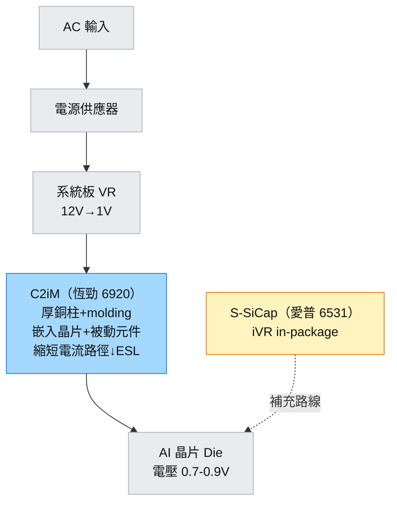

# 6920_恆勁科技（市）

## 基本資料

恆勁科技（6920 TT）是台灣功率封裝載板及嵌入式基板廠，是 **VPD（垂直供電）最直接的台股結構受惠標的**。核心已量産產品：
- **C2iM（Chip-to-interposer in Mold）：** 厚銅柱 + molding 載板，可同時嵌入晶片與被動元件
- **ALF（Advanced Low-profile Package）：** 低高度功率封裝
- **xQFN：** 先進 QFN 封裝格式

恆勁的核心技術優勢在於「厚銅柱 + molding」——此結構可取代傳統 FR4 基板，縮短電流路徑、降低寄生電感，直接改善 PDN（電源分配網路）性能，是 VPD 嵌入式基板路線（四條路線之②）的代表廠。

資料來源：[[報告_先進封裝技術發展方向_20260722]]（定錨產業筆記，2026-07-22）

## 核心技術／競爭優勢

- **C2iM 厚銅柱埋晶片：** 結合功率元件（MOSFET/GaN 等）與被動元件（電容/電感）於同一 molding 封裝體內，縮短電源路徑，等效 ESL 顯著下降。
- **嵌入式基板路線：** 符合 VPD 四條路線中的「② 嵌入式基板（C2iM）」——不需系統板上額外 DrMOS 模組，電源更靠近晶片，是 AI 加速器 Rack 功率密度提升的必然方向。
- **多產品線已量産：** C2iM/ALF/xQFN 三條線同時量産，風險分散，不依賴單一客戶或產品。
- **台股唯一：** 已量産 C2iM 的台廠，國際競爭對手為 Infineon、Vishay 等功率大廠，台廠地位稀缺。

## 產品與應用

| 產品 / 服務 | 應用 | 相關客戶 / 下游 |
|-------------|------|-----------------|
| C2iM 嵌入式封裝載板 | 功率模組/AI 伺服器電源、VPD 嵌入式路線 | AI 伺服器系統廠、CSP |
| ALF 低高度功率封裝 | 電源管理 IC 封裝 | 電源 IC 設計廠 |
| xQFN 先進 QFN | 多功能低高度封裝 | 消費電子/通訊 |

## 圖片 / 架構圖

圖說：恆勁 C2iM 在 VPD 路線中扮演「嵌入式基板」角色——縮短從 VR 到 Die 的電流路徑，補充愛普 iVR 路線形成台股 VPD 雙線受惠。

## 時間軸

| 時間 | 事件 | 類型 | 重要性 | 備註 |
|------|------|------|--------|------|
| 已量産 | C2iM / ALF / xQFN 三線量産 | 里程碑 | ⭐⭐⭐ | 已實現收入，非概念股 |
| 2026+ | AI 伺服器功率密度提升 | 結構趨勢 | ⭐⭐⭐ | GB200 NVL72 機架 120kW，功率管理需求爆發 |
| 2027+ | VPD 標準化滲透提升 | 長線 | ⭐⭐ | CSP 統一採購嵌入式電源模組 |

## 供應鏈位置

- 功率封裝載板製造（已量産）
- 客戶：AI 伺服器系統廠、ODM/OEM、電源 IC 設計廠
- VPD 生態：[[6531_愛普（市）]]（SiCap iVR 路線，互補非競爭）

## 相關公司

| 公司 | 關係 | 說明 |
|------|------|------|
| [[6531_愛普（市）]] | VPD 互補 | 愛普走 iVR 路線，恆勁走嵌入式基板路線，兩者互補 |
| [[2330_台積電（市）]] | 潛在上游 | SoIC 若整合功率元件，恆勁可扮演 interposer 角色 |
| [[3711_日月光投控（市）]] | 潛在客戶 | OSAT 功率封裝模組整合 |

> [!warning] 風險與注意事項
> - **AI 伺服器功率標準仍在演進：** GB200 到 GB300 功率架構可能改變，若 CSP 選擇不同 VPD 路線（如純 BSPDN），C2iM 需求可能延遲。
> - **國際大廠競爭：** Infineon DrMOS、TI、Vishay 等功率大廠有完整產品線，恆勁需以客製化和台灣在地服務差異化。
> - **市值小流動性：** 小型台股，研究報告覆蓋有限，需自行追蹤法說/客戶動態。

## 相關技術頁

- [[技術_垂直供電VPD]] — VPD 四條路線，恆勁 C2iM 定位於「② 嵌入式基板」路線

## 來源

- [[報告_先進封裝技術發展方向_20260722]] — 定錨產業筆記講座，2026-07-22
