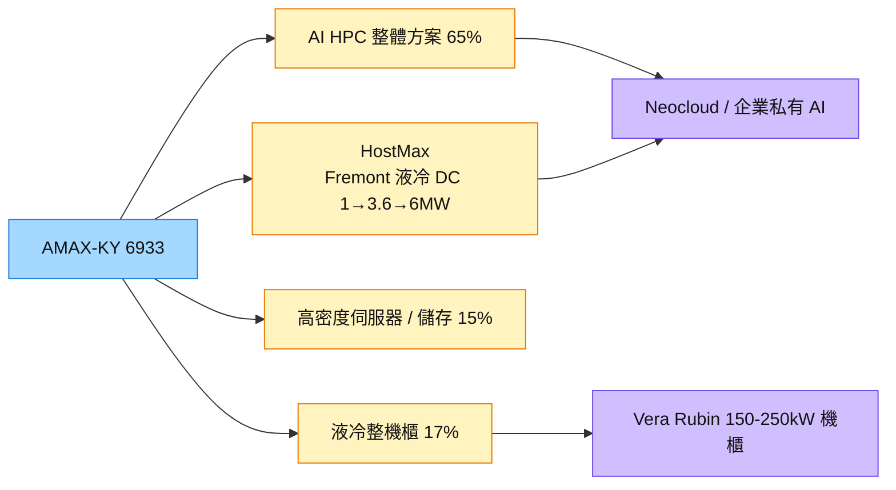

# 6933_AMAX-KY（市）

## 基本資料

AMAX 1984 年創立於美國矽谷，2023 年 11 月在台上市（艾瑪斯科技控股，開曼）。定位已由單項硬體供應商轉為客戶 AI 基礎設施的長期夥伴：提供 AI 高效能運算整體方案（GPU 伺服器＋儲存＋網路＋軟體＋現場部署）、液冷整機櫃與資料中心建置，以及 NPI 到量產的製造能力。

- **財務：** 1H26 營收 44.87 億元、稅後淨利 2.72 億元、EPS 6.43 元；前 8 月營收 72.8 億元，已達 2025 全年 104%。管理層提醒 6–8 月單月 13–14 億元不宜外推為常態。
- **組合：** 1H26 AI 高效能運算 65%（2025 年 59%）、高密度伺服器與儲存 15%（7%）、液冷整機櫃 17%（30%）、其他 3%。專案規模由過去 10–20 萬美元提高到每次 100–200 萬美元。
- **HostMax：** 2026 年 3 月於美國 Fremont 總部完成高密度液冷資料中心，可做客戶燒機、溫度、流量、壓力與可靠度驗證及短期託管；電力 1MW→2026 年 10 月擴至 3.6MW→2027 年申請 6MW 以上（PG&E）。
- **第二代產品：** 工業級全密閉 HEX 液冷運算櫃（空間縮減 17%、液冷能力 +87%）；第二代 AI 加速器機櫃（ORV3、800G 光纖網路）已進入量產，年底至明年初將生產帶回台灣。
- **私募：** 原案依法屆滿一年，仍與數個對象洽談中，尚未公告。

資料來源：[[活動_AMAX-KY6933_CallMemo_20260917]]（國泰證期 Call Memo，2026-09-17）

## 核心技術／競爭優勢

- **十年液冷經驗：** 2015 年起開發，涵蓋機櫃熱流模擬、流量、壓差、供電、配管與 Rack-level 系統工程。
- **端到端交付：** NVIDIA 客戶就緒評估需 site survey（電力、液冷、水溫、風量、承重），AMAX 完成評估回報 NVIDIA 才能取得交付綠燈。
- **加州電力條件：** 三年前即申請電力，已取得擴充所需電力；液冷工程與端到端競爭者明顯少於氣冷伺服器商。
- **不做標準品：** 聚焦高度客製、長期供應的高價值市場，不與大型品牌拼標準化伺服器。

## 產品與應用

| 產品 / 服務 | 應用 | 相關客戶 / 下游 |
|-------------|------|-----------------|
| AI Factory 整體建置（GPU 伺服器、儲存、網路、軟體、部署） | Neocloud、GPUaaS、模型訓練推論 | Neocloud 與企業（未揭露名稱） |
| 液冷整機櫃、第二代液冷運算櫃 | Rubin／Vera Rubin 液冷機櫃（約 95% 液冷） | 平台來自 [[NVDA.US(nvidia)]] |
| HostMax 驗證與短期託管 | 客戶尚無自有機房時的測試與上線 | 新客戶導入 |
| 高密度伺服器與儲存 | 半導體設備商、AI 晶片開發商、資安業者 | 先進運算客戶 |

## 圖片 / 架構圖

圖說：AMAX 以 HostMax 液冷資料中心作為展示與驗證平台，把硬體出貨延伸為液冷、部署與維運的端到端服務。

## EPS 記錄

| 期間 | EPS (元) | 備註 |
|------|---------|------|
| 1H26 | 6.43 | 稅後淨利率 6.07% |

## 時間軸

| 時間 | 事件 | 類型 | 重要性 | 備註 |
|------|------|------|--------|------|
| 2026-10 | HostMax 電力擴至 3.6MW | 擴產 | ⭐⭐ | [[活動_AMAX-KY6933_CallMemo_20260917]] |
| 2026 年底～2027 年初 | 第二代 AI 加速器機櫃生產移回台灣 | 擴產 | ⭐⭐ | ORV3、800G |
| 2027 | HostMax 電力擴至 6MW 以上 | 擴產 | ⭐⭐ | PG&E 預估 2027 |
| 2027 | Rubin／Vera Rubin 全液冷平台導入 | 規格升級 | ⭐⭐⭐ | 機櫃功耗 150–250kW |

→ 跨公司時程詳見 [[時程_2026-2027高速互連與分散式算力]]

## 供應鏈位置

- 上游：GPU 與運算零組件（非主要自製）、CDU、液冷管路
- 下游：Neocloud／GPUaaS、企業私有 AI、半導體設備商、AI 晶片開發商、資安業者
- 所屬供應鏈：[[供應鏈_AI伺服器散熱]]

## 相關公司

| 公司 | 關係 | 說明 |
|------|------|------|
| [[NVDA.US(nvidia)]] | 上游平台 | NVIDIA 平台液冷機櫃；site survey 決定客戶交付 |

## 風險與注意事項

> [!warning] 風險與注意事項
> - **專案認列波動：** 大型專案裝機、測試與認列時間不同，月營收波動大。
> - **營運資金：** 存貨隨備料增加、營業現金流為負，公司未提供轉正時點。
> - **客戶未揭露：** 無法評估客戶集中度。
> - **群組推估不可靠：** 群組流傳的 2026–2029 年 EPS 與目標價推演為情境模型，非公司指引（信心低）。

## 來源

- [[活動_AMAX-KY6933_CallMemo_20260917]] — 國泰證期 Call Memo，2026-09-17
