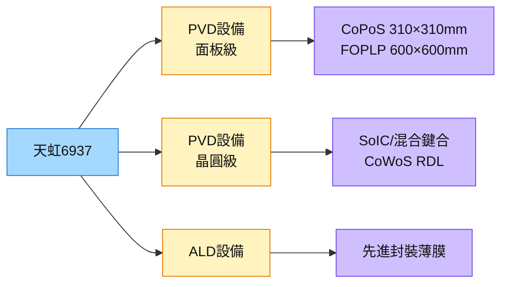

# 6937_天虹（市）

## 基本資料

天虹（6937 TT）是台灣 PVD（物理氣相沉積）/ ALD（原子層沉積）設備廠，主要供應半導體及先進封裝製程的薄膜沉積設備。在先進封裝方面，天虹切入面板級 PVD（CoPoS/FOPLP 面板尺寸 PVD）及混合鍵合（SoIC）製程所需的 PVD 設備，並在玻璃基板 TGV 製程的種子層沉積段佈局。

面板級 PVD 是其差異化競爭點——300mm 晶圓設備廠眾多，但能做 310×310mm（CoPoS）以上面板尺寸 PVD 的廠商遠少於晶圓廠，天虹二三號機訂單進度為重要追蹤指標。

資料來源：[[報告_先進封裝技術發展方向_20260722]]（定錨產業筆記，2026-07-22）

## 核心技術／競爭優勢

- **面板級 PVD 二/三號機進駐：** CoPoS 310×310mm 面板需要能處理大面積的 PVD 設備，天虹是台廠中率先佈局的廠商。
- **SoIC/混合鍵合 PVD：** 混合鍵合製程前需 PVD 種子層，CoWoS-R/L 中介層 PVD 同樣是需求端。
- **ALD 能力：** 進一步布局 ALD 薄膜沉積，適應線寬縮小後薄膜均勻性要求。

## 產品與應用

| 產品 / 服務 | 應用 | 相關客戶 / 下游 |
|-------------|------|-----------------|
| 面板級 PVD 設備 | CoPoS/FOPLP 面板製程種子層 | [[2330_台積電（市）]]、[[3711_日月光投控（市）]] |
| 晶圓級 PVD 設備 | SoIC/混合鍵合種子層、CoWoS RDL | 封裝廠通用 |
| ALD 設備 | 先進封裝薄膜均勻性需求 | 通用 |

## 圖片 / 架構圖

圖說：天虹在先進封裝 PVD 設備的核心差異化是面板尺寸能力，CoPoS 面板化時代來臨時可大幅受惠。

## 時間軸

| 時間 | 事件 | 類型 | 重要性 | 備註 |
|------|------|------|--------|------|
| 2026-2027 | 面板級 PVD 二/三號機交機 | 放量 | ⭐⭐⭐ | 機台進度是最硬的追蹤指標 |
| 2027 試產 | CoPoS 310×310mm 台積電試産 | 上游催化 | ⭐⭐⭐ | 若延期則訂單遞延 |

## 供應鏈位置

- 設備供應：先進封裝 PVD/ALD 製程
- 國際競爭：Evatec、AMAT、ULVAC
- 台廠同業：友威科（3580，PVD 玻璃種子層）

## 相關公司

| 公司 | 關係 | 說明 |
|------|------|------|
| [[2330_台積電（市）]] | 客戶 | CoPoS/SoIC/WMCM 面板級 PVD 設備 |
| [[3711_日月光投控（市）]] | 客戶 | FOPLP VIPack PVD 設備 |

> [!warning] 風險與注意事項
> - **CoPoS 時程風險：** 報告提示 CoPoS 可能延遲最多 2 年，面板級 PVD 設備訂單隨之遞延。
> - **國際競爭：** Evatec/AMAT 在 PVD 技術實力更強，天虹需以服務和面板規格差異化。
> - **小廠流動性：** 市值相對小，研究報告少，需以法說/客戶訊息追蹤。

## 來源

- [[報告_先進封裝技術發展方向_20260722]] — 定錨產業筆記講座，2026-07-22

## 相關頁面

- [[分析_晶片尺寸擴大與面板級封裝2026]]
- [[技術_CoWoS與先進封裝]]
