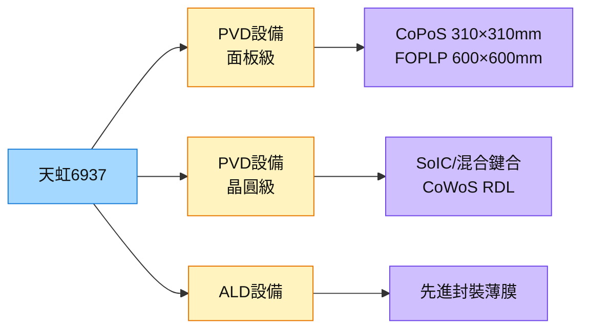

# 6937_天虹（市）

## 基本資料

天虹（6937 TT）是台灣 PVD（物理氣相沉積）/ ALD（原子層沉積）設備廠，主要供應半導體及先進封裝製程的薄膜沉積設備。在先進封裝方面，天虹切入面板級 PVD（CoPoS/FOPLP 面板尺寸 PVD）及混合鍵合（SoIC）製程所需的 PVD 設備，並在玻璃基板 TGV 製程的種子層沉積段佈局。

面板級 PVD 是其差異化競爭點——300mm 晶圓設備廠眾多，但能做 310×310mm（CoPoS）以上面板尺寸 PVD 的廠商遠少於晶圓廠，天虹二三號機訂單進度為重要追蹤指標。

資料來源：[[報告_先進封裝技術發展方向_20260722]]（定錨產業筆記，2026-07-22）

### 2026Q3 營運更新（元大投資論壇，2026-09-09）

- **財務：** 2Q26 營收 7.18 億元（YoY +40.2%）、毛利率 41.65%、EPS 1.58 元；1H26 營收 13.01 億元（YoY +33.6%）、EPS 2.54 元。2025 年為淡年（營收 22.45 億元、EPS 3.01 元），2026 年明顯回升。（fact，高）
- **交機時程：** 12 吋機械式 De-Bonder、Lumina UV ALD、HyFA ALD Chamber 預計 3Q26 交付；Vetra 蝕刻 Chamber 4Q26 交付；310×310 Panel ALD／PECVD／Etch Chamber 預計 1Q27–2Q27 交付，Panel ALD 目標農曆年後交客戶生產。（公司說法，中）
- **PLP 已取得訂單：** 首台 310×310 PLP PVD 已交付策略客戶，並取得多筆 PLP PVD 與 Descum 訂單。
- **新切入點：** 日本競爭對手交付出問題，客戶主動要求天虹驗證 12 吋 Auto Bonder／De-Bonder；光通訊／CPO 客戶近 20 家，化合物半導體新增 InP 客戶（Micro VCSEL）；EUV 二代 Pellicle 量測設備由子公司輝虹開發。日本子公司 JTCK 哲虹已損益兩平。
- 來源：[[活動_天虹6937_元大論壇Memo_20260909]]

## 核心技術／競爭優勢

- **面板級 PVD 二/三號機進駐：** CoPoS 310×310mm 面板需要能處理大面積的 PVD 設備，天虹是台廠中率先佈局的廠商。
- **SoIC/混合鍵合 PVD：** 混合鍵合製程前需 PVD 種子層，CoWoS-R/L 中介層 PVD 同樣是需求端。
- **ALD 能力：** 進一步布局 ALD 薄膜沉積，適應線寬縮小後薄膜均勻性要求。

## 產品與應用

| 產品 / 服務 | 應用 | 相關客戶 / 下游 |
|-------------|------|-----------------|
| 面板級 PVD 設備 | CoPoS/FOPLP 面板製程種子層 | [[2330_台積電（市）]]、[[3711_日月光投控（市）]] |
| 晶圓級 PVD 設備 | SoIC/混合鍵合種子層、CoWoS RDL | 封裝廠通用 |
| ALD 設備 | 先進封裝薄膜均勻性需求 | 通用 |

## 圖片 / 架構圖

```mermaid
flowchart LR
    天虹6937 --> A[PVD設備<br/>面板級]
    天虹6937 --> B[PVD設備<br/>晶圓級]
    天虹6937 --> C[ALD設備]
    A --> D[CoPoS 310×310mm<br/>FOPLP 600×600mm]
    B --> E[SoIC/混合鍵合<br/>CoWoS RDL]
    C --> F[先進封裝薄膜]

    classDef co fill:#a5d8ff,stroke:#1c7ed6,color:#111
    classDef prod fill:#fff3bf,stroke:#e67700,color:#111
    classDef app fill:#d0bfff,stroke:#7048e8,color:#111
    class 天虹6937 co
    class A,B,C prod
    class D,E,F app
```

圖說：天虹在先進封裝 PVD 設備的核心差異化是面板尺寸能力，CoPoS 面板化時代來臨時可大幅受惠。

## 時間軸

| 時間 | 事件 | 類型 | 重要性 | 備註 |
|------|------|------|--------|------|
| 2026-2027 | 面板級 PVD 二/三號機交機 | 放量 | ⭐⭐⭐ | 機台進度是最硬的追蹤指標 |
| 2027 試產 | CoPoS 310×310mm 台積電試産 | 上游催化 | ⭐⭐⭐ | 若延期則訂單遞延 |
| 3Q26 | 12 吋 De-Bonder、Lumina UV ALD、HyFA ALD 交付 | 交機 | ⭐⭐ | [[活動_天虹6937_元大論壇Memo_20260909]] |
| 1Q27–2Q27 | 310×310 Panel ALD／PECVD／Etch 交付 | 交機 | ⭐⭐⭐ | Panel ALD 目標農曆年後交客戶 |

→ 跨公司時程詳見 [[時程_2026-2027高速互連與分散式算力]]

## 供應鏈位置

- 設備供應：先進封裝 PVD/ALD 製程
- 國際競爭：Evatec、AMAT、ULVAC
- 台廠同業：友威科（3580，PVD 玻璃種子層）

## 相關公司

| 公司 | 關係 | 說明 |
|------|------|------|
| [[2330_台積電（市）]] | 客戶 | CoPoS/SoIC/WMCM 面板級 PVD 設備 |
| [[3711_日月光投控（市）]] | 客戶 | FOPLP VIPack PVD 設備 |

> [!warning] 風險與注意事項
> - **CoPoS 時程風險：** 報告提示 CoPoS 可能延遲最多 2 年，面板級 PVD 設備訂單隨之遞延。
> - **國際競爭：** Evatec/AMAT 在 PVD 技術實力更強，天虹需以服務和面板規格差異化。
> - **小廠流動性：** 市值相對小，研究報告少，需以法說/客戶訊息追蹤。

## 來源

- [[報告_先進封裝技術發展方向_20260722]] — 定錨產業筆記講座，2026-07-22
- [[活動_天虹6937_元大論壇Memo_20260909]] — 元大投資論壇即時 Memo，2026-09-09

## 相關頁面

- [[技術_FOPLP]]
- [[分析_晶片尺寸擴大與面板級封裝2026]]
- [[技術_CoWoS與先進封裝]]
