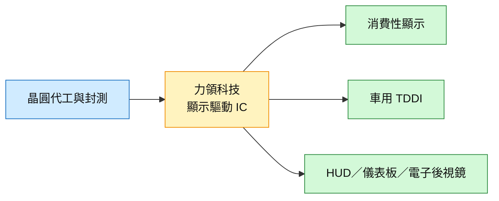

# 6996_力領科技（櫃）

## 基本資料

力領科技（6996.TW）為顯示驅動 IC 業者，產品由一般 STN 顯示驅動延伸至車用 TDDI、HUD、儀表板與電子後視鏡等高階應用。統一投顧 2026-09-22 報告指出，車用產品漲價與產品組合改善推升毛利率，非車用客戶則處於庫存調整；公司在供應鏈位置上屬顯示面板／車用電子的驅動 IC 供應商。

## 核心技術／競爭優勢

- 車用顯示驅動產品可由 TDDI 延伸至 HUD、儀表板及電子後視鏡，產品單價與毛利率高於一般消費性顯示驅動。
- 車用客戶對成本轉嫁的接受度較高，能降低面板與晶圓代工成本上升對毛利率的壓力。
- 車用與非車用產品並行，讓公司在非車用庫存調整期間仍可由車用拉貨支撐獲利。

## 產品與應用

| 產品 / 服務 | 應用 | 相關客戶 / 下游 |
|---|---|---|
| STN 顯示驅動 IC | 一般消費與工控顯示 | 顯示模組廠，客戶未具名 |
| 車用 TDDI | 中控螢幕、車載顯示 | 車用顯示客戶，報告未具名 |
| HUD／儀表板／電子後視鏡驅動 IC | 車用前裝與後裝顯示 | 車廠／Tier 1，客戶未具名 |

## 圖片 / 架構圖

圖說：力領的成長重心由一般顯示驅動逐步轉向車用 TDDI 與高階顯示應用，產品組合是毛利率變化的核心觀察點。

## EPS 預估

| 年度 | 統一投顧 EPS（報告日：2026-09-22） | 備註 |
|---|---:|---|
| 2026E | 15.70 | estimate；漲價與車用 mix 上修 |
| 2027E | 17.90 | estimate；HUD、電子後視鏡與前裝 TDDI 放量假設 |

## EPS 記錄

| 季度 | EPS（元） | 備註 |
|------|----------|------|
| 2Q26 | 4.54 | 統一：營收創高 8.61 億（+19.6% QoQ、+39.7% YoY）、毛利率 43%（+2.2ppt QoQ）；優於原估 3.17 |
| 1Q26 | 3.24 | — |

（26 年現金股利以 10 元計、配息率約 80–82%，統一以 26E EPS 15.7 元估殖利率約 7.3%）

## 目標價與評等

| 券商 | 報告發布日 | 評等 | 目標價 | 評價基礎 | 來源 |
|---|---|---|---:|---|---|
| 統一投顧 | 2026-09-22 | 買進（維持） | NT$215（原 NT$200） | 12x 2027E EPS（約當 6% 殖利率） | [[報告_統一_力領科技_20260922]] |

## 時間軸

| 時間 | 事件 | 類型 | 重要性 | 備註 |
|---|---|---|---|---|
| 2026Q2 | 漲價與車用產品 mix 改善推升毛利率至 42.99% | 財務 | ⭐⭐⭐ | 報告回顧，屬來源數據 |
| 2026Q4 | HUD 與電子後視鏡驅動 IC 開始較大幅出貨 | 放量 | ⭐⭐⭐ | 統一投顧估計，需以營收與客戶出貨驗證 |
| 2027 | 前裝品牌客戶加入、車用產品全年貢獻 | 放量 | ⭐⭐⭐ | 公司／券商展望，客戶未具名 |

## 供應鏈位置

- 上游：晶圓代工、封裝測試與驅動 IC 製程服務。
- 中游：顯示驅動 IC 設計與產品驗證。
- 下游：車用顯示模組、車廠 Tier 1 與消費性顯示設備。
- 所屬主題：[[供應鏈_AI伺服器PCB]]（僅作半導體材料與製程觀察的相鄰鏈，不代表直接供應關係）。

## 相關公司

目前來源未揭露可確認的特定客戶、供應商或競爭對手，先保留 `related_companies: []`；後續以公司法說或公開資料補充。

## 相關頁面

- [[時程_2026記憶體與AI催化劑]]
- [[供應鏈_AI伺服器PCB]]（相鄰材料觀察主線）

> [!warning] 風險與注意事項
> - 非車用客戶庫存調整若延長，可能抵銷車用新品放量。
> - 車用前裝驗證週期長，2027 年全年貢獻仍屬公司／券商展望。
> - 目標價與 EPS 為統一投顧 estimate，不代表公司財測或已確認訂單。

## 統一 2026-09-22 更新：車用產品邁向高階，評價具吸引力

- 統一維持買進、目標價由 NT$200 上修至 NT$215（12x 2027E EPS、約當 6% 殖利率）。
- **2Q26 大幅優於預期**：營收創高 8.61 億元（+19.6% QoQ、+39.7% YoY），車用與非車用皆雙位數增長（非車用 driver 有提前拉貨）；毛利率 43%（+2.2ppt QoQ）、EPS 4.54（原估 3.17）。
- **3Q26**：非車用客戶庫存調整，7/8 月營收 2.55／2.39 億元 MoM 走低；但車用拉貨穩健、占比提升，毛利率估升至 43%+；下修 3Q26 營收至 7.54 億、上修 EPS 至 3.79。
- **4Q26–2027**：車用新品（HUD、儀表板、電子後視鏡 driver）開始出貨，車用客戶較能接受漲價；2027 車用產線營收估 +20% YoY，前裝品牌客戶加入。
- **獲利預估（統一 estimate）**：上修 26E EPS 至 15.69 元（原 13.45）、27E 17.88 元；毛利率 26/27 年約 42.7%／43.4%。來源：[[報告_統一_力領科技_20260922]]（統一投顧，2026-09-22；信心中）。

## 來源

- [[報告_統一_力領科技_20260922]] — 統一投顧，2026-09-22；車用高階化、2Q26 優於預期、EPS 15.69/17.88、TP NT$215
- [[報告_統一_早報_20260922]] — 統一投顧，2026-09-22（早報彙整）

