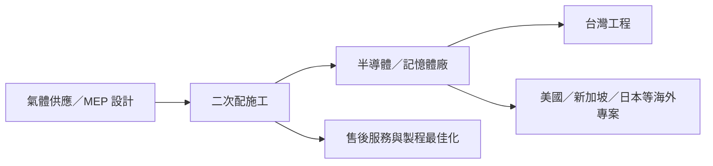

# 7631_聚賢研發-創（市）

## 基本資料

聚賢研發-創（GENII IDEAS，7631.TW）為台灣創新板上市公司，成立於 2018 年，核心為高科技廠房的 MEP 機電、特殊氣體二次配與多系統整合工程。[[活動_聚賢研發法說_20260917]] 稱工程收入約占 97%，在手訂單約 20 億元、消化期約 1.5–2 年；海外營收認列較集中於 2027 年。

## 核心技術／競爭優勢

- **特殊氣體二次配**：從高科技廠房的氣體供應系統設計、施工到多系統二次配整合。
- **海外專案執行**：在美國、日本、新加坡與德國布局子公司，隨客戶建廠提供在地施工服務。
- **製程與設備服務延伸**：管路製程最佳化、零組件及耗材設計、售後服務與自動化整合。

## 產品與應用

| 產品／服務 | 應用 | 相關客戶／下游 |
|---|---|---|
| 特殊氣體二次配 | 半導體與高科技廠房 | 客戶未具名 |
| 多系統二次配工程 | 海外半導體／記憶體廠擴建 | 美國、新加坡專案；客戶未具名 |
| MEP 機電工程與售後服務 | 高科技廠房建置與維護 | 客戶未具名 |

## 圖片 / 架構圖

> 聚賢研發位於高科技廠房的二次配與機電工程環節；來源未揭露具名客戶，故不推定與特定晶圓廠或記憶體廠的供應關係。來源：[[活動_聚賢研發法說_20260917]]。

## 時間軸（催化劑）

| 時間 | 事件 | 類型 | 重要性 | 備註 |
|---|---|---|---|---|
| 2026H2 | 營收可能低於 1H26 | 營運 | ⭐⭐⭐ | 海外案件認列偏後，非需求消失判定 |
| 2026-09–2027-03 | 美國 P2 多系統二次配施工 | 海外工程 | ⭐⭐⭐ | 客戶未具名，收入認列依施工進度 |
| 2026-10–2027-01 | 新加坡半導體廠第二期工程施工 | 海外工程 | ⭐⭐ | 客戶未具名 |
| 2026-12–2027-12 | 新加坡美系記憶體客戶工程施工 | 海外工程 | ⭐⭐⭐ | 客戶未具名，需追蹤認列與毛利 |
| 2027Q2（預估） | 美國 P3 二次配可能發包 | 接單／驗證 | ⭐⭐ | 管理層展望，非已取得訂單 |

## 供應鏈位置

- 位於半導體／高科技廠房建置的特氣二次配、MEP 與多系統整合工程環節。
- 相關產業自動化脈絡見 [[供應鏈_工業自動化]]；本來源未提供可確認的具名上下游。

## 相關公司

| 公司 | 關係 | 說明 |
|---|---|---|
| — | — | 原始法說未揭露具名客戶、供應商或製造夥伴。 |

## 風險與注意事項

> [!warning]
> - 工程營收依進度認列，海外案集中於 2027 可能使 2026H2 短期承壓。
> - 海外工程毛利率略低於國內，實際人力、成本與驗收進度將影響獲利。
> - 在手訂單、年營收成長 20% 目標與 P3 發包均為管理層／券商轉述，非已確定財測或新訂單。

## 來源

- [[活動_聚賢研發法說_20260917]] — 富邦投顧，2026-09-17。
- [台灣證券交易所上市公告](https://wwwc.twse.com.tw/staticFiles/news/news/tsecnews/8a8216d6956a7ba2019589a21e7800c7.pdf) — 7631 於創新板上市，2026-09-22 查閱。

## 相關頁面

- [[分析_聚賢研發海外二次配工程認列_20260917]]
- [[時程_2026廠務與資料中心通路催化劑]]
