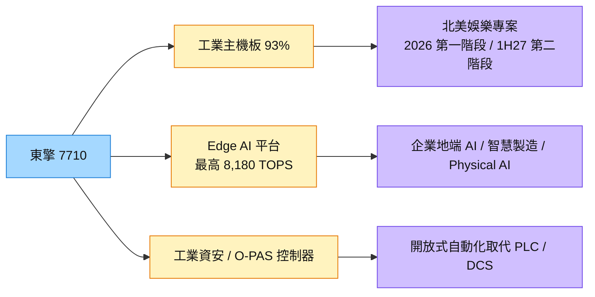

# 7710_東擎（興）

## 基本資料

東擎（ASRock Industrial）為 [[3515_華擎（市）]] 子公司，主力為工業級主機板、嵌入式電腦與強固型 Edge AIoT 平台。2025 年 10 月 28 日登錄興櫃，媒體報導預計 2026 年 10 月下旬轉上市（掛牌後需更新檔名與上市別）。

- **財務：** 1H26 營收 17.58 億元、毛利率 29.1%、營益率 15.6%、稅後淨利 2.67 億元、EPS 4.30 元；1H26 營收已接近 2025 全年 18.26 億元（2025 EPS 3.68 元）。毛利率由 2025 年 38.7% 降至 29.1%，因北美大型娛樂（串流）專案毛利較低。
- **北美大型專案：** 第一階段主機板出貨至 9 月（高峰 3–9 月），整機系統由美國 SI 協助；第二階段已確定下單，預計 2027 上半年出貨、規格升級帶動 ASP。客戶採用主因為資本支出與電費較低。
- **展望：** 2H26 營收預期較 1H26 下滑個位數至低雙位數，但組合回歸傳統產品、毛利率回升；2027 年營收仍以年增兩成以上為目標（高基期下增幅收斂）。
- **組合：** 1H26 美洲占 62%（2025 年 36%）；Entertainment 占 49%（2025 年 7%）；工業電腦主機板占 93%。

資料來源：[[活動_東擎7710_CallMemo_20260901]]（元大投顧 Call Memo，2026-09-01）

## 核心技術／競爭優勢

- **Edge AI 五層產品線：** 由輕量推論到企業級 AI 平台（最高 8,180 TOPS），搭配 AI Pathfinder、KMSpark（企業地端知識庫）、InduAgent、AIUAC Copilot 等軟體。
- **工業資安：** 已取得 IEC 62443-4-1、IEC 62443-4-2 SL2／SL3 與 ISO 27001，因應 2027 年上路的 EU CRA。
- **開放式自動化：** 取得全球首個 O-PAS 認證工業控制器，參與 O-PAS 場域落地，切入取代封閉式 PLC／DCS 的趨勢。

## 產品與應用

| 產品 / 服務 | 應用 | 相關客戶 / 下游 |
|-------------|------|-----------------|
| 工業級主機板 | 北美娛樂／串流專案、工控 | 北美大型客戶（經美國 SI） |
| AI BOX、Edge AI 平台 | 企業地端 LLM、KMSpark 知識庫 | 企業 |
| 強固型 Edge AI（InduAgent） | 智慧製造、機器視覺 | 製造業 |
| O-PAS 工業控制器 | 開放式流程自動化 | 歐美大型客戶驗證中 |

## 圖片 / 架構圖

圖說：東擎短期由北美大型專案驅動，中長期以 Edge AI、工業資安與開放式架構三條線轉型為邊緣 AI 平台。

## EPS 記錄

| 期間 | EPS (元) | 備註 |
|------|---------|------|
| 1H26 | 4.30 | 已超越 2025 全年 3.68 元 |

## 時間軸

| 時間 | 事件 | 類型 | 重要性 | 備註 |
|------|------|------|--------|------|
| 2026-09 | 北美娛樂專案第一階段結束 | 營運 | ⭐⭐ | 2H26 營收較 1H26 下滑 |
| 2026-10 下旬 | 轉上市（媒體報導） | 資本市場 | ⭐⭐ | 掛牌後更新頁名 |
| 1H27 | 北美專案第二階段出貨 | 放量 | ⭐⭐⭐ | [[活動_東擎7710_CallMemo_20260901]] |
| 2027 | EU CRA 上路，工業資安成為門檻 | 法規 | ⭐⭐ | 公司已取得 IEC 62443 |

→ 跨公司時程詳見 [[時程_2026工業自動化與人形機器人]]

## 供應鏈位置

- 上游：CPU、DRAM、PCB（目前偏緊，公司以預收款與提前備料因應，庫存約 3.5 個月）
- 下游：北美娛樂專案、企業 AI、智慧製造與機器人客戶
- 母公司：[[3515_華擎（市）]]
- 所屬供應鏈：[[供應鏈_工業自動化]]

## 相關公司

| 公司 | 關係 | 說明 |
|------|------|------|
| [[3515_華擎（市）]] | 母公司 | 東擎為華擎工業電腦子公司 |

## 風險與注意事項

> [!warning] 風險與注意事項
> - **客戶集中：** 1H26 Entertainment 占 49%，單一北美專案影響大。
> - **記憶體成本：** 專案使用記憶體，毛利率低於傳統產品；記憶體漲價可能影響第二批訂單時程。
> - **高基期：** 2027 年成長率受 2026 年高基期影響。

## 來源

- [[活動_東擎7710_CallMemo_20260901]] — 元大投顧 Call Memo，2026-09-01
- [[活動_華擎3515_CallMemo_20260916]] — 華擎法說，2026-09-16

## 相關頁面

- [[時程_2026-2027高速互連與分散式算力]]
