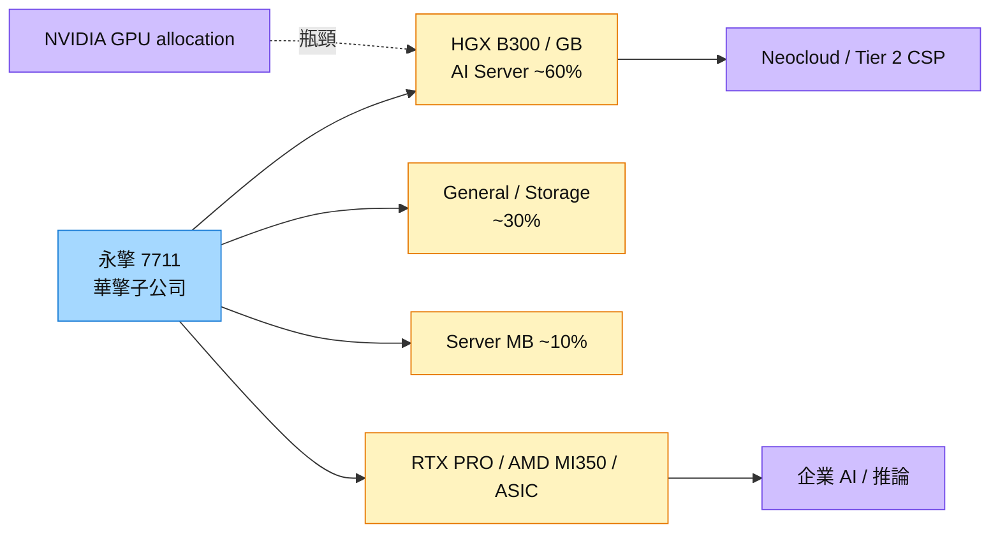

# 7711_永擎（市）

## 基本資料

永擎（ASRock Rack）為 [[3515_華擎（市）]] 旗下伺服器公司，2024 年 12 月登錄興櫃、2025 年 11 月 19 日轉上市。產品涵蓋 AI／GPU Server、General／Storage Server、Server Motherboard 與 Rack-level System；相較大型 ODM 主攻 Tier 1 CSP，永擎主要服務 Tier 2 CSP、GPU Cloud／Neocloud、AI 新創與企業，強項是客製化與快速交付，但 GPU allocation 順位較後，單月營收波動大。

- **財務：** 2Q26 營收 68.2 億元（QoQ −23.3%、YoY +9.2%）、毛利率 18.9%（創新高）、營益率 12%、EPS 9.76 元；1H26 營收 157.1 億元（YoY +44.5%）、毛利率 15.2%、EPS 17.44 元，已超過 2025 全年 13.04 元。
- **產品組合：** 2025 年 AI 80%／General 10%／MB 10%；1H26 AI 約 60%／General 近 30%／MB 約 10%。毛利率排序：MB＞高毛利 System＞RTX PRO／ASIC＞HGX。華擎表示 4Q26 隨 GB 產品放量，AI 占比可望回到近 80%。
- **展望：** 管理層維持 1H：2H＝40：60，推算 FY26 營收約 393 億元；動能為 B300／GB、RTX PRO（2Q 提前量產）、ASIC（3Q、4Q 增加）與 General Server。最大瓶頸是 NVIDIA GPU allocation：7 月營收 51.44 億元、8 月降至 21.54 億元，反映 GPU 到貨時點而非需求轉弱。
- **營運資金：** 1H26 存貨 95.09 億元、占總資產近六成，營業現金流出 36.42 億元；管理層確認有籌資需求（現增、CB 或銀行融資待董事會決議）。

資料來源：[[活動_永擎7711_2Q26法說Memo_20260915]]（2Q26 法說 Call Memo，2026-09-15）；[[活動_華擎3515_CallMemo_20260916]]

## 核心技術／競爭優勢

- **Time to Compute：** 先備齊 GPU 以外 BOM，GPU 一到即組裝 Server／Rack 並部署，協助 Neocloud 提早出租算力。
- **多平台：** NVIDIA（B300、GB、RTX PRO、HGX Rubin NVL8 液冷）、AMD（EPYC 9005＋Instinct MI350／MI355X＋Pensando Pollara 400）、ASIC 平台並行。
- **液冷部署：** Greenfield AI 資料中心傾向 Day 1 液冷；永擎負責 Server 與初期 Deployment，後續維運交給在地合作夥伴。
- **主機板基本盤：** MB 毛利率最高，維持產品組合下限。

## 產品與應用

| 產品 / 服務 | 應用 | 相關客戶 / 下游 |
|-------------|------|-----------------|
| HGX B300／GB 系列 AI Server、Rack | 大型訓練與推論叢集 | Neocloud、Tier 2 CSP；平台來自 [[NVDA.US(nvidia)]] |
| RTX PRO Server | 企業 AI、Agentic AI、推論 | 企業客戶 |
| AMD Instinct MI350／MI355X 系統 | AI 訓練與推論 | [[AMD.US(amd)]] 平台客戶 |
| ASIC Server | TPU／Trainium／MTIA 類平台 | ASIC 客戶 |
| General／Storage Server、Server MB | 通用運算與儲存 | 企業與雲端 |

## 圖片 / 架構圖

圖說：永擎以 Neocloud 與企業 AI 為主，營收高度受 GPU 配額到貨節奏影響；RTX PRO、ASIC 與一般伺服器拉高毛利率。

## EPS 記錄

| 期間 | EPS (元) | 備註 |
|------|---------|------|
| 2Q26 | 9.76 | 毛利率 18.9% 創新高 |
| 1Q26 | 7.68 | 由 1H26 EPS 17.44 元回推 |
| 1H26 | 17.44 | 已超越 2025 全年 13.04 元 |

## 時間軸

| 時間 | 事件 | 類型 | 重要性 | 備註 |
|------|------|------|--------|------|
| 2H26 | B300／GB、RTX PRO、ASIC 放量；1H：2H＝40：60 | 放量 | ⭐⭐⭐ | [[活動_永擎7711_2Q26法說Memo_20260915]] |
| 4Q26 | GB 產品放量，AI 占比回到近 80% | 放量 | ⭐⭐ | 華擎法說 |
| 待定 | 籌資方案（現增／CB／銀行）董事會決議 | 財務 | ⭐⭐ | 營運資金需求 |
| 2027 | Vera Rubin、AMD Instinct、ASIC＋液冷 Rack 帶動 ASP 提升 | 規格升級 | ⭐⭐⭐ | 已展示 HGX Rubin NVL8 液冷平台 |

→ 跨公司時程詳見 [[時程_2026-2027高速互連與分散式算力]]

## 供應鏈位置

- 上游：GPU（NVIDIA／AMD）、HBM／DRAM、SSD、Power IC、PCB
- 下游：Neocloud（CoreWeave 型 GPU Cloud 商業模式）、Tier 2 CSP、企業與垂直 AI
- 母公司：[[3515_華擎（市）]]
- 所屬供應鏈：AI 伺服器，參見 [[分析_2026Q3半導體供需與AI伺服器供應鏈]]

## 相關公司

| 公司 | 關係 | 說明 |
|------|------|------|
| [[3515_華擎（市）]] | 母公司 | 永擎為華擎伺服器子公司 |
| [[NVDA.US(nvidia)]] | 上游 GPU 平台 | B300／GB／RTX PRO／Rubin，GPU 配額為主要瓶頸 |
| [[AMD.US(amd)]] | 上游 GPU 平台 | MI350／MI355X、EPYC 9005 |

## 風險與注意事項

> [!warning] 風險與注意事項
> - **GPU 配額：** 單月營收隨 GPU 到貨大幅波動。
> - **營運資金與稀釋：** 存貨約 95 億元、現金流出，若 GPU 供需反轉恐轉為財務壓力；籌資可能稀釋股本。
> - **毛利率稀釋：** GB 系統單價高但毛利率低於既有產品。
> - **客戶集中於 Neocloud：** 營運與 Neocloud 融資與資本支出循環連動。

## 來源

- [[活動_永擎7711_2Q26法說Memo_20260915]] — 2Q26 法說 Call Memo，2026-09-15
- [[活動_華擎3515_CallMemo_20260916]] — 華擎法說（元大），2026-09-16
