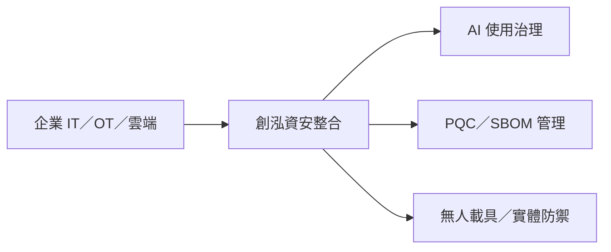

# 7714_創泓科技（櫃）

## 基本資料

創泓科技提供企業資安產品加值服務與通路整合，範圍涵蓋地端、雲端、OT 網路、SaaS 與 AI 應用。公司將 AI 治理、後量子密碼（PQC）、SBOM 與無人載具實體防護列為第二成長曲線；相關財務和商業化主張以 2026-09-02 Call Memo 為準。

## 核心技術／競爭優勢

- 以原廠、加值服務、經銷商與客戶的通路模式，覆蓋政府、高科技、金融、製造與醫療客群。
- 將資安治理延伸至 AI 模型可視化、資料外傳防護及 AI SBOM，切中企業使用未授權模型的風險。
- C2 Defense System 整合雷達、干擾與 EO／IR 追蹤；DevaEye MDR 以 Agent 進行持續監控，屬公司方案描述。

## 產品與應用

| 產品／服務 | 應用 | 進度／邊界 |
|---|---|---|
| 資安加值服務 | 地端、雲端、OT 與 SaaS | 既有核心業務 |
| AI 治理與模型可視化 | AI 使用合規、資料保護 | 客戶詢問熱度為公司轉述 |
| PQC／SBOM 管理平台 | 遷移、盤點與供應鏈資安 | 自研規劃，未揭露商業化規模 |
| C2 Defense／DevaEye MDR | 無人機與實體安全 | 應用拓展中 |

## 圖片 / 架構圖

圖說：創泓將既有資安服務延伸至 AI 治理、軟體供應鏈與實體安全；架構依 2026-09-02 Call Memo 整理。

## 時間軸

| 時間 | 事件 | 類型 | 重要性 | 備註 |
|---|---|---|---|---|
| 2026-09-02 | 業績發表與 AI／PQC 策略更新 | 發表會 | ⭐⭐ | 來源為券商 memo |
| 2026 年底 | 政府 PQC 標準預計提出 | 規格／法規 | ⭐⭐ | 來源轉述，待官方文件 |
| 2035 | 美國 NIST PQC 轉換目標 | 規格／法規 | ⭐ | 長期環境，不等於公司營收 |

→ 跨公司時程參見 [[時程_2026AI軟體與軍工AIoT催化劑]]。

## 供應鏈位置

- 上游：資安軟體原廠、儲存與網路產品供應商。
- 下游：金融、政府、高科技製造、醫療與關鍵基礎設施客戶。
- 無明確可回溯的既有公司關係，`related_companies` 暫維持空白。

## 相關公司

| 公司 | 關係 | 說明 |
|---|---|---|
| 翔龍航太、億達通、天淵實業 | 投資／合作對象 | 來源稱為無人載具布局的一部分；尚未建立公司頁 |

> [!warning] 風險與注意事項
> - PQC、AI SBOM 與無人載具業務仍屬新布局，詢問度不等於合約或營收。
> - 法規時程與採購預算可能延後，且資安通路競爭會影響服務毛利。

## 來源

- [[memo_國泰證期_創泓科技CallMemo_20260902]]（國泰證期研究部，2026-09-02）

