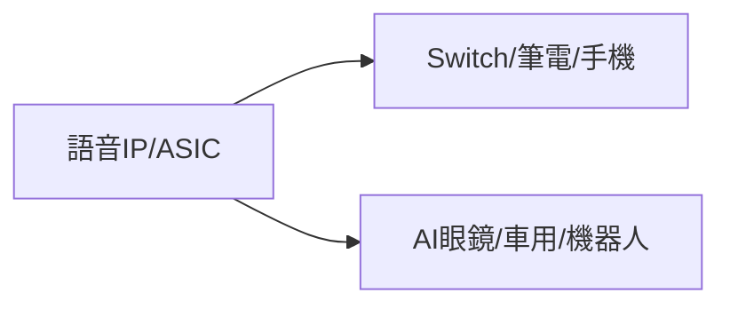

# 7749_意騰-KY（市）

## 基本資料
意騰-KY提供語音辨識、音訊處理、ASIC 與 IP，應用於 Switch、筆電、手機、AI 眼鏡、車用與機器人。2026Q2 公司簡報揭露營收 NT$551.7m、EPS 4.01，年增主要來自 Switch 2、聲學與 Cyberon；2027 年管理層預期維持雙位數成長。

## 核心技術／競爭優勢
- 語音辨識與音訊演算法 IP。
- ASIC 與 IP 混合模式，能在不同客戶量體間彈性配置。
- Switch 2、AI 眼鏡與多模態裝置的客戶導入經驗。

## 產品與應用
|產品|應用|下游|
|---|---|---|
|語音／音訊 ASIC|遊戲主機、筆電、手機|消費電子品牌|
|Cyberon 語音 IP|AI眼鏡、車用、機器人|OEM/ODM|

## 圖片 / 架構圖

## 時間軸
|時間|事件|類型|重要性|
|---|---|---|---|
|2026Q3|營收持續成長、ASIC mix 改善|放量|⭐⭐⭐|
|2027|AI眼鏡與多模態平台擴張|新品|⭐⭐|

## 供應鏈位置
- 上游：晶圓代工與封測。
- 下游：消費電子、車用與智慧裝置；所屬主題：[[供應鏈_AI伺服器PCB]]。

## 相關公司
|公司|關係|說明|
|---|---|---|
|[[2454_聯發科（市）]]|同業／平台夥伴|邊緣 AI SoC 生態系|

> [!warning] 風險與注意事項
> - Switch 2 與消費電子季節性可能造成季度波動。
> - AI 眼鏡、車用與機器人仍屬客戶導入期，時程為管理層展望。

## 來源
- [[報告_意騰-KY_2026Q2法說簡報_20260828]]（公司簡報，2026-08-28）
- [[活動_意騰-KY法說_20260828]]（AlphaMemo.ai，2026-08-28）

## 相關頁面

- [[分析_20260825-28_半導體設備材料與AI應用法說]]
