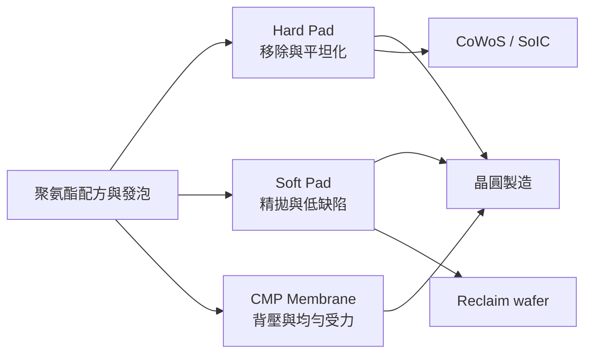

# 7768_頌勝科技（市）

## 基本資料

頌勝科技（7768.TW）於 2026-05-07 在 TWSE 上市，主要供應 [[技術_CMP]] 用 Hard Pad、Soft Pad、CMP Membrane 等聚氨酯耗材，應用涵蓋晶圓製造、晶圓再生及 CoWoS／SoIC 等先進封裝。1H26 半導體產品占營收 66%，為公司主要成長來源；產能目前接近滿載，短期以四班二輪提高稼動率，中期由合肥與中科新廠承接需求。

## 核心技術／競爭優勢

- CMP Pad 配方與孔隙控制：Hard Pad 需同時平衡材料移除率、平坦化能力與不同材料介面，認證門檻高。
- 第二供應來源地位：Soft Pad 已通過部分晶圓廠與 reclaim wafer 客戶認證並開始供貨，受惠客戶降低單一供應商風險。
- 客戶共同開發：部分產品已由單純二供進展至與客戶共同制定規格，提升驗證黏著度。
- 區域化供應：合肥廠服務中國市場，台灣產能服務非中國客戶，以配合地緣政治分流與在地化需求。

## 產品與應用

| 產品 / 服務 | 應用 | 相關客戶 / 下游 |
|-------------|------|-----------------|
| CMP Hard Pad | 較高材料移除率與全域平坦化 | 晶圓製造、CoWoS／SoIC 先進封裝客戶（未具名） |
| CMP Soft Pad | 最終表面拋光、降低刮傷與缺陷 | 晶圓廠、reclaim wafer 客戶（未具名） |
| CMP Membrane | CMP 載具背壓與晶圓均勻受力控制 | 晶圓製造客戶（未具名） |
| PU／醫療與運動材料 | 傳統聚氨酯與代工產品 | 醫療、運動與工業客戶 |

## 圖片 / 架構圖

圖說：頌勝的成長主線由傳統 PU 材料轉向 CMP Pad／Membrane；Pad 配方、製程穩定度與客戶認證共同構成進入障礙。

## EPS 記錄

| 季度 | EPS（元） | YoY | 備註 |
|------|----------|-----|------|
| 2026Q2 | 1.70 | — | 營收 5.71 億元、毛利率 52.08%；掛牌一次性費用拉高費用 |

## 時間軸

| 時間 | 事件 | 類型 | 重要性 | 備註 |
|------|------|------|--------|------|
| 2026Q3 | 新 Soft Pad 產線開始試產 | 技術下線 | ⭐⭐⭐ | 目標 4Q26 達到舊線品質並承接量產 |
| 2026Q4 | 合肥廠開始送樣與新廠認證 | 驗證 | ⭐⭐⭐ | 2027 年起貢獻營收 |
| 2027 | 高階 Soft Pad 陸續取得客戶認證 | 驗證 | ⭐⭐⭐ | 指標客戶通過後可加速複製 |
| 2027Q2 | 中科新廠預計取得使用執照 | 擴產 | ⭐⭐ | 缺工與設計變更曾使時程略延後 |
| 2027Q3 | 中科新廠開始試產 | 技術下線 | ⭐⭐⭐ | 2H27 起逐步增加量產能力 |

→ 跨公司比較詳見 [[時程_2026記憶體與AI催化劑]]。

## 供應鏈位置

- 上游：聚氨酯原料、發泡與精密加工設備。
- 中游：[[技術_CMP]] Pad／Membrane 製造與客戶認證。
- 下游：晶圓製造、reclaim wafer 與 CoWoS／SoIC 等先進封裝製程。
- 所屬研究鏈：[[供應鏈_先進封裝載板]]。

## 相關公司

目前來源未揭露可具名的客戶或主要競爭者，`related_companies` 暫留空，待公司公告或可驗證來源補齊。

> [!warning] 風險與注意事項
> - 客戶認證與新廠認證時間長，合肥／中科產能貢獻可能遞延。
> - 現有產線接近滿載，若新產能未及時開出，可能限制接單並增加加班成本。
> - Soft Pad 價格約為 Hard Pad 的 1/3–1/4，成長需依靠量產放大與良率穩定。
> - 傳統醫療／運動材料受美國消費需求疲弱影響，可能抵銷半導體成長。

## 來源

- [[活動_頌勝科技法說_20260814]] — 公司法說會 memo，2026-08-14
- [TWSE 上市公司基本資料](https://www.twse.com.tw/staticFiles/news/news/tsecnews/8a8216d69dbea9fd019dfc95bee5010f.pdf) — 頌勝科技 7768、TWSE 上市，2026-05-06

## 相關頁面

- [[技術_CoWoS與先進封裝]]
