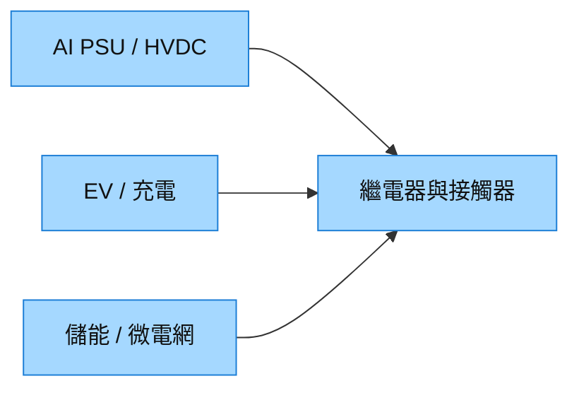

# 7788_松川精密（市）

## 基本資料
松川精密製造繼電器與接觸器，應用於電動車、充電、儲能及 AI 伺服器電力。國泰證期 Call Memo 指 1H26 AI POWER 占比 17%、新能源應用占比 55%，公司並以越南、墨西哥與嘉義擴產支援高功率產品。來源：[[memo_國泰證期_松川精密CallMemo_20260908]]。

## 核心技術／競爭優勢
- 產品由 Relay 延伸至 Contactor，電壓規格朝 400V、800V、1,500V 演進。
- 全球製造據點可對應新能源客戶的區域供貨需求。
- AI POWER、儲能、車用三條高壓應用共用高電壓／高電流產品能力。

## 產品與應用
| 產品／服務 | 應用 | 下游 |
|---|---|---|
| 繼電器／接觸器 | AI PSU、HVDC、PDU、SST | AI 資料中心電力架構 |
| 高壓電控元件 | EV、充電、BMS、DC/DC | 車用與充電系統 |
| 電力控制元件 | 儲能、微電網、逆變器 | 能源系統 |

## 圖片 / 架構圖

圖說：同一高壓開關元件能力可覆蓋資料中心、車用與儲能。

## 時間軸（催化劑）
| 時間 | 事件 | 類型 | 重要性 | 備註 |
|---|---|---|---|---|
| 2026H2 | 高功率 AI POWER 產品陸續量產 | 放量 | ⭐⭐⭐ | 來源為公司展望 |
| 2026 | 越南、墨西哥、嘉義擴產 | 產能開出 | ⭐⭐ | 進度待追蹤 |

## 供應鏈位置
- 屬資料中心電力與車用高壓開關元件供應商；可連結 [[技術_800VDC供電架構]]，但特定平台導入尚未確認。

## 相關公司
| 公司 | 關係 | 說明 |
|---|---|---|
| — | — | 本次來源未具名揭露可連結的公司關係。 |

> [!warning] 風險與注意事項
> - AI POWER 占比與高功率產品量產均屬 Call Memo 口徑，仍須以公司公告驗證。
> - EV、儲能需求與原料、客戶拉貨節奏可能造成波動。

## 來源
- [[memo_國泰證期_松川精密CallMemo_20260908]] — 國泰證期研究部，2026-09-08
