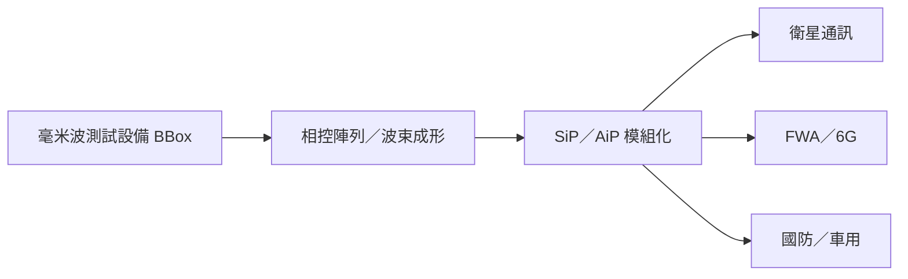

# 7812_稜研科技-創（市）

## 基本資料

稜研科技以毫米波相控陣列天線、波束成形與測試設備為核心，應用延伸至衛星通訊、5G／6G FWA、國防與車用雷達。公司於 2026-09-22 由興櫃轉至臺灣證券交易所創新板上市；本頁的營運與技術資訊主要來自上市前業績發表會。

## 核心技術／競爭優勢

- 模組化相控陣列（CloverCell）讓同頻段設計有 30%–40% 共通性，降低客製開發與驗證時間。
- 將 SiP／AiP 與高頻射頻晶片整合，目標是在高頻天線的路徑損耗、散熱與量產成本間取得平衡。
- BBox 測試設備先切入研發端，再串接模組量產；設備的高毛利與客戶黏著度是商業模式的第一曲線。

## 產品與應用

| 產品／服務 | 應用 | 進度／邊界 |
|---|---|---|
| BBox 毫米波測試設備 | 6G、FR2／FR3 研發與驗證 | 公司稱已售往 34 國、2,200+ 機構 |
| 相控陣列／AiP 模組 | 衛星終端、FWA、國防 | 客戶與量產規模未揭露 |
| AESA／戰術通訊模組 | 國防與雷達 | 出貨與專案狀態為公司轉述 |
| 車載 CPD／通訊雷達 | 車用感測與連網 | 仍屬應用拓展階段 |

## 圖片 / 架構圖

圖說：以測試設備、相控陣列與封裝天線串接衛星、固定無線與國防應用；架構依 2026-09-01 業績發表會整理。

## 時間軸

| 時間 | 事件 | 類型 | 重要性 | 備註 |
|---|---|---|---|---|
| 2026-09-01 | 上市前業績發表會 | 發表會 | ⭐⭐ | 技術與商業化更新 |
| 2026-09-22 | 創新板上市 | 資本市場 | ⭐⭐⭐ | 由興櫃轉板 |
| 2026H2–2027 | 印度毫米波 FWA 驗證／量產進度 | 驗證 | ⭐⭐⭐ | 公司展望，待客戶確認 |

→ 跨公司時程參見 [[時程_2026AI軟體與軍工AIoT催化劑]]。

## 供應鏈位置

- 上游／能力基礎：高頻射頻晶片、先進封裝與電子製造服務。
- 下游：衛星營運商、網通 ODM、國防系統與車用感測應用。
- 現有頁面尚無精確對應的毫米波／衛星供應鏈主軸，暫不建立新標籤或供應鏈頁。

## 相關公司

| 公司 | 關係 | 說明 |
|---|---|---|
| Comtech | 策略合作夥伴 | 公司稱共同整合衛星數據機與相控陣列終端；尚未建立公司頁 |

> [!warning] 風險與注意事項
> - 衛星、國防與 FWA 專案週期長，設計導入不等於量產營收。
> - 模組毛利率與量產時程主要為公司目標或產業描述，尚缺第三方驗證。

## 來源

- [[活動_富邦投顧_稜研科技業績發表會_20260901]]（富邦投顧，2026-09-01）

