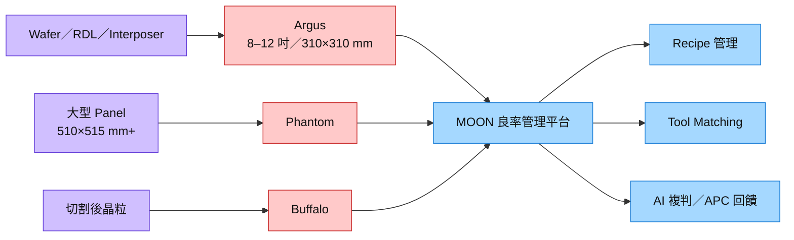

# 7853_政美應用（興）

## 基本資料

政美應用（CMIT，7853）是台灣自動光學檢測（AOI）、量測與良率管理設備商，提供設備、MOON 軟體平台及售後服務。公司軟硬體由台灣團隊自行開發、設計與製造，設備採模組化架構，可配合客戶製程共同開發與改機；成長主線由 [[技術_CoWoS與先進封裝|CoWoS／先進封裝]] 的 RDL、Silicon Interposer 與切割後檢測，延伸至 [[技術_CPO]]、[[技術_玻璃基板|TGV]]、[[技術_混合鍵合|Hybrid Bonding]]、HBM 與 SoIC。

公司 2008 年起供應檢測設備予 [[2330_台積電（市）]]，之後在外包製程的 OSAT 良率管理節點擴大裝機。[[memo_國泰證期_政美應用CallMemo_20260904]] 轉述公司表示約 95% 訂單來自 OSAT、4Q26 與 2027 年各季產能已滿，能見度延伸至 2028 年；這些屬管理層／券商轉述，尚非已公告營收或客戶採購承諾。

掛牌資訊：櫃買中心公告 7853 自 2025-09-30 起登錄興櫃，產業類別為半導體業（[櫃買中心公告](https://www.tpex.org.tw/storage/eb_data/11409/11400081511.html)）。

## 核心技術／競爭優勢

- **2D 檢測＋3D 量測整合**：單一機台整合 AOI 與高度／形貌量測，降低分站搬運與資料割裂，應用由 Micro Bump、RDL、Silicon Interposer 延伸至切割後晶粒。
- **多模態光學能力**：TLI 光學設計用來抑制多層 RDL 干擾，並搭配 IR、螢光與共焦量測處理堆疊、殘膠、高密度 Micro Bump、膜厚與光波導等需求。
- **模組化設備與共同開發**：故障時可直接更換模組縮短復機時間，再將異常模組送回研發端處理；客戶規格尚未定型時可透過改機跟隨製程演進。
- **MOON 良率管理平台**：整合 2D／3D 檢測、量測與 AI 分析，可串接 Recipe 管理、Tool Matching 及客戶端 APC，形成設備裝機後的訂閱與維護收入機會。

## 產品與應用

| 產品／服務 | 應用 | 相關客戶／下游 |
|---|---|---|
| Argus | 8–12 吋晶圓與 310×310 mm 面板的 2D／3D 檢測量測 | [[2330_台積電（市）]]、未具名 OSAT |
| Phantom | 510×515 mm 以上大型面板、PLP／CoPoS／TGV 檢測 | 未具名 OSAT／面板級封裝客戶 |
| Buffalo | 晶片切割後檢測 | 未具名 OSAT |
| Horus | 高靈敏度 Fan-out、CoWoS、矽光子與 HBM 檢測；預計 1Q27 前推出 | 未具名 Tier 1／OSAT 客戶 |
| MOON 軟體平台 | Recipe 管理、Tool Matching、AI 複判、APC 串接與良率管理 | 已導入一家未具名 OSAT 的特定站點 |
| CPO／矽光子檢測方案 | Waveguide、Lens、Micro Lens 與膜厚檢測 | 未具名 OSAT 驗證中 |

## 圖片 / 架構圖

圖說：政美以 Argus、Phantom 與 Buffalo 覆蓋晶圓／面板／切割後檢測，再由 MOON 將 2D／3D 結果、Recipe 與 APC 串成良率管理閉環；本次來源無可嵌入圖片，待補官方產品圖。

## 時間軸

| 時間 | 事件 | 類型 | 重要性 | 備註 |
|---|---|---|---|---|
| 2026Q4 | 產能滿載；承諾交付 TGV Panel Tool | 交付／驗證 | ⭐⭐⭐ | 規格仍待客戶定義，後續需隨製程改機 |
| 2027Q1 前 | Horus 高靈敏度檢測設備預計推出 | 技術下線 | ⭐⭐⭐ | Fan-out、CoWoS、矽光子、HBM |
| 2027 | Hybrid Bonding／HBM／SoIC 專案與共焦 3D 量測開始看到成果 | 驗證／放量 | ⭐⭐⭐ | 公司展望，待客戶驗收與營收確認 |
| 2027H2–2028H1 | TGV、CoPoS 與大型 Panel 設備陸續成為訂單／營收來源 | 放量 | ⭐⭐⭐ | estimate；規格與量產節奏仍可變動 |
| 2028H1 | CPO／矽光子檢測需求預期明顯放量 | 放量 | ⭐⭐⭐ | 客戶提前量產則交付可能提前 |
| 2028 | 規畫擴充產能 | 產能擴張 | ⭐⭐⭐ | 承接 TGV、CPO、HBM、SoIC 新需求 |

→ 跨期追蹤詳見 [[時程_2026-2028政美應用催化劑]]。

## 供應鏈位置

- **上游／核心能力**：自有光學影像、光路、機構、軟體與 AI 分析；設備採模組化設計。
- **主要裝機端**：未具名 OSAT 約占訂單 95%；公司稱已覆蓋多個良率管理節點。
- **終端製程關係**：2008 年起供應檢測設備予 [[2330_台積電（市）]]，目前在 CoWoS 等先進封裝 oS 段為 POR（公司／券商轉述）。
- **技術延伸**：由 RDL／Silicon Interposer／PLP 延伸至 CPO、TGV、Hybrid Bonding、HBM 與 SoIC。
- **所屬供應鏈**：[[供應鏈_CPO]]、[[供應鏈_先進封裝載板]]。

## 相關公司

| 公司 | 關係 | 說明 |
|---|---|---|
| [[2330_台積電（市）]] | 客戶／製程平台 | 2008 年起供應檢測設備；CoWoS 等先進封裝 oS 段 POR 為本次 memo 轉述 |

> [!warning] 風險與注意事項
> - **客戶集中與揭露不足**：約 95% 訂單來自 OSAT，但 memo 未揭露客戶名單、各客戶占比與取消條款；訂單能見度不能直接等同收入。
> - **新技術時程風險**：TGV 規格仍未定，CPO、Hybrid Bonding、HBM 與 SoIC 皆需跨過驗證、客戶驗收與量產節拍門檻。
> - **軟體變現待驗證**：MOON 的訂閱收入取決於裝機台數、功能採購與續約率；來源未揭露 ARR、客戶數或單價。
> - **口徑衝突**：2030 年軟體＋服務占比同一 memo 同時出現「30%以上」與「40%以上」兩種說法，待公司確認。

> [!warning] 資訊衝突
> - [[memo_國泰證期_政美應用CallMemo_20260904]]（2026-09-04）前段：2030 年設備營收占比約 40%，軟體及售後服務占比目標 30%以上。
> - 同一來源後段：軟體與服務合計希望維持 40%以上。
> - 狀態：口徑待公司確認；本頁不將兩者合併為單一目標。

## 來源

- [[memo_國泰證期_政美應用CallMemo_20260904]] — 國泰證期研究部，2026-09-04（公司／券商 Call Memo；訂單、產能與時程多為管理層轉述或 estimate）。
- [櫃買中心：政美應用興櫃掛牌公告](https://www.tpex.org.tw/storage/eb_data/11409/11400081511.html) — 2025-09-19（股票代號、掛牌市場與產業類別）。

## 相關頁面

- [[分析_政美應用先進封裝檢測與軟體轉型_20260904]]
- [[分析_蔚華科TGV檢測商業化追蹤]]
