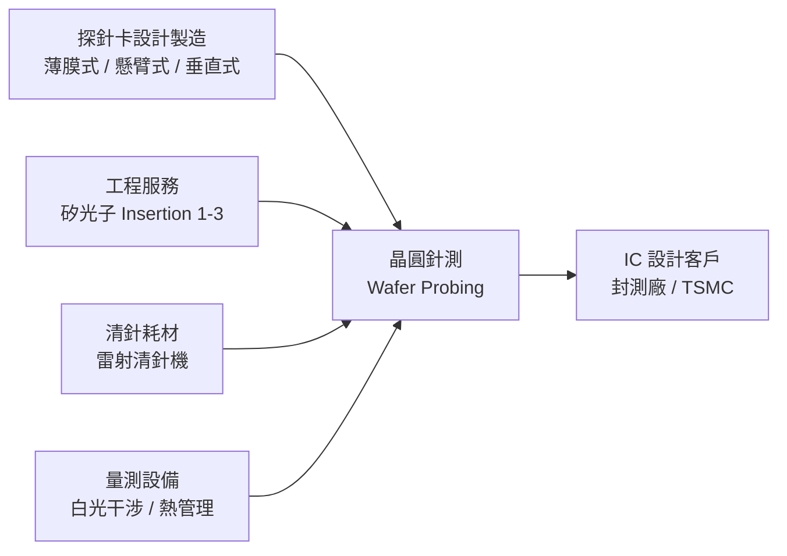

# 7856_漢測（櫃）

## 基本資料

漢測科技（HanTest，7856）是台灣探針卡設計製造與半導體測試服務廠，成立於 2004 年，總部新竹（工程服務）、南科（製造），全球據點涵蓋中國蘇州、日本東京/熊本、新加坡、馬來西亞、美國亞利桑那。

主要業務三塊：**探針卡（薄膜式/懸臂式/垂直式）**、**半導體測試設備與代理**（Advantest 光罩量測 SEM 代理等）、**工程測試服務**（矽光子 insertion 1–3 駐點服務）。

2025 年興櫃登錄，2026-09-17 登錄興櫃申購、**2026-09-22 正式掛牌上櫃（TPEX，同日終止興櫃交易）**；承銷價 NT$2,250 為台股 IPO 史上最高承銷價，掛牌首日盤中一度逾 NT$4,790。屬漢民集團體系。

2025 年營收 NT$24.25 億（+51.8% YoY），毛利率 42.1%，EPS NT$10.83（+372.5% YoY）；1H26 營收 NT$21.85 億（YoY +114.5%）、EPS 21.5 元（YoY +328%），已接近 2025 全年約九成。

資料來源：[[報告_永豐金_漢測7856法說_20260409]]（上市法說，2026-04-09）；[[報告_富邦_漢測_20260922]]（富邦投顧，2026-09-22，未評等）

## 核心技術／競爭優勢

- **薄膜式探針卡（Film Probe Card）**：適用 5G/6G/RF 高頻晶片（TIA、400G+）；100% 台灣在地製造；具備精準平整度控制（水平控制技術）；Q2 2026 開始出貨量產客戶
- **MJC 技術轉移**：與全球前三大探針卡廠日商 MJC 合作，取得 MEMS 探針卡技術，結合自製零組件強化在地支援
- **矽光子測試工程服務**：Insertion 1–3 駐點服務能力；美系客戶 Insertion 2 需求 10 人團隊、Insertion 3 需求 12 人團隊
- **全製程整合能力**：探針卡設計製造 + 清針耗材 + 雷射清針機 + 白光干涉量測 + 熱管理模組

## 產品與應用

| 產品 / 服務 | 應用 | 相關客戶 / 下游 |
|-------------|------|-----------------|
| 薄膜式探針卡（Film Probe） | 5G RF、TIA（400G/800G）、高頻晶片 | 美系 IC 設計客戶 |
| 懸臂式探針卡 | TDDI、LCD driver、GaN | 廣泛 IC 設計 |
| 垂直式探針卡（Cobra/MEMS） | AI/HPC、DRAM DDR5/6、Silicon Interposer | — |
| 雷射清針機 | 探針卡維護耗材 | 封測廠 |
| 白光干涉量測系統 | 表面缺陷檢測 | — |
| 熱管理整合系統 | AI 測試散熱需求 | — |
| 矽光子測試工程服務 | Insertion 1–3（PIC wafer → die 測試） | TSMC、OSAT |

## 圖片 / 架構圖

![[報告_富邦_漢測_20260922_001.png]]

圖說：富邦整理的漢測熱管理系統，應用於晶圓測試階段以主動冷卻探針卡與測試介面，改善高功率 GPU/ASIC 測試的散熱與溫度穩定；此為公司 2026 年主要成長動能。（來源：[[報告_富邦_漢測_20260922]]，2026-09-22）

## EPS 記錄

| 年度 | 營收（億） | 毛利率 | EPS（元） | YoY |
|------|-----------|--------|-----------|-----|
| 2024 | — | — | ~2.30 | — |
| 2025 | 24.25 | 42.1% | 10.83 | +372.5% |
| 2026Q1 | ~9.85（累計至3月） | — | — | — |

## 時間軸

| 時間 | 事件 | 類型 | 重要性 | 備註 |
|------|------|------|--------|------|
| 2025 | 興櫃登錄 | 掛牌 | ★★★ | — |
| 2026-04 | 薄膜式探針卡送樣（TIA 400G/800G） | 產品 | ★★★ | 美系客戶驗證 |
| 2026-04-09 | 上市法說會（Sinopac） | 法說 | ★★ | 計畫 2H26 轉板競拍 |
| 2026-09-22 | 掛牌上櫃（TPEX），終止興櫃交易 | 掛牌 | ★★★★ | 承銷價 NT$2,250（史上最高）；首日盤中逾 4,790 |
| 2026 | 熱管理系統進入大量出貨（GPU）；1H26 半導體設備及客製化占比升至 ~52% | 放量 | ★★★ | 富邦：第二代模組可將 CDA 降溫至 13–14°C，3Q26 送驗 |
| 2027 | 熱管理由 GPU 拓展至 TPU、CPU 平台 | 放量 | ★★★ | 富邦 estimate |
| 2027 | 回焊設備開始貢獻營收（OS 製程切入，後拓 CoW） | 技術下線 | ★★★ | CoW 市場規模估為既有 OS 的 7–8 倍 |
| 2027 | CPO 第二代 Insertion 2 設備出貨（ODM+OEM+Service） | 產品 | ★★★ | 2026 年底完成設計/製造準備，客戶驗證後放量 |
| 2H26 | Silicon Interposer 測試布局 | 產品 | ★★ | — |

## 供應鏈位置

- **上游**：MJC（日本，探針卡技術授權）、Advantest（代理日系測試設備）
- **下游 / 客戶**：IC 設計廠（RF、TIA、AI 晶片）；TSMC/OSAT（矽光子工程服務）
- 所屬供應鏈：→ [[供應鏈_CPO]]（矽光子測試 Insertion 1–3 服務環節）

## 相關公司

| 公司 | 關係 | 說明 |
|------|------|------|
| [[2330_台積電（市）]]| 最終下游 | CoWoS 矽光子封裝需要 Insertion 1–3 測試服務 |

## 風險與注意事項

> [!warning]
> - **客戶集中風險**：矽光子工程服務收入高度依賴少數美系 IC 設計大廠，需求波動影響明顯
> - **薄膜式探針卡尚在驗證**：4月送樣、尚未取得量產訂單，時程延遲會影響 2026 EPS 上調空間
> - **競爭者積極追趕**：薄膜式探針卡有其他台廠跟進開發，差異化需靠速度和良率
> - **轉板不確定性**：興櫃→TWSE 競拍時程可能延遲或失敗，流動性受限

## 富邦 2026-09-22 更新：掛牌上櫃，展望樂觀（未評等）

- 富邦於 9/22 掛牌日出具未評等報告，看法正向；1H26 EPS 21.5 元（YoY +328%），同業本益比區間約 FY27 30–40x（Bloomberg 尚無 2026/27 市場共識 EPS）。
- **熱管理系統**：晶圓測試階段主動冷卻探針卡與測試介面，2025 少量驗證、2026 進入大量出貨（主要 GPU 客戶），帶動 1H26 半導體設備及客製化占比升至 ~52%；第二代模組導入冷卻機後可將 CDA 由 ~25°C 降至 13–14°C，3Q26 送客戶驗證，2027 拓展至 TPU、CPU。
- **回焊設備**：由測試延伸至先進封裝製程，應用於晶圓凸塊、晶片/晶圓接合與 HBM 堆疊；已切入新竹先進封裝客戶取得設備訂單，初期由 OS 製程切入、後拓 CoW（CoW 市場規模估為既有特定 OS 的 7–8 倍），2027 開始貢獻、2028 放大。
- **CPO 測試**：由工程服務升級為 ODM+OEM+Service，與德國設備商合作開發第二代 Insertion 2 設備（重新設計 Chuck/Prober/自動化），2026 年底完成準備、2027 出貨、2028 放大。
- 主要風險：新業務進展遞延、同業競爭加劇。來源：[[報告_富邦_漢測_20260922]]（富邦投顧，2026-09-22；未評等、信心中）。

## 來源

- [[報告_永豐金_漢測7856法說_20260409]]（永豐金，上市投資人說明會，2026-04-09）
- [[報告_富邦_漢測_20260922]]（富邦投顧，2026-09-22；掛牌上櫃、熱管理放量、回焊設備、CPO 測試升級）
