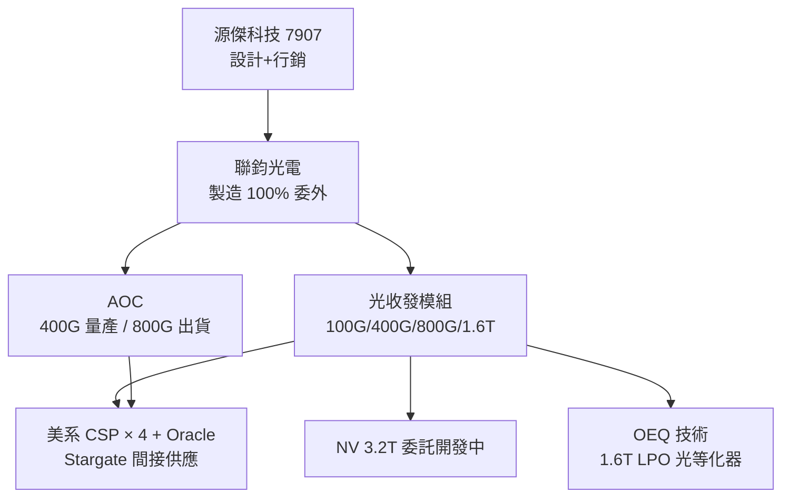

# 7907_源傑科技（興）

## 基本資料

源傑科技（7907）是台灣新竹科學園區的光收發模組設計與銷售公司，專注 AI 資料中心高速光連結方案（100G→1.6T）。製造完全委外給 **聯鈞光電**（鄭祝良創辦人同時為聯鈞大股東）。

2026-07-29 正式登錄興櫃。

主要資料來源：[[活動_源傑科技_興櫃前法人說明會_20260727]]（法人說明會，元大證券主辦，2026-07-27）。

## 圖解

## 核心業務

## 圖片 / 架構圖

![[報告_元大_光通訊產業_20260723_original_009.png]]
圖說：800G OSFP 光收發模組外觀；源傑的產品組合以 400G／800G 插拔式光收發模組與 AOC 為主，後續 NPO/CPO 方案仍須以客戶驗證與量產進度判斷。

### 產品線

| 產品 | 狀態 | 說明 |
|------|------|------|
| 光收發模組 400G | 量產 | 主力貢獻，目前最大獲利來源 |
| 光收發模組 800G | 小量出貨 | 大量驗證中 |
| 光收發模組 1.6T | 驗證中 | OSFP，含 FRO / LRO / LPO 三款 |
| AOC 400G | 大量出貨 | — |
| AOC 800G | 出貨中 | 量較小 |
| 1.6T LPO + OEQ | 驗證 | 自主研發光等化器（全球首家），與 NV + Arista 測試中 |
| NPO（Near-Package Optics） | 研發 | 客製化，已交付某 A 字開頭美系客戶 ELS（外部雷射源）4ch |
| NV 3.2T | 開發尾聲 | 受 NV 委託，開發完成後將送 NV 內部驗證 |

> [!note] 券商產業追蹤補充
> [[報告_元大_光通訊產業_20260723]] 指出，源傑以插拔式光收發模組與 AOC 為主，2026 年 800G 出貨開始增加，並持續與客戶開發 LPO、NPO/CPO 所需的插拔式模組與 ELSFP。報告所稱客戶、驗證與後續量產節奏皆屬券商整理，仍應以公司法說與實際營收驗證。

### 技術特色：OEQ（Optical Equalizer）
1.6T LPO 架構下，兩端均省略 DSP，源傑自主開發**光學等化器（OEQ）**取代電子等化器，功耗可降至 ~10W（全球 1.6T 最低功耗）。已向 NVIDIA、Arista 送測，預期 2027 年初量產。

## 客戶結構

- **美系四大 CSP + Oracle**：核心客戶，Oracle 光通訊占比自 2023 <4% → 2025 ~40%
- **Stargate 間接**：Oracle 為 Stargate 成員，源傑間接供應
- **NVIDIA**：1.6T 模組已於 2024 年底交付驗證；3.2T 委託開發中
- **退貨率**：<5 ppm（2023 年起），極低

## 財務摘要（2025 年全年）

| 指標 | 數值 |
|------|------|
| 營收 | NT$1.811B |
| 毛利率 | 31% |
| 稅後淨利 | NT$289M |
| EPS | NT$4.45（增資稀釋後；還原後約 NT$9-10） |
| 員工人數 | 43 人 |
| 資本額 | NT$669M |

**2026 展望（截至 6M26）**：上半年累積營收已超過 2024 全年一半以上；在手訂單能見度至 2027-02；下半年產能幾近全滿。

## 競爭優勢

1. **台灣製造（TAA 認證）**：通過美國 Trade Agreements Act，可供應美國國家安全相關標案（Oracle 軍方 DC）
2. **OEQ 光學等化器**：全球首家，1.6T LPO 功耗 ~10W，差異化技術
3. **設計完整性**：硬體、軟體、韌體全自主，可遠端升級韌體
4. **聯鈞垂直整合**：設計方與代工方共同創辦，協作優於純 fabless
5. **低退貨率**：<5 ppm，通過嚴格交換器測試（Mellanox / Arista 平台）

## 風險與注意事項

- 規模小（43 人）：執行風險，高度依賴少數核心人才
- 製造 100% 依賴聯鈞，議價力有限
- 800G / 1.6T 量產時程若延遲
- NV 對 OEQ 方案最終決策未定

## 供應鏈位置

- **DSP**：Broadcom、Marvell、達發（聯發科子公司）
- **EML / CW Laser**：三菱、住友、Lumentum（LITE）、Coherent（COHR）
- **PIC（矽光子）**：客戶提供（NV NPO 方案）
- **OEQ**：以色列某公司合作（疑似 Tower Semiconductor 矽光子），源傑為唯一合作廠

## 相關公司

| 公司 | 關係 |
|------|------|
| [[NVDA.US(nvidia)]] | 委託客戶（1.6T / 3.2T） |
| [[COHR.US(coherent)]] | 上游 EML 供應商 |

## 來源

- [[活動_源傑科技_興櫃前法人說明會_20260727]]（元大主辦法說，2026-07-27）
- [[報告_元大_光通訊產業_20260723]]（元大投顧，2026-07-23；800G、AOC 與 LPO／NPO/CPO 插拔式模組產業追蹤）

## 相關頁面

- [[3450_聯鈞（市）]]
- [[技術_CPO]]
- [[技術_光模塊]]
- [[供應鏈_AI光互聯]]
