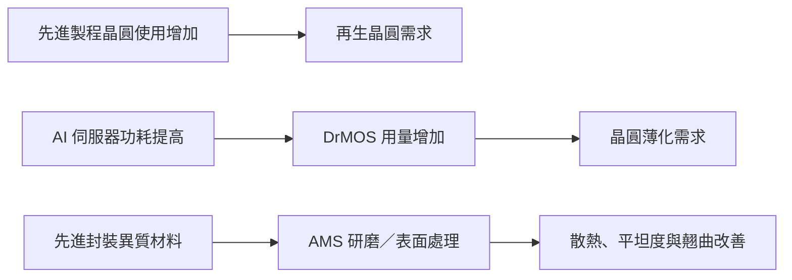

# 8028_昇陽半導體（市）

## 基本資料

昇陽半導體的兩大事業為再生晶圓與晶圓薄化；前者受先進製程晶圓用量上升帶動，後者連結 AI 伺服器 DrMOS 等功率元件需求。公司亦以 AMS 研磨與表面處理解決方案切入先進封裝異質材料。來源稱其 2Q26 營運創新高、2025 年再生晶圓全球市占率首度居冠；上述市占與營運敘述均為來源轉述，仍須以公司正式揭露交叉驗證。來源：[[memo_國泰證期_昇陽半導體CallMemo_20260910]]。

## 核心技術／競爭優勢

- **再生晶圓製程效率**：公司透過世代更新縮短流程；來源稱中港廠相同產出的人力約為竹科廠四分之一。
- **品質升級能力**：擴產同步改善微粒尺寸與數量等品質指標，以支援先進製程需求。
- **晶圓薄化受惠高功率趨勢**：AI 伺服器功耗提高，推升 DrMOS 用量與薄化需求。
- **AMS 先進封裝延伸**：鎖定 SiC、載板與氧化鋁等異質材料研磨／表面處理，對應散熱、結構穩定與翹曲改善需求。

## 產品與應用

| 產品 / 服務 | 應用 | 相關客戶 / 下游 |
|---|---|---|
| 再生晶圓 | 先進製程晶圓製造之監控與製程使用 | 客戶未揭露 |
| 晶圓薄化 | AI 伺服器 DrMOS 等功率元件 | 主要 IDM 客戶未揭露 |
| AMS 研磨與表面處理 | SiC、載板、氧化鋁等先進封裝異質材料 | 客戶未揭露 |
| 氨水回收系統 | 製程資源與碳排管理 | 公司內部製造 |

## 圖片 / 架構圖

*本批資料指向再生晶圓、功率元件薄化與先進封裝材料處理三條成長軸；客戶份額與實際產能仍未揭露。*

## 時間軸

| 時間 | 事件 | 類型 | 重要性 | 備註 |
|---|---|---|---|---|
| 2026H2（預估） | 導入新一代再生晶圓製程 | 製程升級 | ⭐⭐⭐ | 公司／券商轉述，效率提升待驗證 |
| 2026–2028（預估） | AI 伺服器於晶圓薄化業務占比逾 63% | 結構轉變 | ⭐⭐⭐ | 來源預估，非公司已公告營收占比 |
| 2025–2028（預估） | 晶圓薄化業務 CAGR 約 45% | 成長目標 | ⭐⭐ | 來源模型，取決於 IDM 拉貨與占有率 |

→ 技術交集詳見 [[技術_CoWoS與先進封裝]]。

## 供應鏈位置

- 上游：再生晶圓製程所需化學品、耗材與自動化設備；本批未具名。
- 下游：先進製程晶圓廠、功率 IDM 與先進封裝材料加工需求。
- 技術交集：[[技術_CoWoS與先進封裝]]。

## 相關公司

本次來源僅以「主要 IDM 客戶」描述下游，未揭露實體名稱，故 `related_companies` 保持空白。

> [!warning] 風險與注意事項
> - 5 奈米約需兩片再生晶圓、全球市占率第一與毛利率改善均為 Call Memo 轉述，應以公司文件驗證。
> - 晶圓薄化成長高度依賴 AI 伺服器功率元件需求、客戶占有率與產品認證，不能只由 DrMOS 用量外推。
> - AMS 仍屬新增成長支柱；實際客戶導入、收入占比與良率未揭露。

## 來源

- [[memo_國泰證期_昇陽半導體CallMemo_20260910]]（國泰證期研究部，2026-09-10；僅供內部使用）

## 相關頁面

- [[分析_昇陽半導體再生晶圓與薄化雙引擎_20260910]]
