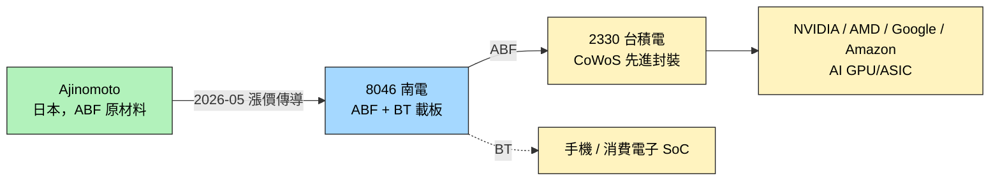

# 8046_南電（市）

## 基本資料
南亞電路板（Nan Ya PCB，簡稱 NYPCB / 南電），台塑集團旗下 IC 載板廠，與 [[3037_欣興（市）]] 並列「台廠 ABF 雙雄」。產品線涵蓋高階 ABF 載板（AI/HPC、Server CPU 封裝）與 BT 載板（手機 AP、儲存）。AI 端動能透過 [[2330_台積電（市）]] CoWoS 出貨至 [[NVDA.US(nvidia)]] 等 AI 晶片客戶。

主要資料來源：[[報告_MS_ABF產業_260508]]（Morgan Stanley Catalyst Event Reaction 短評，2026-05-08）。

## 核心技術／競爭優勢
- **ABF + BT 雙產品線**：與欣興相比，BT 載板比重歷史上更顯著，產品組合略有差異
- **AI 端產能順位**：與欣興同為台廠 AI ABF 載板核心供應商
- **成本轉嫁能力**：與欣興同樣受惠於 Ajinomoto 漲價傳導
- **MS 給予較高中期成長**：MS 模型 medium-term growth = **17%**（vs 欣興 13%），原報告未直接解釋差異來源（claim 類型 estimate、信心中）

## 產品與應用
| 產品 / 服務 | 應用 | 相關客戶 / 下游 |
|-------------|------|-----------------|
| ABF 載板（高階） | AI/HPC GPU、Server CPU 封裝 | [[2330_台積電（市）]] CoWoS → [[NVDA.US(nvidia)]] / AMD / Google / Amazon |
| BT 載板 | 手機 AP、儲存控制器、消費電子 | 移動端 SoC 業者 |

## 圖片 / 架構圖

`[待補來源圖]` 需官方 IR ABF 載板層疊截面圖或封裝產品圖佐證；上方為自製供應鏈示意圖。

## EPS 記錄

| 季度 | EPS (元) | 備註 |
|------|----------|------|
| 4M26（自結） | 0.92 | 累計，來源：活動_南電8046_分析師會議_20260630 |
| 5M26（自結） | 1.21 | 月度，4M+5M 累計 2.10 元 |
| 2Q26E | 3.29 | 分析師估；至 5M26 達成率 65%，6M 差異不大，預計順利達標 |
| FY2026E | 18.5 | 研究部估，2026-06-30 |
| FY2027E | 50 | 研究部估，保守假設：ABF +40%/年、BT +20%/年 |
| FY2028 粗估 | 76 | 動態估算，非絕對確定 |

> [!note] EPS 彈性說明
> 載板佔 AI 伺服器成本約 1-3%（記憶體約 30%），在極度缺貨情境下 ASP 微幅跳動即可帶動 EPS 大幅上修。

## EPS 預估（券商）

| 年度 | 統一投顧（2026-03-24，中性版） | 研究部（2026-06-30 分析師會議） | 備註 |
|------|-------------------------------|-------------------------------|------|
| 2025A | NT$.0 | — | 實際值 |
| 2026E | NT$.2 | NT$18.5 | 研究部大幅上修 |
| 2027E（中性） | NT$.5 | NT$50.0 | 研究部保守估 |
| 2028 粗估 | — | NT$76.0 | 動態推算 |

## 目標價與評等

| 券商 | 報告發布日 | 評等 | 目標價 | 評價基礎 | 來源 |
|------|------------|------|--------|----------|------|
| Morgan Stanley | 2026-05-08 | Overweight（維持） | 未揭露 | RI 模型：cost of equity 9.3%、medium-term growth 17%、terminal growth 3%、beta 1.0 | [[報告_MS_ABF產業_260508]] |
| 研究部（分析師會議） | 2026-06-30 | 買進 | NT$1,500 | PE ~30x（同業基準）；FY26E EPS 18.5 | [[活動_南電8046_分析師會議_20260630]] |

> 南亞集團賣股（2026 年 4-6 月初）壓抑評價並落後同業；賣股已告一段落，近期股價表現轉強。

## 毛利率軌跡（2026-06-30 分析師會議）

| 季度 | GM | QoQ | 備註 |
|------|-----|-----|------|
| 1Q26 | 15.9% | — | 基期 |
| 2Q26E | 22% | +6ppts | 市場預期 19%，南電優於 |
| 3Q26E | 30% | +8ppts | 價格持續推升 |
| 2026 底 ABF | ~40% | — | 研究部預估 |
| 2026 底 BT | ~30% | — | 2026 初不佳 → 跳升 |
| 2027E ABF | ~60% | — | 重回 2022 高峰（保守估）|

## 定價動態

| 產品 | 每季漲幅 | 備註 |
|------|----------|------|
| BT 載板 | +20-30%/Q | 材料被抽調至 ABF，BT 缺貨更嚴重；2026 全年累計漲幅 +80-100% |
| ABF 載板 | +15%/Q | 2026 全年約 +60%；其中一半反映材料成本；2027 保守估再 +40% |

> 現階段 ABF GM 25-30%，vs 2022 年高峰 60%，上行空間大。材料成本（玻纖布、銅箔、防焊油墨）在產能吃緊下可順利轉嫁。

## 競爭優勢：LTA 占比 = 0

南電**長期協議（LTA）占比為 0**，在缺貨漲價循環中，所有訂單均可即時反映市況，價格反應幅度比 Ibiden、欣興等有 LTA 鎖單的同業更劇烈。這是本輪漲價週期中南電最核心的差異化競爭優勢。

## 客戶結構（2026-06-30 分析師會議）

| 客戶 | 產品 | 狀態 | 備註 |
|------|------|------|------|
| [[AVGO.US(broadcom)]] | 1.6T 交換器（ABF） | 2H26 開始放量 | ABF 消耗量 vs 800G 翻倍以上，ASP 同步翻倍 |
| Meta（未建頁） | ASIC | 放量中（4Q25 起） | 目前占比仍低 |
| OpenAI（未建頁） | ASIC | 放量中 | — |
| Google（未建頁） | TPU | 稍晚放量 | 前一代產品先出，最新代稍延 |
| [[2330_台積電（市）]] | CoWoS ABF | — | ABF 主要需求來源 |

> Broadcom 1.6T 網通交換器 ABF 規格（24 層以上、面積 100×100mm），不遜於 ASIC / GPU，且與 800G 相比消耗量翻倍，是 2H26 最強 ASP 驅動力。

## 產能規劃

| 廠區 | 狀況 | 說明 |
|------|------|------|
| 台灣主廠 | 1Q26 BT + ABF 滿載 | 後續成長全數來自漲價 |
| 昆山廠 | 佔總產能 ~25%，稼動率 ~70% | 引導客戶轉至製程較不先進的品項；填滿後貢獻有限 |
| 嘉義廠（擴產） | 2029 量產 | 針對台積電 CoWoS 設計；210×210mm 超大面積、26 層板 |
| 去瓶頸作業 | 2027-2028 主要手段 | 受限設備缺貨，整體產能增量有限 |

> 整體 ABF 供給 CAGR 僅個位數（含欣興/Ibiden 擴產），供不應求至 2027 年相當確定。南電擴產最慢，但 LTA=0 使其更直接受益漲價。

## 時間軸

| 時間 | 事件 | 類型 | 重要性 | 備註 |
|------|------|------|--------|------|
| 2026-05-07 | Ajinomoto 確認 ABF 開始 per-customer 漲價 | 漲價 | ⭐⭐⭐ | 觸發 MS 維持 OW |
| 2026-Q1 | TSMC 法說提 CoPoS 玻璃基板，「未來幾年內量產」 | 替代技術訊號 | ⭐⭐⭐ | 中期路線壓力，見 [[技術_玻璃基板]] |
| 2026-04 | Intel 玻璃基板 3DGS 動工，年產 ~7 萬基板 | 替代技術里程碑 | ⭐⭐ | 影響中期 ABF 載板需求曲線 |

## 供應鏈位置
- **上游**：Ajinomoto（ABF 樹脂原材料，日本獨家供應）
- **下游 ABF 端**：[[2330_台積電（市）]] CoWoS → [[NVDA.US(nvidia)]] / AMD / Google / Amazon
- **下游 BT 端**：移動端 SoC、消費電子
- **CoWoS 外溢承接者**：[[AMKR.US(amkor)]]、日月光（Rubin 部分外包）
- **所屬供應鏈**：[[供應鏈_先進封裝載板]]

## 相關公司

| 公司 | 關係 | 說明 |
|------|------|------|
| [[3037_欣興（市）]] | 同業 / 同類產品 | 台廠 ABF 雙雄，MS 同步維持 OW；MS 給南電的中期成長率較高 |
| [[2330_台積電（市）]] | 下游製造 | CoWoS 載板需求主要來源 |
| [[NVDA.US(nvidia)]] | 終端客戶 | AI GPU 終端，Rubin 進度影響 ABF 需求節奏 |
| [[AMKR.US(amkor)]] | 下游製造 | OSAT，TSMC CoWoS 外溢承接者 |

> [!warning] 風險與注意事項（兩份來源並列）
> **短期觀點（Morgan Stanley，2026-05-08）**
> - 上行：ABF + BT 需求優於預期、AI/5G 動能加速、ASP 漲幅優於預期、CoWoP 等替代技術良率持續無解
> - 下行:突發需求斷崖、技術變遷導向不需 ABF 載板的方案、競爭加劇
>
> **中期觀點（國金證券，2026-05-11）**
> - 玻璃基板 / TGV 正推進量產（Intel / Apple / TSMC 三軌）
> - 中期可能壓縮 ABF 載板成長空間
>
> 兩份來源觀察時點僅差 3 天，反映「短期 cash flow 強化 vs 中期路線替代」並存的時間結構，**不互相否定**。

## 來源
- [[報告_MS_ABF產業_260508]]（Morgan Stanley，2026-05-08，本頁主要來源；分析師 Howard Kao / Sharon Shih / Irene Yen）
- [[報告_其他_玻璃基板_20260511]]（國金證券「玻璃基板行業深度」，2026-05-11；用於中期路線並列）
- [[活動_南電8046_分析師會議_20260630]]（分析師會議，2026-06-30；EPS/GM 軌跡、LTA=0、嘉義廠、Broadcom 1.6T、ASIC 客戶）

## 相關頁面

- [[1303_南亞（市）]]
- [[技術_ABF載板]]
- [[INTC.US(intel)]]

---

## 券商評等與目標價

| 券商 | 報告日 | 評等 | 目標價 | 當時狀況 | 備註 |
|------|--------|------|--------|----------|------|
| 統一投顧 | 2026-03-24 | 買進 | NT\ | ABF漲價週期初期 | 中性版；樂觀版 TP NT\ |
| Morgan Stanley | 2026-05-08 | Overweight（維持） | 未揭露 | ABF 漲價確認 | 短評，medium-term growth 17%（高於欣興 13%） |

## EPS 預估（補齊）

| 年度 | 統一投顧（2026-03-24） | 備註 |
|------|----------------------|------|
| 2025A | NT\.0 | 實際值（近年低點，2024 為 0.32 元） |
| 2026E | NT\.2 | 統一投顧中性版 |
| 2027E（中性） | NT\.5 | ABF 漲幅 +5%/季假設 |
| 2027E（保守） | NT\.2 | ABF 漲幅 +0%/季 |
| 2027E（樂觀） | NT\.2 | ABF 漲幅 +7%/季 |

> [!warning] 南電 EPS 彈性大於欣興
> 統一投顧假設南電 ABF 中性版漲幅 +5%/季（vs 欣興 +3%/季），原因是南電毛利結構在漲價週期中彈性更高（2022 年高峰 GM 40%），EPS 對 ASP 敏感度更強。

## 供需展望（補充）

### 南電擴產計畫

| 年度 | 產能（萬顆，37×37mm/8L） | 重點廠房 | YoY |
|------|--------------------------|----------|-----|
| 2024 | 5,000 | 樹林二期 | — |
| 2025 | 5,000 | — | +0% |
| 2026 | 5,150 | — | +3% |
| 2027E | 5,305 | — | +3% |
| 2028E | 5,464 | — | +3% |

> 南電擴產速度遠低於欣興（欣興 2026-28 CAGR ~18%，南電僅 ~3%），反映南電現有廠房限制；但 AI 端 ASP 漲幅可能更大（統一投顧中性版 ABF 漲幅假設+5%/季），以質取勝。

### 主要客戶供應地位（T-glass 供應鏈）

- **GB200/GB300**：Ibiden 80-90%、南電（部分；具體比例未揭露）
- **Trainium 等 ASIC EMIB-T**：欣興 + 南電（Tier 1 載板廠共同供應）

### 台廠 ABF 雙雄比較

| 指標 | 欣興 3037 | 南電 8046 |
|------|-----------|-----------|
| 2025A EPS | NT\.4 | NT\.0 |
| 2026E EPS（統一中性） | NT\.2 | NT\.2 |
| 2027E EPS（中性） | NT\.0 | NT\.5 |
| 目標價（中性） | NT\ | NT\ |
| 擴產 CAGR 2026-28 | ~18% | ~3% |
| MS 中期成長假設 | 13% | 17% |
| 漲幅彈性（統一假設） | +3%/季 | +5%/季 |

## 時間軸（補充）

| 時間 | 事件 | 類型 | 重要性 |
|------|------|------|--------|
| 2026-03-24 | 統一投顧發布 ABF 載板專題，南電列買進 TP NT\ | 研究報告 | ⭐⭐ |
| 2025-08-29 | Nittobo T-glass 擴產宣布，南電 ABF 產能釋放節點明朗 | 供需轉折 | ⭐⭐⭐ |
| 2026-Q2 | ABF 漲價週期擴大，南電漲幅彈性大 | 漲價 | ⭐⭐⭐ |
| 2026-Q4 | ASIC（Meta/OpenAI）4Q25 開始放量 | 客戶出貨 | ⭐⭐⭐ |
| 2026-2H | Broadcom 1.6T 交換器放量，ABF 消耗翻倍 | 客戶放量 | ⭐⭐⭐ |
| 2026-06-30 | 分析師會議：研究部 FY26E EPS 18.5、FY27E 50，買進 TP 1,500 | 研究報告 | ⭐⭐⭐ |
| 2027 | ABF 供需缺口 26% 格局，南電高彈性期 | 供需 | ⭐⭐⭐ |
| 2029 | 嘉義廠量產（CoWoS 超大面積載板 210×210mm 26L） | 擴產 | ⭐⭐⭐ |

## 相關公司（補充）

| 公司 | 關係 | 說明 |
|------|------|------|
| [[3189_景碩（市）]]（未建頁） | 同業 | 台廠 ABF 第三，統一投顧 TP NT\（中性） |
| Ibiden（日本，未建頁） | 主要競爭者 | 全球 ABF 載板龍頭 |
| Nittobo 日東紡（日本，未建頁） | 上游材料 | T-glass 獨家供應商 |

## 來源（補充）

- [[報告_統一投顧_ABF載板專題_20260324]]（統一投顧，2026-03-24；三情境 EPS 與 TP、南電/欣興/景碩比較）
- [[報告_福邦_PCB載板產業展望_20260401]]（福邦投顧，2026-03-19；2027-28 缺口預估）

## 時間軸補充（MS 首次升評）

| 時間 | 事件 | 類型 | 重要性 | 備註 |
|------|------|------|--------|------|
| 2026-02-22 | Morgan Stanley 首次升評至 OW（from UW），TP NT\ | 評等升級 | ⭐⭐⭐ | 四年來首次看多；AI ABF 上行週期論點首次完整建立 |
| 2026-06-12 | 南電法說：1Q26 營收 +32.1% YoY，OP margin 12.1%（1Q25 3.8%）；ABF+BT 滿載 | 法說 | ⭐⭐ | 官方確認 1Q26 業績；年底或 1H27 新 ABF 產能投產 |

## 法說亮點（2026-06-12）

來源：[[活動_南電法說_20260612]]（永豐金主辦，2026-06-12，報告 1Q26 業績）

| 指標 | 數值 | 備註 |
|------|------|------|
| 1Q26 合併營收 YoY | +32.1% | 主因 Server / 交換器 + 高階 RIC 載板 |
| 1Q26 營業利益 | 13.19 億 | OP rate 12.1%（1Q25 僅 3.8%） |
| 網通應用佔比（1Q26） | ~49% | 含交換器 / 路由器 |
| AI 高效能運算佔比（1Q26）| ~16.8% | — |
| ABF+BT 佔公司營收 | ~90% | ABF 約 60%，BT 約 30% |
| ABF 交期 | 6-12 週 | 短複雜品 6 週，長複雜品 12 週 |
| ABF+BT 稼動率 | 維持高檔 | AI 伺服器需求持續強勁 |

**擴廠**：針對先進封裝所需高階 ABF 進行擴建，新產能預計**年底或 1H27** 投產（BT 以 de-bottleneck 為主，真正新廠針對 ABF）。

**替代技術**：CPO（Co-Packaged Optics）在技術成熟後可能直接取代部分 ABF 載板應用；玻璃基板也將取代部分有機基板。管理層認為替代時點取決於需求、設計、成本，目前難以預估完全取代時點。

**材料端**：T-glass 由 Nittobo（日系獨家）供應；E-glass 多家可選；貴金屬價格持續上漲。

## 來源（法說補充）

- [[活動_南電法說_20260612]]（永豐金法說，2026-06-12；1Q26 業績、ABF/BT 稼動率、擴廠節奏、CPO 替代技術討論）
