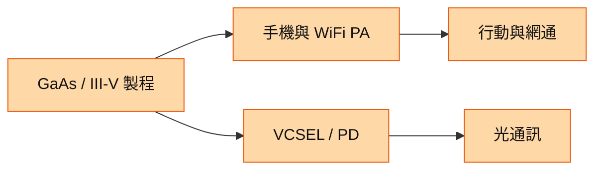

# 8086_宏捷科（櫃）

## 基本資料
宏捷科為 III-V 化合物半導體晶圓代工廠，營運基礎是手機與 WiFi PA，並以既有砷化鎵製程延伸 VCSEL Datacom、Photodiode 等光通訊元件。來源稱 1H26 營收 25.20 億元、年增 44.4%，2Q26 光通訊營收占比仍僅 2.8%。來源：[[memo_國泰證期_宏捷科CallMemo_20260909]]。

## 核心技術／競爭優勢
- 長期手機 PA 量產經驗，支撐良率、品質及服務能力。
- WiFi／無人機 PA 與手機 PA 形成規模基盤；來源稱無人機 PA 訂單 1H26 年增 194.6%。
- 部分 PD 與 VCSEL 可沿用既有砷化鎵設備，降低光通訊導入門檻。

## 產品與應用
| 產品／服務 | 應用 | 下游 |
|---|---|---|
| 手機 PA | 中高階手機射頻 | 手機設計客戶 |
| WiFi PA | Router、手機 WiFi 7、無人機 | 網通與無人機 |
| VCSEL／Photodiode | 資料通訊、光接收端 | 光通訊模組客戶 |

## 圖片 / 架構圖

圖說：公司以 III-V 平台支援既有 PA 及光通訊元件兩條產品路線。

## 時間軸（催化劑）
| 時間 | 事件 | 類型 | 重要性 | 備註 |
|---|---|---|---|---|
| 2026Q3 | 營收估與 2Q26 持平 | 營運 | ⭐ | 來源預估 |
| 2026 年底前 | Solar Cell 預計開始量產 | 技術下線 | ⭐⭐ | 公司展望 |
| 2027 | 部分光通訊新品驗證／小量導入 | 驗證 | ⭐⭐ | 量產貢獻待確認 |

## 供應鏈位置
- 為 [[技術_光互連]] 的 III-V 光電元件潛在供應商，亦服務無線 PA 市場；來源未揭露特定光通訊客戶。

## 相關公司
| 公司 | 關係 | 說明 |
|---|---|---|
| — | — | 本次來源未具名揭露可連結的公司關係。 |

> [!warning] 風險與注意事項
> - Epi 材料與黃金成本上升，毛利率轉嫁仍有不確定性。
> - 光通訊占比低且多數新品仍在驗證，不能以題材外推短期營收。

## 來源
- [[memo_國泰證期_宏捷科CallMemo_20260909]] — 國泰證期研究部，2026-09-09
