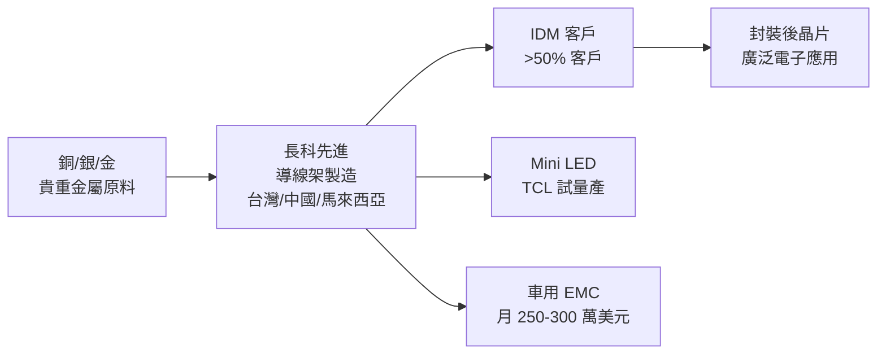

# 8086_長科先進（市）

## 基本資料

長科先進（台股代號 8086，TWSE 上市）是台灣主要的導線架（Lead Frame）製造商，在全球導線架市場位居三大之一，另兩家為日本 Mitsui High-tec 及韓國 Haesung DS，三家市佔率大致相當。

導線架是半導體封裝的核心結構材料，用於固定晶片並提供電氣連接，廣泛應用於 QFN（藍牙、網路晶片、GaN 氮化鎵）、SOP/SOT（工控、消費電子）、Mini LED 背光及車用 EMC 封裝。

全球佈局：台灣（QFN 主力，4Q26 投入 photo 產能）、中國蘇州/成都（傳統產品）、中國威海（新廠，投資 11 億人民幣，為蘇州/成都 1.5 倍規模，簽約 2026-05）、馬來西亞（IDM 為主，擴廠分兩階段，一階段 26Q1 完工）。三角形黃金成長佈局。

26Q1 營收 NT$36.7 億元（YoY +NT$15.5 億），毛利率 21.7%，EPS NT$0.5 元。公司重申每季股利維持 ≥NT$0.45 元，派息率 80%，擴廠不影響股利政策。

資料來源：[[活動_長科法說_20260601]]（2026-06-01 法說）

## 核心技術／競爭優勢

- **QFN 機械製程護城河**：台灣 QFN 採機械製程（vs. 日系 photo 製程），生產速度快、良率高、成本效益佳；4Q26 將投入 photo 產能，進一步提升技術廣度
- **全球三大寡占市場**：導線架全球市場由長科、Mitsui High-tec、Haesung DS 三家主導，進入門檻高（資本、製程積累），市場分散化程度低
- **多元應用布局**：GaN 晶片（藍牙/網路/電源）、Mini LED 背光（毛利率 >50%）、車用 EMC（毛利率 >50%）+ 工控、機器人，高毛利應用佔比持續提升
- **馬來西亞 IDM 客戶基礎**：馬來西亞廠約九成來自 IDM 客戶（美系、歐系、日系）；IDM 具高黏著性，採前三個月均價定價機制降低價格風險

## 產品與應用

| 產品 / 服務 | 應用 | 相關客戶 / 下游 |
|-------------|------|-----------------|
| QFN 導線架 | 藍牙/Wi-Fi/網路晶片、GaN、伺服器交換器 | IDM（廣泛）|
| SOP / SOT 傳統有腳導線架 | 工控、消費電子（持續需求提升）| IDM |
| Mini LED 背光導線架 | Mini LED 電視背光模組 | 大陸 TCL（試量產中）|
| 車用 EMC 導線架 | 汽車電控模組 | 車用 IDM |
| 機器人應用導線架 | IDM 客戶機器人領域 | IDM（2026Q2 開始放量，約 5%）|

## 圖片 / 架構圖

> 自製 供應鏈示意圖；來源：[[活動_長科法說_20260601]]

## EPS 記錄

| 季度 | 營收（NT$億） | EPS（NT$） | 毛利率 | 備註 |
|------|--------------|------------|--------|------|
| 26Q1 | 36.7（QoQ+4.85%, YoY+NT$15.5億）| **0.5** | 21.7% | 貴重金屬漲價壓抑毛利 |

- 每季股利：≥NT$0.45 元，派息率 80%
- Mini LED 導線架：月產 10 萬台 → 約 USD 150 萬，毛利率 >50%（TCL 試量產中）
- 車用 EMC：月營收 USD 250–300 萬，毛利率 >50%

## 時間軸

| 時間 | 事件 | 類型 | 重要性 | 備註 |
|------|------|------|--------|------|
| 2026-05 | 與威海政府簽訂投資協議（11億人民幣）| 擴廠 | ⭐⭐⭐ | 蘇州/成都 1.5倍規模 |
| 2026Q1 | 馬來西亞廠擴充一階段完工；開始貢獻營收 | 產能 | ⭐⭐⭐ | 對接 IDM 需求 |
| 2026Q2 | 機器人應用訂單開始放量（約 5% 佔比）| 訂單 | ⭐⭐ | IDM 客戶機器人領域 |
| 2026Q2 | 預期營收挑戰淡季歷史新高 | 業績 | ⭐⭐⭐ | 法說明確表示 |
| 2026 Q4 | 台灣投入 photo 產能建置 | 技術 | ⭐⭐⭐ | 提升 QFN 技術層次 |
| 2026 下半 | Mini LED 大陸 TCL 試量產驗證關鍵期 | 技術 | ⭐⭐⭐ | 若成功可大幅放量 |
| 2027 Q1 | 台灣 photo 產能開始送樣認證並貢獻營收 | 出貨 | ⭐⭐ | |
| 2027 Q3 | 馬來西亞廠二階段新廠正式完工 | 產能 | ⭐⭐⭐ | 總廠房面積達現有 200% |

## 供應鏈位置

- 上游原料：銅箔、金、銀（貴重金屬，從去年 Q4 到 26Q1 漲幅大）；採前三個月均價機制
- 下游客戶：IDM 廠（美系/歐系/日系，超過半數客戶）、TCL（Mini LED）、車用電控廠
- 競爭同業：日本 Mitsui High-tec、韓國 Haesung DS

## 相關公司

| 公司 | 關係 | 說明 |
|------|------|------|
| Mitsui High-tec（日本）| 競爭同業 | 全球三大導線架之一（日本） |
| Haesung DS（韓國）| 競爭同業 | 全球三大導線架之一（韓國） |

> [!warning] 風險與注意事項
> - **貴重金屬成本**：金、銀原料從 25Q4 到 26Q1 漲幅顯著，直接壓縮毛利率；銀價波動（0.115→70多美分）影響成本結構
> - **Mini LED 驗證不確定性**：Mini LED 概念討論多年仍未完全成功；TCL 試量產是否能大量放量，為 26H2 重要觀察點
> - **地緣政治 / 中國廠擴產**：威海新廠投資 11 億人民幣規模龐大，若中美關係惡化或中國需求不如預期，資本回收期延長
> - **車用週期延遲**：車用市場後疫情回溫最慢，落後工控 2–3 季；若車用修正期延長，車用 EMC 業務成長受限

## 來源

- [[活動_長科法說_20260601]]（2026-06-01，長科先進法說；財務長 張輔仁 / 業務 楊中琪 / 黃嘉能）
