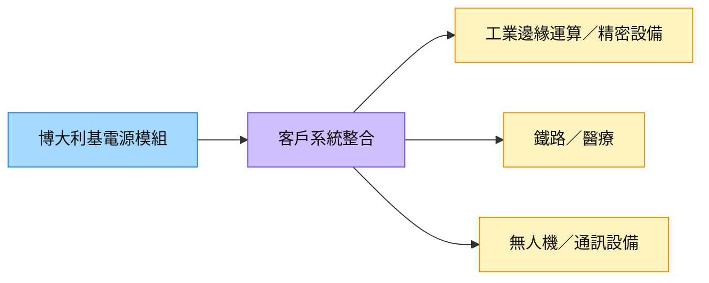

# 8109_博大（櫃）

## 基本資料

博大提供利基型電源模組／零組件，應用涵蓋工業、鐵路、醫療、通訊與無人機／國防。[[活動_華南投顧_博大8109_20261007]] 指出主要市場在歐美、亞洲次之，2026Q4 至 2027Q1 接單動能正向，鐵路部分訂單延伸至 2027 年。

AI 曝險主要來自工業設備增加邊緣運算及精密機器設備，電源模組先進入系統再進入設備；公司未把自己定位為資料中心大型電源系統供應商。越南廠供一般／經濟型產品，高階主力仍在台灣。掛牌依 [櫃買上櫃收盤行情](https://www.tpex.org.tw/web/stock/aftertrading/otc_quotes_no1430/stk_wn1430_result.php?d=&l=zh-tw&o=htm&s=0%2Casc%2C0&se=EW) 確認。

## 核心技術／競爭優勢

- **利基規格與驗證**：鐵路、醫療、無人機對可靠度及規格有不同要求，導入測試與量產資格形成客戶黏著；來源未提供獨占地位。
- **多應用分散**：工業邊緣運算、鐵路、醫療及通訊需求可形成多條產品線，但各自的訂單與認列週期不同。
- **跨廠產品分工**：台灣承接高階產品、中國成熟產線協助越南學習，有利逐步擴產；越南目前尚未追平中國廠，不假定良率相同。

## 產品與應用

| 產品／服務 | 應用 | 相關客戶／下游 |
|---|---|---|
| 利基電源模組 | 工業邊緣運算、精密機器與半導體搬運設備 | 系統／設備客戶未具名 |
| 鐵路及醫療電源 | 歐洲／亞洲鐵路、醫美及微創設備 | 部分鐵路訂單延伸至 2027 年 |
| 無人機電源零組件 | 探勘、農用及國防延伸應用 | 歐美已有部分驗證／量產，營收未量化 |
| 通訊電源 | 網路設備、衛星地面站相關應用 | 長期大型通訊客戶未具名，通訊占比約十幾% |

## 圖片 / 架構圖

圖說：華南 2026-10-07 座談所述「零組件→系統→設備」路徑；不把精密機器設備曝險等同人形機器人訂單。來源只有裝飾圖，故補 Mermaid。

## 時間軸

| 時間 | 事件 | 類型 | 重要性 | 備註 |
|---|---|---|---|---|
| 2026Q2 後 | 越南廠運作、陸續出貨 | 產能開出 | ⭐⭐ | Q&A 另以 Q3 營收貢獻描述，運作與認列分開看；fact／中 |
| 2026Q4–2027Q1（預估） | 接單動能延續，鐵路訂單跨至 2027 | 出貨 | ⭐⭐⭐ | 訂單能見度約 3–6 個月；12 月歐美假期可能影響出貨 |
| 未定（依訂單） | 按訂單彈性擴產 | 擴產 | ⭐⭐ | 台中新廠可擴至約三倍為空間潛力，未有正式時程／預算，不列確定年度催化劑 |

跨公司時程：[[時程_2026-2028華南六家公司商業化節點]]。

## 供應鏈位置

是系統及設備前段的利基電源零組件供應商，工業應用見 [[供應鏈_工業自動化]]，AI 需求邏輯見 [[技術_邊緣AI]]。資料中心內部大型電源與邊緣設備模組屬不同位置，不直接套用資料中心 PSU 市場成長率。

## 相關公司

| 公司 | 關係 | 說明 |
|---|---|---|
| 未具名系統／設備／通訊客戶 | 下游 | 無可核對客戶名與訂單金額，保留 `related_companies: []` |

## 風險與注意事項

> [!warning] 產能與新應用情境
> - 三廠自去年 H2 至本年累計擴產約 30%、目前近滿載為公司轉述（fact／中）；台中新廠「約三倍」未指明基準、時程及投入，不視為 2027 已確定產能。
> - 無人機與國防受政策及預算影響；未量化營收、客戶、毛利或特定人形機器人供應地位。
> - 越南仍在學習，新廠移轉費用與折舊可能影響費用率；回到 12–13% 為目標方向，未承諾日期。
> - 接單強勁不保證出貨同季認列，需觀察歐美假期、交付協商及訂單消化。

## 來源

- [[活動_華南投顧_博大8109_20261007]] — 華南投顧，2026-10-07；公司座談轉述，產能與既有運作 fact／中，未來成長與擴產 estimate／中低。
- [櫃買上櫃收盤行情](https://www.tpex.org.tw/web/stock/aftertrading/otc_quotes_no1430/stk_wn1430_result.php?d=&l=zh-tw&o=htm&s=0%2Casc%2C0&se=EW) — 掛牌別核對，2026-10-08 查閱。

## 相關頁面

- [[分析_華南六家公司成長動能與商業化驗證_20261008]]
