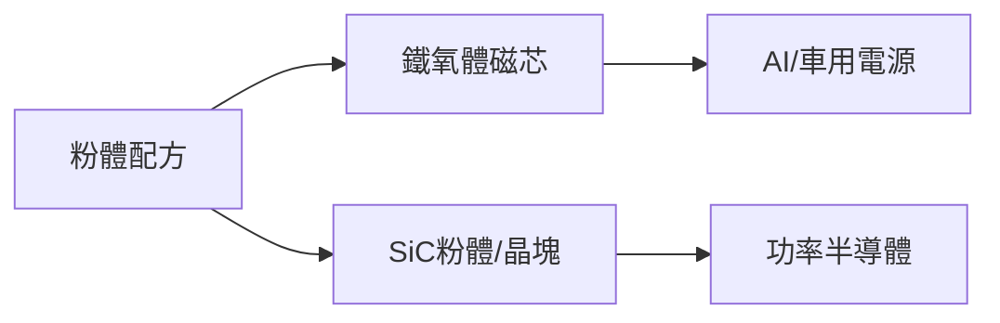

# 8121_越峰（市）

## 基本資料
越峰生產鐵氧體磁芯、磁性材料及 SiC 粉體／燒結材料，應用於電源、車用、AI 伺服器與高頻元件。2026Q2 公司簡報顯示 H1 營收 NT$1.745bn、年增 20.5%，毛利率 18.1%；此官方簡報數據優先於逐字稿中 24.5% 的誤植。

## 核心技術／競爭優勢
- 鐵氧體粉體配方與高頻磁芯量產能力。
- SiC 粉體、晶塊與燒結材料垂直整合，切入功率半導體。
- 馬來西亞產能布局降低供應鏈集中風險。

## 產品與應用
|產品|應用|下游|
|---|---|---|
|鐵氧體磁芯|AI電源、車用、網通|電源模組廠|
|SiC粉體／晶塊|功率半導體、HVDC|功率元件廠|

## 圖片 / 架構圖

## 時間軸
|時間|事件|類型|重要性|
|---|---|---|---|
|2026H2|鐵氧體稼動率維持高檔|放量|⭐⭐⭐|
|2027H1-H2|SiC 材料由試單轉商業貢獻|量產|⭐⭐|

## 供應鏈位置
- 上游：金屬氧化物與 SiC 原料。
- 下游：AI 伺服器電源、車用與功率半導體；所屬主題：[[供應鏈_被動元件]]。

## 相關公司
|公司|關係|說明|
|---|---|---|
|[[NVDA.US(nvidia)]]|需求端|AI 伺服器電源需求，非直接客戶|

> [!warning] 資訊衝突
> - [[報告_越峰_2026Q2法說簡報_20260828]]（公司簡報，2026-08-28）：H1 營收年增 20.5%。
> - [[活動_越峰法說_20260828]]（AI 逐字稿，2026-08-28）：摘要出現 24.5%，視為轉錄錯誤；以公司簡報為準。

## 來源
- [[報告_越峰_2026Q2法說簡報_20260828]]（公司簡報，2026-08-28）
- [[活動_越峰法說_20260828]]（AlphaMemo.ai，2026-08-28）
