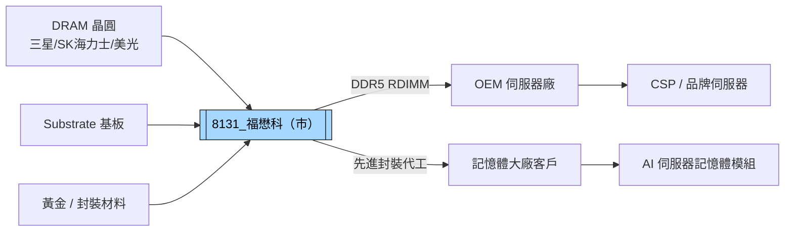

# 8131_福懋科（市）

## 基本資料

福懋科技（Force-MOS Technology，或稱福懋科），台灣 DRAM / 記憶體模組封測代工廠（非 PCB 製造），主力業務為 **BGA、Flip Chip 及 3D TSV 先進封裝代工**，下游應用以 DDR5 / RDIMM 伺服器記憶體模組為主，亦有 OEM 伺服器用及工業控制記憶體模組。定位為純代工廠，產能與客戶 Fab 搭配，量能可控。

> [!note] 業務性質說明
> 福懋科技是記憶體封測代工廠（類 OSAT 但專注記憶體），**不是 PCB 廠**，與 PCB 供應鏈的聯繫為下游應用（伺服器記憶體模組）而非 PCB 製造本身。

生產基地：台灣（一廠至五廠），目前 1-3 廠稼動率 95-99%+。五廠（7 層新廠房）已完成，Flip Chip + 多層 TSV 先進封裝產能 2027 年初至年底陸續開出，全年預計三個無塵室空間投入生產。

**1Q26 財務亮點**：
| 指標 | 數值 | YoY | 備註 |
|------|------|-----|------|
| 合併營收 | 29.45 億元 | +32% | 2026Q1 vs 2025Q1 |
| 毛利率 | 19.6% | 大幅提升 | 平均代工價格持續改善 |
| 營業淨利 | 4.75 億元 | +28.8% | — |
| 稅後淨利 | 4.26 億元 | +180% | — |
| EPS | 0.96 元 | — | 每股淨值 28.5 元 |
| 2026 全年 capex 預估 | 59.46 億元 | — | 歷史新高，先進封裝擴產 |

主要資料來源：[[活動_福懋科法說_20260611]]（2026-06-11，說明 1Q26 績效與五廠擴產規劃）。

## 核心技術／競爭優勢

- **3D TSV 鍍銅製程 + RDL 覆晶封裝**：2 層堆疊技術 2026Q3 小量市場；4 層多層堆疊 Q4 2026 完成技術開發 → 應用於 DDR5/RDIMM；台灣少數具備此製程能力的代工廠
- **Bumping + RDL 全流程代工（2027Q1 起）**：晶圓 Bumping → RDL → Flip Chip 封裝全流程，技術整合難度高，客戶黏著度強
- **純代工定位，產能穩定**：不做成品公司，產能跟隨客戶 Fab 配置，景氣波動時利潤不至極端惡化或虧損
- **客戶深度綁定**：從 BGA 切入，逐步推進至先進封裝，既有客戶衍生周邊需求，轉換成本高
- **高現金股利政策**：2025A EPS 1.36 元，配息 1 元（約 70%）；2026 配息率提升至 74%；現金充裕（2026 年初 40.56 億），無需籌資

## 產品與應用

| 產品 / 服務 | 技術 | 應用 | 下游 |
|-------------|------|------|------|
| BGA 封裝代工 | 傳統 BGA | DRAM / 記憶體模組 | 記憶體大廠 |
| Flip Chip 封裝代工 | 覆晶 | 高速 DRAM / SoC | 記憶體廠 / CSP |
| 3D TSV 2-layer 堆疊 | 3D TSV + RDL | DDR5 伺服器 RDIMM | 記憶體廠 |
| 3D TSV 4-layer 堆疊（2026Q4 完成）| 多層 3D TSV | 未來 HBM-like 方向 | 記憶體廠 |
| Bumping + RDL 全流程（2027Q1）| 晶圓 Bumping + RDL + Flip Chip | 先進封裝全製程代工 | 記憶體 / 先進封裝客戶 |
| OEM 記憶體模組 | 標準 | OEM 伺服器 / 工業控制 | ODM 伺服器廠 |

## 圖片 / 架構圖

> 福懋科介於記憶體晶圓廠與記憶體模組廠之間，提供封裝代工服務；五廠擴產後 Flip Chip + 3D TSV 成為主力差異化製程。

## EPS 記錄

| 年度 / 季度 | EPS（元） | 備註 |
|------------|---------|------|
| 2025A | 1.36 | 實際值；現金配息 1 元（70%） |
| 1Q26 | 0.96 | 季度 EPS；毛利率 19.6%，YoY +180% |
| 2026 配息率 | 74% | 提升，高現金股利政策延續 |

## 時間軸

| 時間 | 事件 | 類型 | 重要性 | 備註 |
|------|------|------|--------|------|
| 2025 年底 | 五廠取得使用執照，開始公用機電設備裝設及無塵室建設 | 擴產 | ⭐⭐⭐ | 7 層新廠房 |
| 2026-Q2 | 五廠 Bumping/RDL 新機台陸續移入，開始試車 | 擴產 | ⭐⭐ | — |
| 2026-Q3 | 3D TSV 2-layer 堆疊進入小量市場 | 技術 | ⭐⭐⭐ | DDR5 RDIMM 應用 |
| 2026-Q4 | 4-layer 多層堆疊技術開發完成；Bumping/RDL 完成客戶初期驗證 | 技術 | ⭐⭐⭐ | — |
| 2026 全年 | 資本支出 59.46 億（歷史新高），先進封裝五廠產能擴建 | 擴產 | ⭐⭐⭐ | 今明兩年均為 capex 高峰 |
| 2027-Q1 | 五廠 Bumping + RDL + Flip Chip 全流程代工服務正式提供 | 里程碑 | ⭐⭐⭐ | — |
| 2027 全年 | 五廠三個無塵室空間陸續投入，先進封裝產能大幅開出 | 放量 | ⭐⭐⭐ | 1-3 廠目前 95-99%；4-5 廠 +20% |

## 供應鏈位置

- **上游晶圓廠**：DRAM 晶圓廠（三星、SK 海力士、美光等，供應晶圓進行封裝代工）
- **上游材料**：Substrate（基板，價格持續上漲）、黃金（封線用，價格高波動）、電力（夏季增加，綠電成本）
- **下游客戶**：記憶體大廠（BGA/Flip Chip/3D TSV 代工）→ OEM 伺服器廠 → CSP / 品牌伺服器
- **競爭者**：日月光（封測龍頭）、力成（記憶體封測）等 OSAT
- **所屬供應鏈**：[[供應鏈_先進封裝載板]]（先進封裝製程鏈）

## 相關公司

| 公司 | 關係 | 說明 |
|------|------|------|
| 三星電子（未建頁）| 潛在客戶（上游） | 全球 DRAM 龍頭，封測代工需求 |
| SK 海力士（未建頁）| 潛在客戶（上游） | HBM 龍頭，記憶體封測需求 |

> [!warning] 風險與注意事項
> - **Substrate 與黃金價格波動**：毛利率對 substrate 與黃金 ASP 敏感度高，黃金曾漲至 5,000 元以上，成本轉嫁有滯後；電力費用夏季上漲亦為壓力
> - **五廠擴產執行風險**：2026 年 capex 高達 59.46 億元為歷史高峰，先進封裝良率爬坡期若拉長，折舊攤銷壓力在 2027 年將顯著增加
> - **DRAM 景氣循環**：HBM 排擠一般 DRAM 產能造成代工需求成長，但若 HBM 需求放緩或 DRAM 供給過剩，下游客戶代工需求可能下修
> - **客戶集中**：以既有客戶為主，新客戶開拓速度影響五廠產能填充率

## 來源

- [[活動_福懋科法說_20260611]]（2026-06-11；1Q26 財務、五廠擴產規劃、3D TSV/Bumping+RDL 技術路線、記憶體市場展望）
