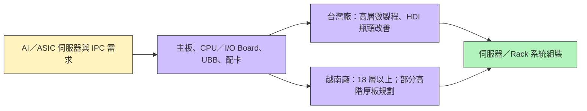

# 8155_博智（櫃）

## 基本資料
博智電子（ACCL）為台灣上櫃 PCB 廠，提供伺服器、工業電腦與網通用多層板。公司在 2026 年 9 月座談會表示，Server 約占應用營收 80%、IPC 約 20%、網通約 1%（為公司約數，合計略高於 100%）；14 層以上板約占 PCB 組合 80%。AI／ASIC 伺服器與高階 IPC 推動層數、厚度及產品組合升級，越南新廠若如期爬坡，將增加供給空間。掛牌資訊參照[博智公司簡介](https://www.accl.com.tw/tw/modules/news/article.php?storyid=1)與[櫃買中心上櫃公告](https://www.tpex.org.tw/storage/eb_data/10112/10100301961.htm)；營運觀察來源為 [[活動_博智8155_華南投顧_20260924]]（華南投顧，2026-09-24）。

## 核心技術／競爭優勢
- 多層板能力：公司稱 14 層以上產品約占組合 80%，現有量產出貨最高約 50 層；設備技術能力最高約 72 層、板厚 8 mm。設備能力不等於可穩定量產或客戶認證規格。
- AI 伺服器板卡覆蓋：座談會稱已供應伺服器／Rack 內多種板件；GPU 加速卡最高階 HDI 板尚未大量出貨，部分新平台 CPU 板處於打樣與小量產。
- 高階 IPC 與產品組合：高階 IPC 可使用 40 多層板；公司以解決高階板製程瓶頸、提高層數與 ASP 作為台灣廠方向，若面積不增仍有組合改善空間。
- 越南產能布局：一期設備設定以 18 層以上板為主，客戶需求下約 20% 規劃配置更高階、更厚及更大尺寸板；目前仍是建置與爬坡計畫。

## 產品與應用
| 產品 / 服務 | 應用 | 相關客戶 / 下游 |
|---|---|---|
| 多層伺服器 PCB | Server 主板、CPU Board、I/O Board、UBB 與各式配卡 | 未具名伺服器 ODM、品牌客戶及 CSP；客戶身分未揭露 |
| 高階多層板／HDI | AI／ASIC 伺服器與 GPU 加速卡 | GPU 最高階 HDI 尚未大量出貨；不推定客戶名稱 |
| 工業電腦 PCB | 高階 IPC，包含 40 多層板 | 未具名 IPC 客戶 |

## 圖片 / 架構圖

圖說：依 2026-09-24 座談會，博智供應伺服器與 Rack 內多種 PCB；GPU 最高階 HDI 尚未大量出貨。越南廠配置與量產節點為公司計畫，仍待後續驗證。

## 時間軸
| 時間 | 事件 | 類型 | 重要性 | 備註 |
|---|---|---|---|---|
| 2026-09 底（原目標，待確認） | 越南廠一期首批設備進場安裝 | 擴產 | ⭐⭐ | 2026-09-24 座談會提出的計畫；截至 2026-10-07 尚未確認是否按期完成 |
| 2026-10–11（預估） | 越南廠第二期預計啟動 | 擴產 | ⭐⭐ | 公司計畫，尚非已完成建置 |
| 2027Q2（目標） | 越南廠一期具備量產能力 | 量產 | ⭐⭐⭐ | 公司目標；實際良率、客戶認證與稼動率待驗證 |
| 2027Q1 前（能見度） | 部分 IPC 客戶訂單能見度 | 訂單 | ⭐⭐ | 座談會轉述，不等同新增訂單或保證出貨 |

→ 跨公司追蹤見 [[時程_2026Q3Q4_AI網通與硬體催化劑]]。

## 供應鏈位置
- 中游 PCB 製造：承接伺服器與 IPC 設計所需多層板，供應系統／Rack 內多種板件；尚無來源具名可列示的終端客戶或 ODM。
- 所屬主題：[[供應鏈_AI伺服器PCB]]、[[技術_PCB]]。

## 相關公司
目前來源未具名客戶、ODM 或競合公司，因此 `related_companies: []`；後續取得可確認公司關係再補列。

> [!warning] 風險與注意事項
> - AI 需求強勁及主要客戶接受漲價均為座談會轉述；產品組合、價格轉嫁與毛利率改善仍需財報驗證。
> - 越南廠 2027Q2 量產是公司目標；設備進度、良率、認證與利用率可能使營收貢獻延後。
> - 72 層／8 mm 為設備技術能力上限，並非等同目前量產規格；最高階 GPU HDI 尚未大量出貨。
> - Server、IPC、網通約數合計略高於 100%，且口徑未在座談會中進一步調節，使用時保留原始約數。

## 來源
- [[活動_博智8155_華南投顧_20260924]] — 華南投顧座談會摘要，2026-09-24。
- [博智公司簡介](https://www.accl.com.tw/tw/modules/news/article.php?storyid=1) — 公司官網；[櫃買中心上櫃公告](https://www.tpex.org.tw/storage/eb_data/10112/10100301961.htm) — 上櫃日期與代號。

## 相關頁面
- [[分析_博智AI伺服器PCB與越南廠放量_20260924]]
