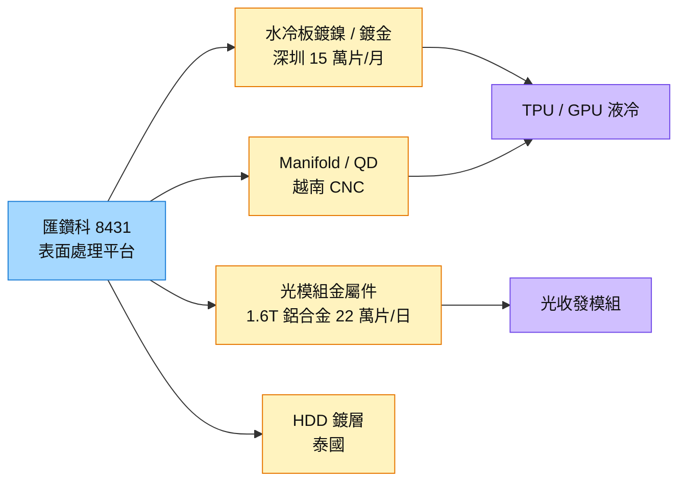

# 8431_匯鑽科（櫃）

## 基本資料

匯鑽科原為消費性連接器電鍍廠（2025 年手機／連接器約占 75%、硬碟約 20%），自 2025 年起轉型為 AI 高精密製造與表面處理平台，三大成長軸為水冷板鍍鎳／鍍金、光模組金屬件、液冷管路零組件（Manifold、QD 快接頭）。具備中國（深圳江碧）、泰國、北越三國表面處理與排污資格，可為美系終端客戶做多國產能配置。

- **水冷板：** 聚焦 TPU 用 MCCP 水冷板局部鍍鎳鍍金與 GPU 水冷板鍍鎳；TPU 專案已完成 EVT、DVT（第一至第六階段），即將進入 PVT；GPU 專案送認證中，客戶希望 4Q26 底至 1Q27 量產。深圳小線 1,000 片／日已認證、大線 4,500 片／日 9 月底送終端客戶審查，合計月產能約 15 萬片；可於 90 天內再建一條大線。
- **光模組金屬件：** 深圳首條 1.6T 鋁合金全自動線 10 月底建成、11–12 月量產，產能約 22 萬片／日（逾 600 萬片／月），4 家客戶洽談中、在手需求約 9–10 萬片／日；泰國 800G 鋅合金實驗線 1.5 萬片／日，泰國新廠 1.6T 線 2027 年爬坡，目標 2027 年光模組占泰國營收約 60%。
- **Manifold／QD：** 深圳 Manifold 試產（目標 6,000 根／月→1 萬根），越南 QD 快接頭 2026 年 6 月開始交貨。
- **損益兩平：** 管理層估單月營收約 1.2 億元較易達損益兩平；水冷板與光模組毛利率目標超越 2020–2021 年歷史高點。

資料來源：[[活動_匯鑽科8431_元大論壇Memo_20260915]]（元大投資論壇，2026-09-15）

## 核心技術／競爭優勢

- **電鍍資格與排放額度：** 水冷板接單需同時具備電鍍資格、工業區許可與廢水排放額度，三國合計廢水許可約 2,100 噸／日。
- **無塵室與檢測：** 深圳水冷板專案無塵室與檢測設備投資逾人民幣 2,000 萬元，導入 KEYENCE VK-X3000 雷射顯微鏡做鍍前鍍後全檢，良率 97–99%。
- **清洗鈍化 know-how：** Manifold 與 QD 需去脂、去游離鐵、電解拋光與鈍化，避免殘留微粒堵塞快接頭。
- **泰國先行優勢：** 2016 年即進入泰國，中國光模組大廠產能外移泰國時具時間優勢。

## 產品與應用

| 產品 / 服務 | 應用 | 相關客戶 / 下游 |
|-------------|------|-----------------|
| 水冷板局部鍍鎳鍍金（MCCP）／鍍鎳 | TPU、GPU 液冷 | 美系兩大終端客戶（經散熱模組廠） |
| 1.6T 鋁合金／800G 鋅合金光模組金屬件 | 光收發模組外殼 | 光模組金屬件客戶 4 家 |
| Manifold、QD 快接頭、清洗鈍化 | AI 伺服器液冷管路 | NVIDIA 平台與中國 AI 伺服器客戶 |
| HDD 讀寫臂鍍層 | 50TB 以上高容量硬碟 | 硬碟客戶（泰國基本盤） |

## 圖片 / 架構圖

圖說：匯鑽科以電鍍與表面處理能力，從手機連接器轉向 AI 液冷與光模組兩條新產品線，深圳先量產認證、再複製到北越與泰國。

## 時間軸

| 時間 | 事件 | 類型 | 重要性 | 備註 |
|------|------|------|--------|------|
| 2026-09 底 | 深圳水冷板大線認證報告送終端客戶審查 | 認證 | ⭐⭐⭐ | [[活動_匯鑽科8431_元大論壇Memo_20260915]] |
| 2026-11～12 | 深圳 1.6T 鋁合金光模組全自動線量產 | 放量 | ⭐⭐⭐ | 22 萬片／日 |
| 4Q26 底～1Q27 | GPU／TPU 水冷板鍍層量產 | 放量 | ⭐⭐⭐ | 客戶期望時程 |
| 2026-12～2027-01 | 泰國新廠設備進場，1.6T 線 2027 年爬坡 | 擴產 | ⭐⭐ | — |

→ 跨公司時程詳見 [[時程_2026-2027高速互連與分散式算力]]

## 供應鏈位置

- 上游：鋁合金、鋅合金、不鏽鋼棒材、電鍍化學品
- 下游：散熱模組／水冷板廠、光模組廠、AI 伺服器液冷系統
- 所屬供應鏈：[[供應鏈_AI伺服器散熱]]、[[供應鏈_AI光互聯]]

## 相關公司

尚無公開揭露之客戶名稱（管理層僅稱美國兩大終端客戶），`related_companies` 暫留空。

## 風險與注意事項

> [!warning] 風險與注意事項
> - **認證未完成：** 水冷板大線與 GPU 專案仍在認證，量產時程依終端客戶審查。
> - **轉型期虧損：** 營收需達單月約 1.2 億元才易損益兩平；消費性連接器占比仍高。
> - **執照與審批：** 越南第二廠電鍍執照與環評時程長。
> - **客戶集中：** 水冷板主要對應美系兩大終端客戶。

## 來源

- [[活動_匯鑽科8431_元大論壇Memo_20260915]] — 元大投資論壇 Call Memo，2026-09-15

## 相關頁面

- [[技術_光模塊]]
