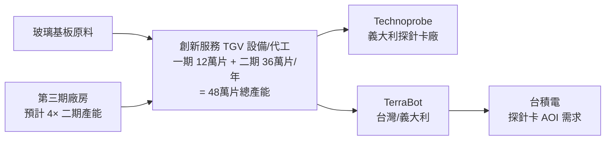

# 8482_創新服務（市）

## 基本資料

創新服務股份有限公司（台股代號 8482）為台灣上市半導體設備及玻璃基板技術公司，主要聚焦於 TGV（Through Glass Via，玻璃穿孔）設備製造與代工，並延伸至 PCB 探針卡設備、先進封裝自動化設備及 AIP-Attentive Packaging 整合電感模組。

三大成長引擎：(1) TGV 玻璃基板設備及代工；(2) 探針卡與量測設備；(3) AIP-Attentive Packaging 產品（含 Power Mini IC）。毛利率極高——設備類 70–80%+，代工 80–90%+——反映技術壁壘。義大利 Google Cloud 投資後，公司取得全球最大銀行市場，成為重要里程碑。主要客戶為 Technoprobe（義大利）及 TerraBot（義大利/台灣）。

資料來源：[[活動_創新服務法說_20260605]]（2026-06-05 法說）

## 核心技術／競爭優勢

- **TGV（Through Glass Via）技術壟斷地位**：產能 48 萬片/年（一期 12 萬 + 二期 36 萬）仍無法滿足客戶需求；全球高速微波探測模式供應商僅兩家，另一家在美國；護城河為製程積累與良率
- **高度垂直整合**：自行開發設備（工程師設計）+ 材料包 + 代工三位一體，現金流自主、不需外部合作
- **持續研發與每月發明**：專業團隊每月產出 8–30 件持續性發明，目標每年 30–40 項，深耕核心建立物產科學
- **自動化 AI 融合能力**：結合 Neural Network 自動化，開發第二波自動化管理設備（2026Q4 開發，2027Q1 出貨），ASP 較現有產品提升

## 產品與應用

| 產品 / 服務 | 應用 | 相關客戶 / 下游 |
|-------------|------|-----------------|
| TGV 設備（一/二期） | 玻璃穿孔基板製造 | Technoprobe、TerraBot |
| TGV 代工 | 玻璃基板代工 | 半導體 IC 封裝廠 |
| 材料包（TGV 配套） | 配套耗材 | 設備客戶 |
| 探針卡設備 | 晶圓測試 | 探針卡廠 |
| AIP-Attentive Packaging | 整合電感模組 | 醫療型耳機 WiFi 模組、Power Lay 整合電感 |
| Power Mini / Power Mini IC | 小型電源模組 | 目標初期供應 1000 萬個 |
| 第二波自動化管理設備（2027Q1）| 產線自動化 | 計劃 3–5 年全面自動化 Main 產線 |

## 圖片 / 架構圖

> 自製 TGV 供應鏈示意圖；來源：[[活動_創新服務法說_20260605]]

## EPS 記錄

| 月/季度 | EPS（NT$） | 備註 |
|---------|------------|------|
| 2026-04（月） | **1.35** | YoY 營業收入、毛利、營業利益率均顯著提升 |

- 2026 年 4 月營收：NT$1.3 億元
- 下半年預期正向成長（訂單需求量增加）
- 毛利結構：設備 70–80%+；代工 80–90%+；材料包 ~30%

## 時間軸

| 時間 | 事件 | 類型 | 重要性 | 備註 |
|------|------|------|--------|------|
| 2026Q3 | 新竹東北廠第三季全面建成 | 產能 | ⭐⭐⭐ | 大幅增加設備產量 |
| 2026Q4 | 第二波自動化管理設備開發完成並送認證 | 技術 | ⭐⭐⭐ | ASP 更高整合度與精密度 |
| 2027Q1 | 第二波自動化管理設備開始出貨 | 出貨 | ⭐⭐⭐ | |
| 2027 年 | 推出第三代 TGV 產品 | 技術 | ⭐⭐⭐ | 2027 年前完成所有小樣式退化 |
| 2027 後 | 第三期新場地啟用（二期四倍產能）| 產能 | ⭐⭐⭐ | 以滿足持續供不應求的 TGV 需求 |
| 2028–2029 | 公司預期需求持續旺盛 | 展望 | ⭐⭐ | 法說明確表示旺至 2028–2029 |

## 供應鏈位置

- 半導體先進封裝設備提供商（TGV 玻璃基板）
- 下游客戶：Technoprobe（義大利，探針卡）、TerraBot（義大利/台灣，支援台積電需求）
- 參與 A-plus 計畫（玻璃機板，與工研院合作）
- [[供應鏈_先進封裝載板]]：TGV 玻璃基板為先進封裝載板關鍵技術

## 相關公司

| 公司 | 關係 | 說明 |
|------|------|------|
| [[2330_台積電（市）]] | 間接客戶 | TerraBot 台灣團隊優先支援台積電需求 |

> [!warning] 風險與注意事項
> - **客戶集中**：主要客戶 Technoprobe 及 TerraBot 為高度集中，若其需求放緩，影響顯著
> - **產能擴充風險**：三期廠預計四倍於二期，龐大資本支出壓力；若 TGV 需求增速放緩，存在產能閒置風險
> - **技術競爭**：全球僅兩家高速微波探測供應商，技術若被競爭者追上，護城河將縮窄
> - **存貨 / 備料**：因應成長備料與增聘人力，存貨及費用相對偏高，若訂單延遲影響現金流

## 來源

- [[活動_創新服務法說_20260605]]（2026-06-05，創新服務法說；業務副董 林俊忠 / 財務協理 張琪琪）
