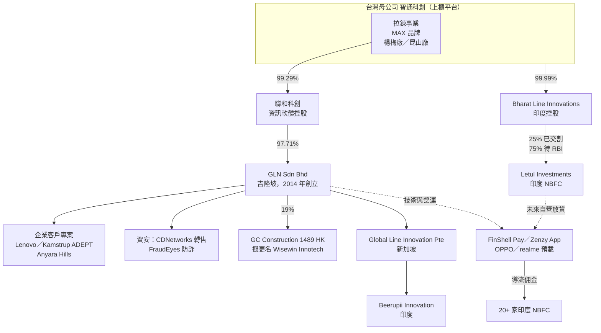

# 8932_智通（櫃）

> [!info] 資料更新狀態
> - **資料截止日**：2026-10-07
> - **最新已公布季度**：2Q26（2026/8/13 董事會通過，勤業眾信核閱）；公司會計年度＝日曆年度，本頁所有季度與年度皆為日曆年，未混用。
> - **最新月營收**：2026 年 8 月（9 月營收依規定 10/10 前公布，撰寫時尚未取得）。
> - **最新重大事件**：2026/9/24 完成印度 NBFC 公司 Letul 首階段 25% 股權交割（10/2 公告）；子公司 GLN 持有 19% 的港股 GC Construction（1489 HK）於 2026/10/6 股東會通過更名。
> - **股價參考**：NT$90.1（2026/10/6 收盤）；股本 10.65 億元、面額 NT$2.5、發行股數約 4.26 億股，市值約 NT$384 億。
> - **資料涵蓋缺口**：vault 內無任何 8932 券商報告、法說 memo 或 Raw_data；本頁以公司財報、法說簡報、重訊與公開媒體為主建立。Valuation 與 Debate 中的「券商觀點」僅能引用二手轉述，信心水準低，需待取得券商報告後更新。

> [!note] 來源分級標記
> 〔財報〕經會計師查核／核閱之合併財報與重訊；〔法說〕公司法說簡報與官網；〔媒體〕財經媒體轉述管理層說法；〔第三方〕非公司來源（投顧轉述、產業網站、外國監管文件）；〔推論〕本頁依資料自行計算或推導，未經公司證實。

---

## 1. Quick Guide

**一句話定位**：智通是一家「台灣上櫃殼＋馬來西亞軟體公司＋印度手機金融 App 流量」的組合體。帳面上仍有傳統拉鍊工廠（MAX 品牌），但 2025 年 69% 營收、約 86% 毛利來自子公司 Global Line Network（GLN）的企業軟體與相關服務。〔財報〕〔法說〕

**三塊業務**

| 業務 | 2Q26 營收占比 | 毛利率 | 對獲利的角色 |
|---|---|---|---|
| 軟體事業（GLN 企業軟體＋印度 Fintech 導流） | 61% | 86%（2Q26） | 幾乎全部的營業利益來源 |
| 拉鍊製造（台灣楊梅、中國昆山） | 39% | 21%（2Q26） | 現金流穩定，但只占約 14% 毛利 |
| 印度自營放貸（收購 NBFC Letul 中） | 0% | n.a. | 選擇權價值，2027–28 才可能放量 |

〔財報〕依合併財報「客戶合約收入之細分」計算。

**主要客戶**：GLN 揭露的旗艦客戶為 Lenovo（亞太 11 國銷售管理系統）、丹麥水表商 Kamstrup（ADEPT 智慧水表維運平台，GLN 為其歐洲以外市場獨家技術夥伴）、馬來西亞 Anyara Hills 智慧社區、Alliance Bank（資安 MSA）。印度端合作方為 OPPO／realme（預載 App 版位）與 20 多家印度 NBFC（貸款導流）。〔法說〕

**商業模式**：GLN 以「顧問 → 專案建置 → 維護 → SaaS 訂閱」四段收費；印度 App 目前以向 NBFC 收取導流佣金為主，未來目標是取得 NBFC 執照後自營放貸，改賺利差。〔法說〕

**成長動能（依確定度排序）**

1. GLN 既有大客戶跨模組擴充與維運收入（已有財務證據，但 3Q25 起單季軟體營收持平在 NT$3.9–4.2 億）。
2. ADEPT 平台在 Kamstrup 生態系內複製到新公用事業客戶（日本 Azbil Kimmon、馬來西亞 Cubiq Meters 已簽），屬於「已有 traction、尚未大量變現」。
3. 資安產品線（CDNetworks 轉售＋FraudEyes）與經常性收入，屬於早期。
4. 印度自營小額信貸：首階段 25% 股權已交割，其餘 75% 需 RBI 核准，管理層把放量時點放在 2027–28。

**主要風險**：軟體營收成長停滯、客戶集中、83–88% 軟體毛利率的可持續性、印度監管與時程反覆延後、非本業投資（港股 GC Construction、比特幣可轉債）帶來的治理與盈餘波動、董監質押與融資餘額偏高、估值已反映相當成長（TTM P/E 約 51 倍）。

---

## 2. 公司介紹

### 2.1 歷史：從拉鍊廠到軟體控股

| 時間 | 事件 | 來源 |
|---|---|---|
| 1978/2 | 宏大拉鍊於台北新莊創立，1979 年自創 MAX 品牌 | 〔法說〕官網大事記 |
| 1995／2004 | 設立宏大拉鍊（中國）昆山廠，2004 年投產 | 〔法說〕 |
| 2001/3/29 | 上櫃，為台灣唯一掛牌拉鍊廠 | 〔法說〕 |
| 2020–2022 | 本業連年虧損（2020–22 營業利益率 -6%～-4%）；2020 年鍾富瑋、蔡焜煌團隊入主 | 〔財報〕〔媒體〕工商時報 2025/6/29 |
| 2023/3 | 經子公司聯和科創收購馬來西亞 GLN 97.71% 股權 | 〔財報〕〔媒體〕經濟日報 2026/6/26 |
| 2023/6 | 更名智通科創，9/25 生效 | 〔媒體〕 |
| 2023 起 | 承接 OPPO 退出印度金融業務後的 FinShell Pay App 營運，取得 OPPO／realme 印度手機預載版位 | 〔媒體〕工商時報 2025/6/29；〔法說〕 |
| 2024/9/9 | 面額 NT$10 → NT$5 | 〔法說〕 |
| 2025/2 | 現增 400 萬股，每股 NT$90，募資 3.6 億元用於償還銀行借款 | 〔媒體〕旺得富 2025/1/16；〔財報〕 |
| 2025/8 | 董事會通過「比特幣儲備策略」，領投 Top Win International（現 SORA）US$1,000 萬三年期可轉債，智通出資 US$200 萬 | 〔媒體〕區塊客 2025/9/2；〔第三方〕SEC 6-K 2025/8/15 |
| 2025 | 楊梅新廠啟用（投資約 NT$7 億，取代龍潭廠） | 〔法說〕〔媒體〕今周刊 2023/9 |
| 2025/12/22 | 面額 NT$5 → NT$2.5（1 拆 2），2026/3/9 換發新股 | 〔法說〕 |
| 2026/1 | 簽署印度 Letul Investments 100% 股權 SPA | 〔媒體〕經濟日報 2026/2/2 |
| 2026/3 | 以 NT$7,293 萬增持聯和科創，持股 90.70% → 99.29% | 〔財報〕2Q26 附註 |
| 2026/8/25 | GLN 以 HK$7,790 萬（約 NT$3.17 億）取得港股 GC Construction 19% | 〔財報〕重訊 |
| 2026/9/24 | 完成 Letul 首階段 25% 交割 | 〔媒體〕經濟日報 2026/10/2 |

**解讀**：智通的轉型路徑是「併購而來」。2022 年以前的拉鍊本業每年營收約 NT$8–9 億、持續虧損；2023 年起獲利改善幾乎全部來自 GLN 併表。因此研究這家公司，等同研究 GLN 與印度 App 這兩個海外資產，台灣母公司扮演上市平台與資金調度角色。〔推論〕

### 2.2 經營團隊與股權

- 董事長鍾富瑋（永讚開發代表）、總經理蔡焜煌（宏達開發代表）、副董事長黃偉特；董事另有兩位馬來西亞籍人士 Vincent Wong Mun Seng、Tan Tiong Ming。〔第三方〕富聯網 2026/9 董監持股
- 法人股東永讚開發持股 7.84%、宏達開發持股 7.95%，兩者質押比率各約 40%。〔第三方〕富聯網 2026/9
- 理財周刊 2026/7/15 指出融資餘額 63,593 張、占股本約 17.8%，董監質押比 47.9%（與富聯網 9 月資料口徑不同）。〔媒體〕
- 〔推論〕兩位馬來西亞籍董事與 GLN 的關係公司未正式說明，可能為 GLN 原經營團隊，待年報確認。

### 2.3 公司在價值鏈中的位置

圖說：依 2Q26 合併財報子公司持股表與 1H26 法說簡報繪製。App 與 GLN 之間的契約關係公司未完整揭露，以虛線表示〔推論〕。FinShell Pay 在 Google Play 的發行主體為 M-Kash India Financial Solutions（2019 年設立，原為 OPPO Kash／realme PaySa 背後的 FinShell 團隊），該公司不在智通子公司清單內〔第三方〕。

### 2.4 這家公司替客戶解決什麼問題

**GLN（企業軟體）**：許多跨國品牌在東南亞各國有大量第一線人員（門市促銷員、水表安裝技師、保全），總部需要知道他們在哪、做了什麼、賣了多少。大型套裝軟體（如 SAP、Salesforce）功能完整但昂貴、在地化慢；GLN 的做法是替單一客戶量身打造一套行動 App＋後台系統，再按年維運、擴模組。以 Lenovo 為例，系統從 2019 年馬來西亞的銷售追蹤、考勤、庫存開始，逐步加上商品陳列、全球展示機互動介面（Lenovo on The Beat），擴展到亞太 11 國。〔法說〕

**印度 App**：印度有大量年輕、缺乏信用紀錄的手機用戶，傳統銀行難以放款給他們。手機出廠預載的 App 等於拿到免費的開機入口，智通在這個入口放上「貸款超市」，把申貸者篩選後推薦給合作 NBFC，按成功件數收佣金。〔法說〕

**拉鍊**：成衣與包袋品牌需要符合國際認證、交期穩定的拉鍊供應商；MAX 在高附加價值、小批量訂單有定位，量大品則由昆山廠負責。〔媒體〕工商時報 2025/6/29

---

## 3. 產品與業務架構

### 3.1 產品分層

| 層級 | 產品／服務 | 是什麼（白話） | 目標客戶 | 收費方式 | 狀態 |
|---|---|---|---|---|---|
| 應用層：企業流程平台 | 銷售管理（Lenovo）、Field Force Management、通路管理、供應鏈、HR（PortComm）、預訂管理、電商 | 替企業做「管人、管貨、管單」的客製化 App 與後台 | 跨國品牌在東南亞的分公司 | 專案建置費＋年度維護＋部分 SaaS | 主力收入，已變現 |
| 應用層：產業平台 | ADEPT 智慧水表平台 | 水表讀數、安裝更換、維修派工、即時資料同步 | Kamstrup 及其公用事業客戶 | 建置里程碑款＋長期維運 | 已變現，2026 新增 2 家客戶 |
| 應用層：智慧社區 | Anyara Hills 系統 | 住戶繳費、訪客通行、SOS、AI 客服、活動管理 | 高端住宅社區開發商 | 專案＋後續模組 | 2026/5/20 上線，7/1 App 上架 |
| 資安層 | FraudEyes（行動威脅防護）、Captivity（弱點掃描）、Slaughtery（韌體與供應鏈稽核）、Infiltration（紅隊演練） | 偵測手機上的詐騙 App、替機構找漏洞 | 政府、電信、銀行 | 專案／訂閱 | 早期，營收貢獻未揭露 |
| 資安轉售 | CDNetworks 雲端資安（Alliance Bank MSA） | 代理國際 CDN／WAF 平台，在地導入與合規客製 | 馬來西亞銀行 | 分潤制＋長約 | 早期 |
| 消費端 | FraudEyes Mobile | 一般用戶自行安裝的防詐 App，持續監控 | 馬來西亞手機用戶 | Google Play 訂閱 | 2026/6 推出，無用戶數據 |
| 流量層（印度） | FinShell Pay → Zenzy App | 預載於 OPPO／realme 的金融生活 App：貸款超市、遊戲、繳費、會員點數、理財保險上架 | 印度年輕手機用戶 | NBFC 導流佣金、廣告、合作分潤 | 已有收入，金額未單獨揭露 |
| 金融層（印度，規劃中） | Letul NBFC 自營放貸 | 自己出資放小額貸款，賺利差 | Zenzy 用戶 | 利息收入 | 25% 已交割，待 RBI |
| 製造層 | MAX 尼龍、塑鋼、金屬、隱形拉鍊 | 成衣、包袋用拉鍊 | 成衣品牌與代工廠，銷售 40 餘國 | 產品銷售 | 成熟業務 |

〔法說〕1H26、4Q25、3Q25 法說簡報；〔財報〕收入認列政策。

### 3.2 重要名詞白話解釋

- **ERP／SaaS**：ERP 是企業管理進銷存與財務的核心系統；SaaS（Software as a Service）是把軟體放在雲端、按月或按年收訂閱費。GLN 現階段主要做客製專案，SaaS 是轉型方向。
- **Field Force Management**：管理外勤人員的系統，例如派工、打卡、拍照回報、庫存盤點。ADEPT 屬於此類，專用於水表安裝與維修。
- **NBFC（Non-Banking Financial Company）**：印度的非銀行金融公司，持 RBI 執照可放款但不能吸收活期存款，是印度數位小額信貸的主要放款主體。
- **LSP（Lending Service Provider）**：替持牌放款機構找客戶、做初步篩選與催收服務的業者，本身不承擔信用風險。FinShell／Zenzy 的貸款超市即屬此類。
- **預載 App（Pre-installed App）**：手機出廠就裝好的 App，用戶不用下載，取得成本低，但主動使用率通常偏低。
- **MAU／DAU**：月活躍與日活躍用戶數。
- **合約負債**：客戶已預付、公司尚未提供服務的金額，可視為部分預收款的先行指標。
- **非控制權益（NCI）**：子公司不屬於母公司股東的那一部分淨利；NCI 下降代表更多子公司獲利歸母公司股東。

### 3.3 GLN：智通真正的獲利引擎

- **規模與背景**：2014 年創立、總部吉隆坡，業務橫跨 13 國，與 30 多家跨國企業合作。〔法說〕
- **收入組成**：公司揭露分為顧問、專案、維護、SaaS 四類，但未揭露各類金額或占比。〔法說〕收入認列政策顯示，應用軟體銷售與開發勞務在「某一時點」（交付或里程碑）認列，維護服務「隨時間」認列。〔財報〕2025 年報附註
- **GLN 合約總金額（US$ 百萬）**：2022 年 1.9、2023 年 11.8、2024 年 21.6、2025 年 37.6；1–3Q25 為 29.9；2026 年 1Q 為 33.6、2Q 為 40.7。〔法說〕
  - 〔推論〕此指標定義未說明。若為當年度累計簽約金額，1Q26 單季 33.6 已接近 2025 全年，與軟體營收持平矛盾；較可能為「有效合約總值」或滾動 12 個月簽約額。建議下次法說請公司釐清。
  - 〔推論〕2025 年軟體營收約 NT$15.6 億（約 US$4,800 萬，以 32.5 匯率概算），高於 GLN 合約總金額 US$3,760 萬，代表軟體營收中有一部分不在 GLN 合約統計內，可能包括印度 App 相關收入或其他子公司收入。
- **核心客戶深化進度（1H26）**：Lenovo 四項平台穩定運行，進入「2027 財年」合約續約準備；ADEPT 平台強化模組 2026/5 完成最終付款里程碑，客製化工單模組進入開發，UAT 預計 4Q26；兩季 SLA 達成率 100%。〔法說〕
- **對財務的意義**：GLN 交付以既有平台改寫為主，邊際交付成本低，這是軟體毛利率能維持 80% 以上的主要解釋。公司在 1H26 簡報中也主張「既有平台邊際複製成本遞減」。〔法說〕

### 3.4 印度 Fintech：流量入口與放貸執照

**現況（流量變現階段）**

- 預載於印度 OPPO 與 realme 手機；OPPO＋realme 合計約 23% 印度智慧型手機市占、2024 年約 3,000 萬支年銷量。〔法說〕3Q25 簡報
- 貸款超市串接 20 多家印度 NBFC，2025 年 4Q 新增 L&T Finance、Poonawalla；1H26 新增 Spheeti Fintech、CreditSea。理財與保險上架 ICICI Lombard、HDFC Life、Axis Mutual Fund、YesBank、Kotak811；支付合作 Juspay；另有 Bajaj EMI 卡、AngelOne。〔法說〕
- 收入來源：導流佣金、付費廣告、遊戲與異業合作分潤。〔法說〕3Q25 簡報
- 遊戲：與華義合資（華義 51%、智通 49%）開發 StarX City，智通以權益法認列，2Q26 帳面 NT$1,017 萬。〔媒體〕〔財報〕

**用戶指標演變（口徑不一致，需謹慎使用）**

| 時點 | 累計裝機 | MAU | 來源 |
|---|---|---|---|
| 2024 年底 | 1.2 億 | 2,400 萬 | 〔法說〕CEO Week 2025/4 |
| 2025/6 | 年下載 1.2 億 | 2,500 萬 | 〔媒體〕工商時報 |
| 2025/8 | 1.27 億 | n.a. | 〔媒體〕旺得富 2025/8/15 |
| 3Q25 | 1.19 億 | 2,398 萬（季平均） | 〔法說〕3Q25 |
| 2025/12 | 1.15 億 | 2,116 萬 | 〔法說〕4Q25（1H26 簡報改稱「2025 年平均」） |
| 2026/6 | 逾 1.3 億 | 2,300 萬（近三個月） | 〔法說〕1H26 |
| 2026/9 | n.a. | 2,100 萬以上；DAU 90 萬以上 | 〔法說〕官網 |

- 公司說明 2025/10 起 Android 隱私新規影響 MAU 統計。〔法說〕4Q25
- 〔推論〕「累計裝機」理應只增不減，但數字在 1.15–1.3 億間來回，代表口徑曾調整。DAU/MAU 約 4.3%，顯示預載入口的主動黏著度偏低；放貸業務的經濟性取決於這 2,000 多萬月活中有多少人會申貸並被核准，公司尚未揭露轉換率。

**放貸執照進度**：詳見第 8 節 Debate 3。

### 3.5 拉鍊事業

- MAX 品牌，產品涵蓋尼龍、塑鋼、金屬、隱形拉鍊，銷售 40 餘國，取得近 60 個國際品牌認證（如 Boohoo、C&A、Sainsbury）。〔法說〕2023 年報、官網
- 台灣楊梅廠（2025 年啟用，取代龍潭廠）聚焦高附加值、小批量；昆山廠負責量大產品。管理層 2025 年說法：楊梅廠效率提升 2.7 倍、人力減少約 3 成，對本業期望是「打平到小賺」。〔媒體〕工商時報 2025/6/29
- 競爭：YKK 主導中高階市場，中國業者壓縮價格。〔媒體〕今周刊 2023/9
- 財務：2024、2025 年營收各約 NT$7.1 億，毛利率約 17–19%；1H26 營收 NT$4.78 億（+14.6% YoY），毛利率 23.4%（1H25 為 18.9%），2Q26 單季營收年增 27.7%。〔財報〕〔推論〕依財報細分計算。2Q26 成長原因公司未說明。

---

## 4. Revenue Breakdown

### 4.1 公司正式揭露口徑

合併財報僅揭露三類收入：拉鍊銷售、軟體銷售及勞務、租賃收入（極小）。公司未揭露 GLN 與印度 Fintech 的拆分、地區別、客戶別或顧問／專案／維護／SaaS 拆分。〔財報〕

### 4.2 季度拆解（NT$ 百萬）

| 項目 | 1Q25 | 2Q25 | 3Q25 | 4Q25 | 1Q26 | 2Q26 |
|---|---|---|---|---|---|---|
| 營業收入 | 518.2 | 634.1 | 565.9 | 551.4 | 605.0 | 686.1 |
| 軟體及勞務收入 | 310.7 | 423.9 | 約 418 | 約 409 | 394.7 | 417.8 |
| 軟體 YoY | +175% | +143% | +129% | +31% | +27% | -1% |
| 拉鍊收入 | 207.5 | 210.2 | 約 148 | 約 142 | 210.2 | 268.3 |
| 軟體占比 | 60% | 67% | 74% | 74% | 65% | 61% |
| 軟體毛利率 | 80% | 88% | 85% | 81% | 80% | 86% |
| 合併毛利率 | 56.2% | 64.7% | 66.4% | 63.9% | 61.2% | 60.8% |

〔財報〕1Q25、2Q25、1Q26、2Q26 依財報細分；〔法說〕3Q25、4Q25 軟體營收（NT$418M、NT$409M）與占比、軟體毛利率；拉鍊為〔推論〕倒算。2024 年軟體營收約 NT$7.8 億（2024 各季占比 37%／44%／52%／71%）。

### 4.3 年度結構

| 年度 | 營收 | 軟體營收（約） | 拉鍊營收（約） | 毛利率 | 營業利益率 | 歸屬母公司淨利 | EPS（公司重編） |
|---|---|---|---|---|---|---|---|
| 2022 | 799 | 0 | 799 | 16% | -4% | -29 | -0.12 |
| 2023 | 961 | n.a. | n.a. | 38% | 18% | 88 | 0.33 |
| 2024 | 1,495 | 780 | 715 | 56% | 34% | 319 | 0.92 |
| 2025 | 2,270 | 1,563 | 707 | 63% | 47% | 658 | 1.85 |
| 1H26 | 1,291 | 813 | 478 | 61% | 45% | 400 | 1.13 |

〔法說〕5 年損益表；軟體／拉鍊拆分為〔推論〕。EPS 為公司依 2025/12 面額變更追溯重編之數字，尚未反映 2026 年 19.2% 盈餘轉增資（見第 9.3 節）。

### 4.4 每塊收入代表什麼

**軟體及勞務收入（2Q26 占 61%）**

- 內容：GLN 客製專案、維護、SaaS、資安轉售分潤，以及印度 App 的導流佣金與廣告（後者金額未揭露）。〔法說〕〔推論〕
- 收入性質：專案與里程碑款屬一次性、在交付時點認列，波動大；維護與 SaaS 為經常性。公司持續強調「訂閱與經常性收入占比提升」，但未揭露 ARR 或經常性比例。〔法說〕
- 先行指標：軟體合約負債由 2025/6/30 的 NT$184 萬增至 2026/6/30 的 NT$4,831 萬，顯示預收款明顯增加，與「長約＋維運」方向一致。〔財報〕
- 毛利特性：80–97% 的季度毛利率對一般 IT 服務業偏高（多數系統整合商毛利率在 20–40%）。〔推論〕可能原因：交付以既有平台改寫為主、部分人力成本列在營業費用、或部分收入屬授權與平台抽成性質。會計師 2025 年查核報告將「來自特定軟體專案之銷售收入」列為關鍵查核事項。〔財報〕
- 未來占比：管理層預期上升；1H26 實際因拉鍊成長較快而下降至 63%。

**拉鍊銷售（2Q26 占 39%）**

- 實體產品、交易型收入，毛利率約 17–23%，以 B2B 成衣供應鏈訂單為主。〔財報〕
- 占比將隨軟體成長自然下降；拉鍊收入的波動目前會明顯稀釋合併毛利率，例如 2Q26 合併毛利率較 2Q25 下滑 4 個百分點，主因是拉鍊占比升高。〔推論〕

### 4.5 正在進行的商業模式轉換

| 轉換 | 舊模式經濟特性 | 新模式經濟特性 | 對財報的影響 |
|---|---|---|---|
| GLN 專案 → 長期維運／SaaS | 里程碑認列、季度波動大、需持續找新案 | 隨時間認列、續約率高、可預測性高 | 短期營收可能因不再有大額里程碑而平緩；合約負債與經常性收入上升；估值可往經常性收入倍數靠攏 |
| 印度導流佣金 → 自營放貸 | 輕資產、無信用風險、毛利高但單筆收入小 | 需資本金、承擔壞帳、收入＝利息減資金成本減信用成本 | 營收大幅放大但毛利率下降；資產負債表擴張；現金流需區分營業與放款資產；風險與監管成本上升 |
| 拉鍊＋軟體雙主業 → 軟體／金融為主 | 製造業估值 | 軟體／金融科技估值 | 市場傾向以軟體倍數評價全公司，拉鍊成為估值的稀釋項 |

〔推論〕依公司策略與一般產業經濟特性整理。

---

## 5. 財務結構與盈餘品質

### 5.1 季度損益（NT$ 百萬）

| 項目 | 1Q25 | 2Q25 | 3Q25 | 4Q25 | 1Q26 | 2Q26 |
|---|---|---|---|---|---|---|
| 營業收入 | 518.2 | 634.1 | 565.9 | 551.4 | 605.0 | 686.1 |
| 毛利 | 291.0 | 410.3 | 375.7 | 352.6 | 370.2 | 416.8 |
| 營業費用 | 81.2 | 91.6 | 85.7 | 96.2 | 97.7 | 114.4 |
| 營業利益 | 209.8 | 318.7 | 290.0 | 256.5 | 272.5 | 302.4 |
| 營業利益率 | 40.5% | 50.3% | 51.2% | 46.5% | 45.0% | 44.1% |
| 業外損益 | -0.3 | -63.2 | 約 16 | 約 -22 | 2.7 | 8.7 |
| 稅前淨利 | 209.5 | 255.4 | 約 306 | 約 235 | 275.3 | 311.1 |
| 本期淨利 | 162.5 | 181.0 | 236.1 | 165.0 | 210.6 | 218.0 |
| 歸屬母公司淨利 | 145.0 | 158.4 | 約 210 | 約 144 | 188.3 | 211.5 |
| 非控制權益 | 17.5 | 22.6 | 約 26 | 約 21 | 22.3 | 6.4 |
| EPS（元，公司重編） | 0.42 | 0.44 | 0.59 | 0.41 | 0.53 | 0.60 |

〔財報〕〔法說〕3Q25／4Q25 部分項目取自法說簡報（四捨五入至百萬）。

### 5.2 1H26 歸屬淨利 +32% 的組成

1H26 歸屬母公司淨利較 1H25 增加 NT$9,650 萬，拆解如下〔推論〕依財報計算：

| 因素 | 金額（NT$ 百萬） | 說明 |
|---|---|---|
| 營業利益增加 | +46.4 | 營收 +12%、營業費用 +23%，營業利益僅 +9% |
| 業外損益改善 | +75.0 | 2Q25 有 NT$6,672 萬「其他利益及損失」（主要為新台幣升值造成的外幣換算損失），2026 年未再發生 |
| 所得稅增加 | -36.4 | 有效稅率 1H26 為 26.9%（2025 年 25.9%） |
| 非控制權益減少 | +11.4 | 2026/3 增持聯和科創至 99.29% |

重點：本業營業利益成長 9%，帳面 +32% 主要由去年同期匯損基期與少數股權買回墊高。2Q26 單季營業利益年減 5%，營業費用年增 24%（印度與馬來西亞團隊擴編）。

### 5.3 少數股權買回的影響

- 2026/3 以 NT$7,293 萬取得聯和科創 8.59 個百分點股權；非控制權益帳面由 2025 年底 NT$1.62 億降至 2026/6/30 的 NT$3,181 萬。〔財報〕
- 〔推論〕買回對價約為該部分股權帳面價值的一半以下，以此推算聯和科創 100% 估值約 NT$8.5 億，遠低於智通市值（約 NT$384 億，主要價值即來自 GLN）。賣方身分與定價依據公司未說明，屬於值得追問的治理問題。
- 〔推論〕GLN 有效持股由約 88.6% 升至約 97.0%。以 2025 年非控制權益占本期淨利 11.7% 計算，歸屬母公司股東的淨利占比由約 88% 升至約 97%，相當於歸屬淨利約 +9–10%，屬一次性階梯式提升，2027 年起不再有年增效果。

### 5.4 資產負債與現金流

| 項目（NT$ 百萬） | 2024/12 | 2025/12 | 2026/6 |
|---|---|---|---|
| 現金及約當現金 | 870 | 1,506 | 2,016 |
| 應收帳款及票據 | 223 | 418 | 506 |
| 短期＋長期借款 | 511 | 525 | 673 |
| 母公司股東權益 | 1,462 | 2,276 | 2,455 |
| 非控制權益 | 80 | 162 | 32 |
| 合約負債（軟體） | n.a. | 34 | 48 |

〔財報〕

- 營業現金流：1H26 為 NT$4.36 億，與本期淨利 NT$4.29 億相當；1H25 僅 NT$1.47 億，因應收帳款增加 NT$3.61 億。2025 年上半年的獲利有相當部分壓在應收款，2026 年收款改善。〔財報〕
- 資本支出：1H26 購置設備 NT$334 萬、預付設備款 NT$1,144 萬，軟體業務資本密集度極低。〔財報〕
- 〔推論〕帳上現金 NT$20 億同時有 NT$6.7 億借款，可能是現金多數留在海外子公司、台灣母公司以借款支應資金需求；海外盈餘匯回的稅務與外匯成本會影響母公司實際可動用現金。
- 3Q26 預期現金流出：發放現金股利 NT$2.55 億、GC Construction 投資 NT$3.17 億。〔財報〕〔推論〕

### 5.5 匯率敏感度

GLN 以馬幣與美元計價，財報以新台幣表達。2Q25 新台幣急升造成約 NT$6,700 萬匯損，同季其他綜合損益另有 NT$7,839 萬換算損失。〔財報〕新台幣升值同時壓低營收換算值與造成業外損失，是季度 EPS 最大的非營運波動源。

---

## 6. 成長動能

### 6.1 GLN 既有客戶擴模組（volume＋mix）

- **基礎規模**：軟體季營收 NT$3.9–4.2 億，TTM 約 NT$16.4 億。〔推論〕
- **成長來源**：Lenovo 地域擴張（計畫延伸至澳洲、紐西蘭）、ADEPT 工單模組、Anyara Hills 第二階段（帳務、金流、設施預約）。
- **變現**：專案里程碑款＋維運年費。
- **傳導**：軟體毛利率 80% 以上，每增加 NT$1 億軟體營收約貢獻 NT$8,000 萬毛利；營業費用已隨團隊擴編上升，營業槓桿空間取決於新營收能否超過費用增速。〔推論〕
- **證據**：2Q26 軟體營收年減 1%，連續四季在 NT$4 億附近，成長在 3Q25 後明顯放緩。管理層表示 2H26 營收與獲利優於 1H26。〔財報〕〔媒體〕經濟日報 2026/8/26

### 6.2 平台複製（price × volume，新客戶）

- ADEPT 已透過 Kamstrup 合作架構新增日本 Azbil Kimmon、馬來西亞 Cubiq Meters，GLN 並成為 Kamstrup 歐洲以外市場獨家技術夥伴。〔法說〕
- 意義：Kamstrup 業務遍及多國，ADEPT 若成為其標準配套，GLN 可沿著 Kamstrup 的公用事業客戶名單複製，獲客成本低。目前新增客戶數少、營收貢獻未揭露。

### 6.3 資安與消費端訂閱（新產品）

- 資安矩陣四產品＋CDNetworks 轉售（Alliance Bank MSA），目標複製至印尼、泰國、越南銀行。〔法說〕
- FraudEyes Mobile 2026/6 推出，完成 Google Play 訂閱計費整合，尚無使用者數據。〔法說〕
- 確定度：低。屬管理層願景階段。

### 6.4 印度自營放貸（新市場、新收入型態）

- **市場**：公司引述印度個人貸款市場 2024 年 US$83.4 億、2032 年 US$548.6 億、CAGR 26.6%。〔法說〕CEO Week 2025/4（引用第三方市調，原始來源未標）
- **真正可服務市場**：Zenzy 的 2,000 多萬 MAU 中，具申貸需求、能通過自有風控、且在 NBFC 資本金容量內的部分。公司規劃 2027 年以試營運累積放款數據訓練風控模型，2027–28 擴大規模。〔法說〕1H26
- **變現**：利息收入減資金成本與信用成本；同時保留貸款超市的導流佣金。
- **第三方假設（未經驗證）**：2025/6 優分析文章引述「法人預估」2026 年貸款轉化率 6%、2027 年 8%，淨利差潛力 50%（年利率 80–100% 扣除成本）。〔第三方〕信心低：時程已落後，且 RBI 數位放貸新規下高利率產品受監理關注。
- 〔推論〕此塊在 2027 年前難以對營收有實質貢獻，目前應視為選擇權。

### 6.5 TAM 能否轉換為收入

公司常引用的大數字（印度個人貸款市場、OPPO 裝機量）描述的是天花板。轉換成智通收入需要依序通過：RBI 核准股權轉讓 → 注入足夠資本金 → 風控模型驗證 → 用戶轉換率 → 壞帳控制。目前只完成第一步的 25%。〔推論〕

---

## 7. 競爭、護城河與合作夥伴

### 7.1 依市場分開看競爭

**A. 東南亞企業客製軟體（GLN 主戰場）**

| 對手類型 | 直接競爭點 | 對手優勢 | GLN 優勢 | 客戶選擇 GLN 的情境 |
|---|---|---|---|---|
| 大型套裝 SaaS（Salesforce Field Service、SAP 等） | 銷售管理、外勤管理 | 品牌、功能完整、生態系 | 價格、在地化速度、客製彈性 | 品牌在東南亞分公司預算有限、流程特殊 |
| 國際顧問與 SI（NTT Data、Accenture 等） | 大型數位轉型專案 | 規模、跨國交付 | 成本、小團隊快速交付 | 專案規模中小、需快速迭代 |
| 馬來西亞與區域本地軟體開發商 | 同類客製專案 | 價格戰 | 既有跨國客戶參考案例、平台化資產 | 需跨國展開（如 Lenovo 11 國） |

〔第三方〕以一般產業結構描述，資料庫內無同業比較資料；〔推論〕客戶選擇情境。

**B. 資安（防詐與轉售）**：FraudEyes 面對 Google Play Protect、電信商內建防詐、國際防毒廠商；CDNetworks 平台與 Cloudflare、Akamai 等在銀行 WAF／CDN 市場競爭。GLN 在此只扮演在地整合與轉售角色，產品力來自原廠，差異化有限。〔推論〕

**C. 印度貸款導流與 App 入口**

| 對手類型 | 競爭點 | 對手優勢 | Zenzy 優勢 |
|---|---|---|---|
| 支付超級 App（PhonePe、Paytm、Google Pay 的貸款市集） | 用戶入口與貸款導流 | 高頻支付使用、品牌信任 | 出廠預載、免取得成本 |
| 貸款比價平台（Paisabazaar、BankBazaar） | 多家 NBFC 比價 | 專業化、轉換率 | 用戶基數來自手機出貨 |
| 數位直放 NBFC（KreditBee、MoneyView、Fibe、Navi） | 自營放貸 | 風控模型、資金規模、多年數據 | 未來可結合流量與放貸 |
| 其他手機品牌預載金融 App | 預載版位 | 各自品牌綁定 | OPPO／realme 獨家版位 |

〔第三方〕一般市場結構，非來自本資料庫；〔推論〕優劣比較。

**D. 拉鍊**：YKK 主導中高階、中國廠商主導價格帶；MAX 以小批量高附加價值與台灣製造定位。〔媒體〕

### 7.2 Moat 評估

| 來源 | 強度 | 證據 | 可能被削弱的方式 |
|---|---|---|---|
| Workflow ownership／switching cost（GLN） | 中 | Lenovo 自 2019 年合作至今、Kamstrup 自 2019 年至今並升級為獨家夥伴 | 客戶總部改採全球統一 SaaS；續約議價 |
| 平台複製成本優勢（ADEPT） | 中低 | 已新增 2 家公用事業客戶 | 依賴 Kamstrup 單一生態系 |
| 預載流量（印度） | 中 | OPPO／realme 約 23% 印度市占 | 合作條款未揭露、OPPO 印度出貨下滑、監管對預載金融 App 的限制 |
| 資料（印度用戶行為） | 低（尚未驗證） | 公司稱累積申貸行為數據 | 尚無自營放貸實績，數據價值未被證明 |
| 規模經濟（拉鍊） | 低 | 營收約 NT$7 億，遠小於 YKK | 價格競爭 |

〔推論〕

### 7.3 合作夥伴與依賴風險

- **OPPO／realme**：補足的是用戶取得能力。印度 App 的流量幾乎完全依賴這一個版位，合作條款（期限、分潤、排他性）未揭露。2022 年起印度執法單位對中資背景貸款 App 與支付業者的查緝，代表與中國手機品牌深度綁定的金融服務存在監管與政治敏感度。〔第三方〕Deccan Herald、Tribune India 相關報導；〔推論〕
- **Lenovo、Kamstrup**：補足的是收入基礎與參考案例；同時形成客戶集中。公司未揭露單一客戶占比，會計師將特定軟體專案收入列為關鍵查核事項。〔財報〕
- **CDNetworks**：補足資安產品，GLN 為轉售商，毛利分潤，原廠可直接進入市場。〔法說〕〔推論〕
- **華義（3086 TT）**：遊戲內容，持股 49% 合資，規模小。〔財報〕

---

## 8. Recent Drivers / Key Debates

### Debate 1：GLN 軟體營收成長是否已進入平台期？

- **偏多證據**：GLN 合約總金額由 2025 年 US$37.6M 升至 2Q26 的 US$40.7M；軟體合約負債年增約 26 倍；ADEPT 新客戶、Lenovo 續約準備；管理層表示 2H26 優於 1H26。〔法說〕〔財報〕
- **偏空證據**：軟體季營收 3Q25 NT$418M → 4Q25 409M → 1Q26 395M → 2Q26 418M，四季持平；2Q26 軟體營收年減 1%；營業費用年增 24%，營業利益率由 2025 年 47% 降至 1H26 45%。〔財報〕〔法說〕
- **已知**：2025 年的翻倍成長主要來自 2024 下半年到 2025 年中的新專案導入。
- **未知**：專案收入與經常性收入比例、合約總金額定義、2027 年 Lenovo 續約條件。
- **驗證指標**：3Q26 與 4Q26 軟體營收能否突破 NT$4.5 億／季；軟體合約負債；公司是否開始揭露 ARR 或經常性收入占比。

### Debate 2：80% 以上的軟體毛利率是結構性的嗎？

- **偏多**：交付基於既有平台改寫、維運收入毛利高；2Q26 回升至 86%。〔法說〕
- **偏保守**：季度毛利率在 80–97% 間大幅跳動（4Q24 97%、1Q26 80%），顯示認列時點與專案組合影響大；一般 IT 服務業毛利率遠低於此；會計師將特定軟體專案收入列為關鍵查核事項。〔財報〕〔推論〕
- **未知**：人力成本在營業成本與營業費用間的分類方式、GLN 員工數、單一客戶占比。
- **驗證**：年報員工人數與營收比、前十大客戶揭露、1Q 類型低毛利季是否重複出現。

### Debate 3：印度自營放貸何時能成為真正的收入？

- **時程演變**〔法說〕〔媒體〕：

| 說法時點 | 目標 |
|---|---|
| 2024/2 媒體 | 稱已在印度「申請（部分報導誤寫為取得）NBFC 執照」 |
| 2025/6 | 2025 年底前完成 NBFC 執照申請 |
| 2025/11（3Q25 法說） | 2025 年底取得 Letul 25%，1H26 再取得 55%，達 80% 後試營運 |
| 2026/3（4Q25 法說） | 2026 下半年試營運 |
| 2026/8（1H26 法說） | 公司坦言「低估印度方股權移轉流程速度」；2027 年建立風控、2027–28 擴大 |
| 2026/9/24 | 完成首階段 25% 交割 |

- **監管機制**：RBI 規定任何導致取得 NBFC 26% 以上股權（含分次累積）的股權變動，以及控制權變更，須事先取得 RBI 書面核准，並在全國與地方報紙公告 30 天。〔第三方〕RBI Master Direction 整理（TaxGuru）首階段停在 25% 正好低於門檻；其餘 75% 必須等 RBI 審查，審查時間公司無法控制。〔推論〕
- **數位放貸新規**：RBI《Digital Lending Directions, 2025》要求多放款人平台（LSP）呈現所有符合條件的貸款報價、不得以暗黑模式偏袒特定放款人，相關規定 2025/11/1 生效，數位放貸 App 須向 RBI CIMS 申報。〔第三方〕Vinod Kothari 2025/5 Zenzy 在 2026 年轉型為「LSP 新平台」與此規範有關。〔推論〕
- **偏多**：已有流量、20 多家 NBFC 合作數據、首階段交割完成。
- **偏空**：時程已延後約 3 季；自營放貸需注入資本並承擔信用風險；尚無轉換率或放款數據；監管環境趨嚴。
- **驗證**：RBI 核准公告、資本注入金額、試營運首季放款量與逾期率。

### Debate 4：EPS 成長有多少來自本業？

- 1H26 歸屬淨利 +32%，本業營業利益 +9%；差額來自去年匯損基期、所得稅與少數股權買回（第 5.2 節）。〔推論〕
- 2026 年 19.2% 盈餘轉增資使股數由約 3.58 億增至 4.26 億，未來公布的 EPS 會依新股數追溯調整，1H26 EPS 1.13 元換算新股本約 0.94 元。〔推論〕投資人比較 EPS 時需留意口徑。
- 驗證：3Q26 營業利益年增率是否轉正（3Q25 基期 NT$2.90 億、營業利益率 51%）。

### Debate 5：資本配置與治理是否為估值折價因素？

- **GC Construction（1489 HK）**：GLN 於 2026/8/25 以每股 HK$0.41 取得 1.9 億股（19%），對價 HK$7,790 萬，公告為非關係人交易、目的為「因應未來中長期發展」。〔財報〕重訊 該公司原為香港泥水工程承包商，截至 2026/3 年度營收約 HK$2.6 億、歸母淨虧損約 HK$6,078 萬、毛利率 1.6%。〔第三方〕智通財經 2026/9/18 2025/9 原大股東以每股 HK$0.168 將 72.89% 股權轉讓予 Gan Kok En。〔第三方〕同上 2026/9/8 持股 19% 的股東要求召開股東特別大會更名為「Wisewin Innotech Group（智盈科創集團）」，10/6 通過。〔第三方〕智通財經、財聞網、TipRanks
- 股價自 8 月起大漲，9/17 收 HK$4.095、10/2 收 HK$3.80，約為 GLN 取得成本的 9 倍；券商席位集中度極高（單一席位持股 76%），換手率常低於 1%。〔第三方〕智通財經、StockAnalysis
- 〔推論〕以 10/2 價格計，智通持股市值約 NT$29 億，接近智通母公司股東權益（NT$24.6 億）。該投資在財報上的分類（透過損益按公允價值衡量、透過其他綜合損益，或因重大影響力改採權益法）尚未揭露，將決定 3Q26 是否出現大額未實現評價利益。股價的流動性與可實現性存疑，市場可能將其視為治理風險。
- **比特幣可轉債**：US$200 萬 Top Win（SORA）三年期可轉債，帳列透過損益按公允價值衡量 NT$5,881 萬。〔財報〕〔第三方〕金額小，但反映管理層資本配置偏好。
- **股東結構**：兩大法人股東質押約 40%、融資占股本約 17.8%（7 月）。〔第三方〕〔媒體〕
- **庫藏股**：2025–1H26 累計買回成本 NT$2.48 億。〔財報〕

### Debate 6：拉鍊事業是包袱還是穩定器？

- 1H26 拉鍊營收 +14.6%、毛利率提升 4.5 個百分點，楊梅廠效益顯現。〔財報〕〔推論〕
- 但拉鍊占營收 37%、只占毛利約 14%，稀釋合併毛利率與估值敘事。
- 公司未表態是否分拆或處分。〔推論〕若未來處分，合併營收下降、毛利率與 ROE 指標上升。

---

## 9. Guidance、財務框架與 Valuation

### 9.1 Company Guidance

| 時點 | 項目 | 內容 | 1H26 實際 | 來源 |
|---|---|---|---|---|
| 2026/3/31 | 2026 營收 | 有機會雙位數成長 | +12.0% | 〔法說〕4Q25 |
| 2026/3/31 | 2026 營業利益率 | 目標優於 2025 年（47.4%） | 44.5% | 〔法說〕4Q25 |
| 2026/8/26 | 2H26 | 營收與獲利優於 1H26 | 7–8 月營收 NT$3.98 億，YoY +11.7% | 〔媒體〕經濟日報；〔財報〕月營收 |
| 2026/8/26 | 印度 | 依 RBI 審查與交易程序審慎推進 | 25% 交割 9/24 完成 | 〔法說〕 |

〔推論〕要達成全年營業利益率高於 2025 年，若 2H26 營收 NT$13 億，2H 營業利益率需約 50%，高於 1H26 的 44.5%，需仰賴軟體占比回升。全年營收雙位數成長只需 2H26 營收 ≥ NT$12.1 億（2H25 為 NT$11.2 億），以 7–8 月走勢判斷達成機率高。

### 9.2 市場預估（低信心）

| 來源 | 日期 | 2026E 營收 | 2026E EPS | 目標價 | 評等 | 備註 |
|---|---|---|---|---|---|---|
| 台新投顧（經 CMoney AI 文章轉述） | 未標，推測 2026 下半年 | NT$33.74 億 | 4.2 元 | NT$210 | 看多 | 〔第三方〕信心低。營收預估隱含 2H26 年增約 86%，與月營收趨勢差距大；EPS 股本口徑未說明，若為面額 NT$5 口徑，換算現行股本約 1.76 元、目標價約 NT$88 |

vault 內沒有任何券商正式報告，本節無法建立年度 × 券商矩陣。取得報告後依 schema 補齊。

### 9.3 股本口徑提醒

- 2024/9 面額 10 → 5；2025/12 面額 5 → 2.5；2026 年盈餘轉增資每股 0.4804 元（約 19.2%），股本 8.95 億 → 10.65 億。〔財報〕〔法說〕
- 2025 年度配息：現金 0.7207 元、股票 0.4804 元（以 2.5 元面額計）；現金股利總額 NT$2.55 億，約為 2025 年歸屬淨利的 39%。〔財報〕

### 9.4 目前隱含估值（2026/10/6，NT$90.1）

| 指標 | 數值 | 計算基礎 |
|---|---|---|
| 市值 | 約 NT$384 億 | 4.26 億股 |
| TTM 歸屬淨利 | NT$7.54 億 | 3Q25–2Q26 |
| TTM P/E | 約 51 倍 | 以現行股本計 TTM EPS 約 1.77 元 |
| P/B | 約 15.6 倍 | 2026/6 母公司權益 NT$24.6 億 |
| EV（扣除淨現金、加回應付股利） | 約 NT$372 億 | 淨現金 NT$14.2 億，減應付股利 NT$2.55 億 |
| EV/TTM 營收 | 約 15.5 倍 | TTM 營收 NT$24.1 億 |
| EV/TTM 營業利益 | 約 33 倍 | TTM 營業利益 NT$11.2 億 |
| 若拉鍊以 1 倍營收計，軟體隱含 EV/Sales | 約 22 倍 | 拉鍊 TTM 營收約 NT$7.7 億；軟體 TTM 約 NT$16.4 億 |

〔推論〕全部為本頁計算，未扣除 GC Construction 持股市值。理財周刊 2026/7/15 於股價 NT$126.5 時計算 P/E 64 倍、P/B 17.8 倍。〔媒體〕

### 9.5 適合的估值方法

- **P/E**：公司已有穩定獲利，市場最常用。需注意 EPS 包含匯兌、少數股權變動與未來可能的投資評價損益，建議以「營業利益扣稅、扣 NCI」的核心 EPS 為基礎。〔推論〕
- **EV/Sales 或 EV/Gross Profit**：適用軟體業務，但 GLN 收入含大量一次性專案，以專案型 IT 服務業倍數比較較合理，經常性收入比例揭露前不宜直接套用 SaaS 倍數。〔推論〕
- **SOTP**：拉鍊（製造業倍數）＋GLN（IT 服務／軟體倍數）＋印度金融科技（選擇權價值，視 RBI 核准後放款規模）＋投資部位（GC Construction、可轉債，需折價反映流動性）。〔推論〕
- 本資料庫無券商對標公司與歷史估值區間，不在此自行設定合理倍數。

### 9.6 Re-rating／De-rating 觸發點

- **Re-rating**：RBI 核准其餘 75% 且試營運數據良好；揭露 ARR／經常性收入並證明占比上升；軟體季營收突破平台期；GC Construction 投資的價值與用途透明化。
- **De-rating**：軟體營收連續衰退；Lenovo 或 Kamstrup 合約條件轉差；RBI 審查延宕或否決；OPPO 預載合作變動；GC Construction 股價回落或衍生治理爭議；董監質押斷頭壓力。

---

## 10. EPS 記錄

| 季度 | EPS（元） | YoY | 備註 |
|---|---|---|---|
| 2Q26 | 0.60 | +36% | 公司重編口徑；營業利益年減 5%，業外與 NCI 貢獻成長 |
| 1Q26 | 0.53 | +26% | 增持聯和科創 |
| 4Q25 | 0.41 | +1% | 業外 -22M |
| 3Q25 | 0.59 | n.a. | 營業利益率 51% 高點 |
| 2Q25 | 0.44 | n.a. | 匯損 -67M |
| 1Q25 | 0.42 | n.a. | |

〔財報〕〔法說〕EPS 依 2025/12 面額變更重編，尚未反映 2026 年盈餘轉增資；2025 年以前各季重編數字公司僅部分揭露，YoY 只列可比口徑。

---

## 11. 時間軸（催化劑）

| 時間 | 事件 | 類型 | 重要性 | 備註 |
|---|---|---|---|---|
| 2026/10/10 前 | 9 月營收 | 月營收 | ⭐⭐ | 3Q26 營收基期 NT$5.66 億 |
| 2026/11 中 | 3Q26 財報 | 財報 | ⭐⭐⭐ | 重點：GC Construction 會計分類與評價、軟體營收是否突破 |
| 2026/11 | 3Q26 法說 | 法說 | ⭐⭐ | 2025 年為 11/19 |
| 4Q26 | ADEPT 客製化工單模組 UAT | 客戶專案 | ⭐⭐ | 〔法說〕 |
| 未定 | RBI 核准 Letul 其餘 75% 股權轉讓 | 監管 | ⭐⭐⭐ | 需事前核准與 30 天公告 |
| 未定 | Zenzy LSP 新平台正式上線 | 產品 | ⭐⭐ | 8 月初內測通過 |
| 2027 財年 | Lenovo 合約續約 | 客戶合約 | ⭐⭐⭐ | 〔法說〕 |
| 2027 | 印度自營放貸試營運、風控模型建置 | 新業務 | ⭐⭐⭐ | 〔法說〕1H26 |
| 2027/3 | 2026 年報與股利 | 財報 | ⭐⭐ | |

---

## 12. 供應鏈位置

- **上游**：雲端與資安原廠（CDNetworks）、拉鍊原料（尼龍、金屬、塑鋼粒）、印度合作 NBFC（資金方）。
- **本身**：東南亞企業軟體開發與維運商；印度 LSP／貸款導流平台；拉鍊製造商。
- **下游**：跨國品牌東南亞分公司（Lenovo）、公用事業與水表商（Kamstrup 生態系）、住宅開發商、銀行、印度手機用戶、成衣與包袋品牌。
- 所屬供應鏈：[[供應鏈_金融服務]]（印度數位放貸與流量導流）

## 13. 相關公司

| 公司 | 關係 | 說明 |
|---|---|---|
| Lenovo | 客戶 | GLN 銷售管理系統，亞太 11 國，2027 財年續約 |
| Kamstrup（丹麥） | 客戶／通路夥伴 | ADEPT 平台，GLN 為歐洲以外獨家技術夥伴 |
| OPPO／realme | 流量合作 | 印度手機預載 App 版位 |
| CDNetworks | 上游原廠 | GLN 為其馬來西亞轉售商，分潤制 |
| [[NET.US(cloudflare)]] | 同業／替代 | CDN 與 WAF 平台，與 GLN 轉售的 CDNetworks 產品競爭 |
| 華義（3086） | 合資夥伴 | 華智數位（華義 51%／智通 49%），印度手機遊戲 |
| Letul Investments（印度） | 收購標的 | NBFC，已取得 25% |
| GC Construction（1489 HK） | 投資標的 | GLN 持股 19%，已通過更名 Wisewin Innotech |
| Top Win International（SORA） | 投資標的 | 比特幣儲備公司，智通持有 US$200 萬可轉債 |
| YKK | 同業 | 全球拉鍊龍頭 |

> 上表除 Cloudflare 外，資料庫內尚無公司頁，維持純文字避免失聯連結。

> [!warning] 風險與注意事項
> - **成長停滯**：軟體季營收連續四季約 NT$4 億，2Q26 年減 1%，營業費用年增 24%。
> - **客戶集中**：Lenovo、Kamstrup 為核心客戶，占比未揭露；會計師將特定軟體專案收入列為關鍵查核事項。
> - **印度監管與時程**：Letul 其餘 75% 需 RBI 事前核准，時程已延後約 3 季；數位放貸規範趨嚴；與中國手機品牌綁定的政治敏感度。
> - **非本業投資與治理**：GC Construction 19% 持股股價波動劇烈、籌碼高度集中；聯和科創少數股權以低於帳面價買回，賣方與定價未說明；比特幣可轉債。
> - **股權結構**：主要法人股東質押約 40%，融資占股本比重高，股價下跌時有斷頭賣壓風險。
> - **匯率**：新台幣升值同時壓低營收換算與造成業外匯損。
> - **資訊揭露**：營收僅分拉鍊與軟體兩類；用戶數、裝機量口徑多次變動；合約總金額定義不明。

> [!warning] 資訊衝突
> - **2025 年軟體營收占比**：公司 4Q25 法說簡報為 69%；經濟日報 2026/4/1 寫 74%（應為 4Q25 單季占比誤植）。本頁採 69%。
> - **Letul 狀態**：區塊客 2025/9/2 寫「已完成收購 Letul，取得 NBFC 執照」；旺得富 2024/2/26 寫「取得 NBFC 執照」。公司正式文件顯示 2026/1 才簽 SPA、2026/9/24 才完成 25% 交割。本頁採公司文件。
> - **FinShell 累計裝機**：1.15 億至 1.3 億之間反覆，口徑未說明。
> - **單季 EPS YoY**：Yahoo 等網站顯示 2Q26 EPS 年減 37.5%，係未依面額變更追溯調整；公司重編後為年增 36%。

---

## 14. What Matters Most

**核心商業模式**：智通的價值幾乎等於 GLN。GLN 以客製化平台切入跨國品牌與公用事業的第一線作業流程，靠續約與擴模組賺取 80% 以上毛利；印度 App 用 OPPO／realme 預載流量做貸款導流，未來想升級為自營放貸；拉鍊是低毛利的現金流部位。

**長期投資主軸**

1. **GLN 由專案轉向長約維運**：現在有 Lenovo、Kamstrup 等多年客戶與上升的合約負債 → 若經常性收入占比提高 → 營收波動下降、續約可預測 → 反映在軟體營收穩定成長與估值倍數。狀態：部分已被財務證明（2024–25 高成長），2026 年成長放緩待驗證。
2. **ADEPT 平台沿 Kamstrup 生態系複製**：現在有 2 家新公用事業客戶 → 若成為 Kamstrup 歐洲以外標準配套 → 低獲客成本的新客戶 → 反映在軟體營收與毛利率。狀態：有 traction、未大量變現。
3. **印度流量轉自營放貸**：現在有約 2,100–2,300 萬 MAU 與 25% Letul 股權 → 若 RBI 核准、風控驗證 → 利息收入 → 反映在營收規模大幅放大，但毛利率與資本需求同步改變。狀態：管理層願景，2027–28 才可能放量。
4. **少數股權收回與資本結構**：NCI 已由 11.7% 降至約 3% → 歸屬淨利一次性提升約 9–10% → 反映在 2026 年 EPS。狀態：已發生，2027 年後無延續效果。

**最大風險／Debate**

1. 軟體營收是否已進入平台期（Debate 1）。
2. 軟體毛利率可持續性與客戶集中（Debate 2）。
3. RBI 審查時程與放貸經濟性（Debate 3）。
4. GC Construction 等非本業投資對盈餘與治理的影響（Debate 5）。
5. 高估值（TTM P/E 約 51 倍、P/B 約 16 倍）搭配高質押與融資比。

**未來幾季追蹤清單**

| 指標／事件 | 看什麼 | 門檻或判斷 |
|---|---|---|
| 軟體季營收 | 是否突破 NT$4.2 億平台 | 3Q26 ≥ NT$4.5 億視為重新加速 |
| 軟體毛利率 | 是否維持 80% 以上 | 低於 80% 需確認原因 |
| 營業費用 | 年增率 vs 軟體營收年增率 | 費用增速持續高於營收則營業利益率下滑 |
| 軟體合約負債 | 是否持續上升 | 經常性收入的先行指標 |
| GLN 合約總金額 | 定義與趨勢 | 要求公司說明口徑 |
| 營業現金流／淨利 | 收款品質 | 低於 0.7 需警覺應收增加 |
| GC Construction 會計分類 | 3Q26 財報附註 | FVTPL 會有大額評價利益，需從核心 EPS 剔除 |
| Letul 其餘 75% | RBI 核准公告 | 核准後看注資金額與試營運時程 |
| Zenzy MAU／DAU、轉換率 | 是否開始揭露 | 放貸經濟性的必要資訊 |
| 拉鍊營收與毛利率 | 2Q26 年增 28% 能否延續 | 判斷楊梅廠效益 |
| 董監質押、融資餘額 | 每月變化 | 股價下跌時的賣壓來源 |

---

## 15. 來源

**公司正式文件**
- 智通 115 年第 2 季合併財務報告（2026/8/13 核閱）：https://wiselink.tw/wp-content/uploads/2026/08/智通115Q2合併財報用印版.pdf
- 智通 114 年度合併財務報告（2026/4）：https://wiselink.tw/wp-content/uploads/2026/04/智通114Q4合併財報用印版.pdf
- 1H26 法說簡報（2026/8/26）：https://wiselink.tw/wp-content/uploads/2026/09/1H26智通科創法說簡報_CHN_Finalized.pdf
- 4Q25 法說簡報（2026/3/31）：https://wiselink.tw/wp-content/uploads/2026/04/智通科創Q425法說會中文_final.pdf
- 3Q25 法說簡報（2025/11/19）：https://wiselink.tw/wp-content/uploads/2026/01/智通科創3Q25-法說會簡報_中文.pdf
- QIC CEO Week 簡報（2025/4/22）：https://wiselink.tw/wp-content/uploads/2025/05/智通科創CEO-Week-中文簡報_April2025.pdf
- 112 年年報（2023）：https://wiselink.tw/wp-content/uploads/2025/05/智通科創年報112.pdf
- 官網大事記、FinShell Pay 頁（2026/9 更新）：https://wiselink.tw/home-2/milestones/ 、https://wiselink.tw/home-2/finshell-pay/
- 重訊：GLN 取得 GC Construction 19%（2026/8/25）：https://tw.stock.yahoo.com/news/%E5%85%AC%E5%91%8A-%E8%91%A3%E4%BA%8B%E6%9C%83%E6%B1%BA%E8%AD%B0%E9%80%9A%E9%81%8E%E5%AD%90%E5%85%AC%E5%8F%B8global-line-network-sdn-092916897.html
- 重訊：115 年第 2 季財報（2026/8/13）：https://tw.stock.yahoo.com/news/%E5%85%AC%E5%91%8A-%E6%99%BA%E9%80%9A-%E8%91%A3%E4%BA%8B%E6%9C%83%E9%80%9A%E9%81%8E115%E5%B9%B4%E5%BA%A6%E7%AC%AC2%E5%AD%A3%E5%90%88%E4%BD%B5%E8%B2%A1%E5%8B%99%E5%A0%B1%E5%91%8A-072815141.html

**媒體（管理層說法轉述）**
- 經濟日報 2026/10/2 Letul 首階段 25% 交割：https://money.udn.com/money/story/5612/9790892
- 時報資訊 2026/10/3：https://www.chinatimes.com/realtimenews/20261003001180-260410
- 經濟日報 2026/8/26 法說兩篇：https://money.udn.com/money/story/5612/9715845 、https://money.udn.com/money/story/5612/9716261
- MoneyDJ 2026/8/27：https://tw.stock.yahoo.com/news/%E6%99%BA%E9%80%9A-%E6%94%BB%E5%8D%B0%E5%BA%A6fintech%E9%A0%98%E5%9F%9F-%E5%BB%BA%E7%AB%8B%E4%B8%AD%E9%95%B7%E6%9C%9F%E6%88%90%E9%95%B7%E5%8B%95%E8%83%BD-024500340.html
- 理財周刊 2026/7/15：https://www.moneyweekly.com.tw/ArticleData/Info/Article/237144
- 經濟日報 2026/6/26 股東會：https://udn.com/news/story/7254/9591161
- 經濟日報 2026/4/1：https://udn.com/news/story/7254/9414718
- 經濟日報 2026/3/31 法說：https://money.udn.com/money/story/5612/9414461
- 旺得富 2026/2/14：https://wantrich.chinatimes.com/news/20260214900082-420101
- 經濟日報 2026/2/2 Letul SPA：https://money.udn.com/money/story/5613/9303901
- LINE TODAY 2026/4（印度放貸籌備）：https://today.line.me/tw/v3/article/qozLvYy
- 區塊客 2025/9/2 比特幣策略專訪：https://blockcast.it/2025/09/02/wiselink-8932-exclusive-interview/
- 旺得富 2025/8/15 2Q25：https://wantrich.chinatimes.com/news/20250815900490-420101
- 工商時報 2025/6/29 轉型專題：https://www.ctee.com.tw/news/20250629700011-430502
- 旺得富 2025/1/16 現增：https://wantrich.chinatimes.com/news/20250116900597-420101
- 旺得富 2024/2/26：https://wantrich.chinatimes.com/news/20240226900426-420101
- 今周刊 2023/9/11 更名：https://www.businesstoday.com.tw/article/category/183008/post/202309110038/

**第三方**
- Top Win International 6-K 新聞稿（2025/8/15）：https://www.sec.gov/Archives/edgar/data/0002033515/000121390025077034/ea025330201ex99-2_topwin.htm
- 智通財經（Investing.com 轉載）GC Construction 籌碼分析 2026/9/18：https://hk.investing.com/news/stock-market-news/article-1663266
- GC Construction 更名公告轉述：https://cn.investing.com/news/stock-market-news/article-3557700 、https://www.caiwennews.com/article/1617242.shtml
- TipRanks GC Construction 股東會通過更名（2026/10/6）：https://www.tipranks.com/news/company-announcements/gc-construction-wins-shareholder-backing-for-name-change-and-governance-overhaul
- StockAnalysis 1489 HK 報價（2026/10/2）：https://stockanalysis.com/quote/hkg/1489/
- 富聯網董監持股（2026/9）：https://ww2.money-link.com.tw/TWStock/StockBasic.aspx?TWMId=Basic_S4&SymId=8932
- HiStock 月營收：https://histock.tw/stock/8932/每月營收
- CMoney 轉述台新投顧預估（未標日期，AI 生成）：https://readmo.cmoney.tw/article/b5387c50-a9a4-4778-b258-5fcd864b336b
- 優分析 2025/6/11：https://uanalyze.com.tw/articles/6265654217
- RBI NBFC 股權變動核准規定整理（TaxGuru）：https://taxguru.in/chartered-accountant/rbi-approval-change-management-nbfcs.html
- RBI Digital Lending Directions 2025 整理（Vinod Kothari）：https://vinodkothari.com/2025/05/digital-lending-directions-largely-a-consolidation-new-rules-on-multi-lender-platforms-and-lending-apps/
- M-Kash India Financial Solutions 公司登記：https://www.registrationwala.com/company/m-kash-india-financial-solutions-private-limited/U65990MH2019PTC328222
- 印度中資貸款 App 查緝背景：https://www.deccanherald.com/amp/story/india%2Fkarnataka%2Fbengaluru%2Fed-cracks-down-on-chinese-linked-apps-that-gave-instant-loans-1104549

> 本頁尚未建立對應 Raw_data；以上來源若需依 ingest 流程落地為 `data_base/Raw_data/` 檔案，需另行執行。
