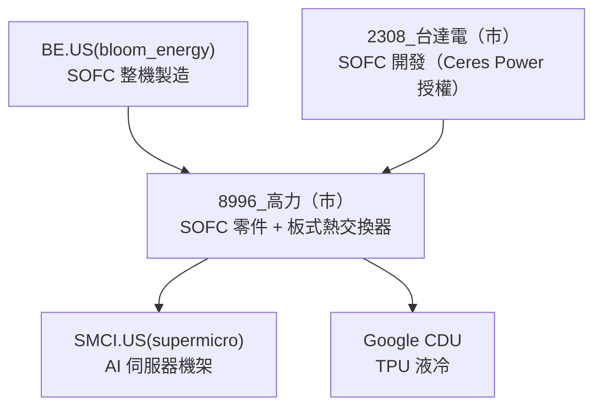

# 8996_高力（市）

## 基本資料

高力熱處理工業（8996 TT，Kaori）是台灣最純粹的 SOFC（固態氧化物燃料電池）零件供應商，同時生產板式熱交換器（Plate Heat Exchanger）用於 AI 伺服器 CDU 液冷散熱與 Bloom Energy（BE）燃料電池堆組。

成長驅動：
1. **SOFC 放量**：Bloom Energy 計畫上修 SOFC 出貨指引，Delta 台達電正啟動 SOFC 自研（Ceres Power 技術授權），2026-27 年將向高力採購 SOFC 零件，開啟全新 TAM。
2. **AI 伺服器 CDU**：AI 算力機架（如 xAI、SMCI）散熱需求強勁；高力板式熱交換器已切入 SMCI 供應鏈，並可能供貨 Google CDU，打入 ASIC/TPU 生態。
3. **伺服器機架熱管理**：xAI 上調 GB 算力部署預測至 30k（SMCI/Dell 各 14k/16k），高力被視為最大受益廠商。

May 2026 月營收為谷底，June 2026 預估跳升至 NT$1B。

資料來源：[[memo_AI半導體_top_picks_UMC_Kaori_ABF_Yageo_Delta_20260615]]（2026-06-15）、[[memo_AI半導體_top_picks_update_UMC_Kaori_ABF_20260615v2]]（2026-06-15）

## 核心技術／競爭優勢

- **SOFC 零件壟斷**：亞洲 SOFC 供應鏈中唯一（few）的純 SOFC 播放，Bloom Energy 主要 SOFC 板材或零件外包對象
- **板式熱交換器**：高精密板式熱交換器用於燃料電池堆與 AI CDU，客戶認證門檻高
- **Google CDU 切入**：平板式熱交換器供應 Google TPU CDU，開啟新 TAM（TAM 來自 xAI+SMCI 供應鏈 + Google TPU）
- **Delta SOFC 排他**：Delta 台達電 SOFC 將全數向高力採購（delta starts SOFC development via Ceres Power partnership, will give orders to Kaori）

## 產品與應用

| 產品 | 應用 | 相關客戶 / 下游 |
|------|------|-----------------|
| SOFC 零件（板材/模組） | 固態氧化物燃料電池堆 | [[BE.US(bloom_energy)]]、[[2308_台達電（市）]] |
| 板式熱交換器（CDU） | AI 伺服器機架液冷散熱 | SMCI.US(supermicro)、Google（Google_TPU（未）） |
| 高溫處理件 | 工業熱處理 | 傳統工業客戶 |

## 圖片 / 架構圖

高力 SOFC + 散熱供應鏈位置：BE 與 Delta 為 SOFC 下單主力，SMCI 與 Google CDU 為熱交換器應用端。

## EPS 預估

| 年度 | 買方研究員（報告日：2026-06-15） | 備註 |
|------|----------------------------------|------|
| 2026E | NT$33 | estimate |
| 2027E | NT$71 | estimate |
| 2028E | NT$127 | estimate |

## 目標價與評等

| 分析來源 | 報告日 | 評等 | 目標價 | 評價基礎 | 來源 |
|---------|--------|------|--------|----------|------|
| 買方研究員 | 2026-06-15 | Top Pick #2 | NT$2,800 | 40x 2027E EPS NT$71 | [[memo_AI半導體_top_picks_UMC_Kaori_ABF_Yageo_Delta_20260615]] |

## 時間軸

| 時間 | 事件 | 類型 | 重要性 | 備註 |
|------|------|------|--------|------|
| 2026-05 | 月營收觸底 | 營收 | ⭐⭐ | 谷底確認 |
| 2026-06 | 月營收跳升至 NT$1B | 放量 | ⭐⭐⭐ | 高力 AI 訂單拉貨 |
| 2026-06末 | BE 納入 Russell 1000 | 催化劑 | ⭐⭐ | 帶動高力等 BE 供應鏈 |
| 2026 下半 | BE 再度上調 SOFC 出貨指引 | 催化劑 | ⭐⭐⭐ | 擴大採購高力零件 |
| 2026-27 | Delta SOFC 訂單開始 | 放量 | ⭐⭐⭐ | Ceres Power 技術授權確立 → 高力全包 |

→ 跨公司比較詳見 [[供應鏈_AI伺服器散熱]]

## 供應鏈位置

- 上游材料：高溫合金板材（進口）
- 下游 SOFC：[[BE.US(bloom_energy)]]（直接 SOFC 客戶）、[[2308_台達電（市）]]（SOFC 新客戶）
- 下游 CDU：SMCI.US(supermicro)（AI 機架散熱）、Google TPU CDU
- 所屬供應鏈：[[供應鏈_AI伺服器散熱]]

## 相關公司

| 公司 | 關係 | 說明 |
|------|------|------|
| [[BE.US(bloom_energy)]] | 下游 / 客戶 | SOFC 零件主要採購方 |
| [[2308_台達電（市）]] | 下游（新） | SOFC 自研後將向高力採購，Ceres Power 合作確立 |
| SMCI.US(supermicro) | 下游 / 客戶 | AI 機架散熱板式熱交換器 |
| 3324_建準（市） | 同業 / 比較 | 同為 SMCI AI 散熱供應鏈（Auras） |

> [!warning] 風險與注意事項
> - **BE 出貨依賴**：Bloom Energy 佔高力 SOFC 業務比重高，若 BE 訂單縮減或延後，高力 SOFC 業務受衝擊
> - **AI 機架散熱競爭**：CDU 市場競爭者眾，高力在 AI CDU 的市占仍屬早期，具不確定性
> - **SOFC 技術轉換風險**：若 SOFC 被 PEMFC 或其他燃料電池技術取代，高力需重新定位
> - **上市別待查證**：8996 高力上市別（市/櫃）需查證；本頁暫以市（TWSE）記載

## 來源

- [[memo_AI半導體_top_picks_UMC_Kaori_ABF_Yageo_Delta_20260615]]（2026-06-15）
- [[memo_AI半導體_top_picks_update_UMC_Kaori_ABF_20260615v2]]（2026-06-15）
- [[memo_AI半導體_top_picks_UMC_ABF_MLCC_ASIC_20260601]]（2026-06-01）
