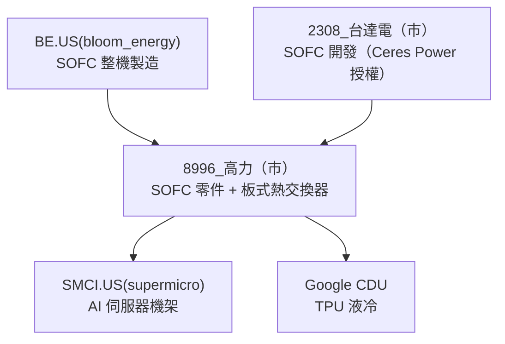

# 8996_高力（市）

## 基本資料

高力熱處理工業（8996 TT，Kaori）是台灣最純粹的 SOFC（固態氧化物燃料電池）零件供應商，同時生產板式熱交換器（Plate Heat Exchanger）用於 AI 伺服器 CDU 液冷散熱與 Bloom Energy（BE）燃料電池堆組。

成長驅動：
1. **SOFC 放量**：Bloom Energy 計畫上修 SOFC 出貨指引，Delta 台達電正啟動 SOFC 自研（Ceres Power 技術授權），2026-27 年將向高力採購 SOFC 零件，開啟全新 TAM。
2. **AI 伺服器 CDU**：AI 算力機架（如 xAI、SMCI）散熱需求強勁；高力板式熱交換器已切入 SMCI 供應鏈，並可能供貨 Google CDU，打入 ASIC/TPU 生態。
3. **伺服器機架熱管理**：xAI 上調 GB 算力部署預測至 30k（SMCI/Dell 各 14k/16k），高力被視為最大受益廠商。

May 2026 月營收為谷底，June 2026 預估跳升至 NT$1B。

資料來源：[[memo_AI半導體_top_picks_UMC_Kaori_ABF_Yageo_Delta_20260615]]（2026-06-15）、[[memo_AI半導體_top_picks_update_UMC_Kaori_ABF_20260615v2]]（2026-06-15）

## 核心技術／競爭優勢

- **真空焊接技術與產品品質**：SinoPac 2026-10-06 認為既有焊接製程能力支持燃料電池與液冷產品競爭力；屬券商 thesis，信心中。
- **SOFC 零件壟斷**：亞洲 SOFC 供應鏈中唯一（few）的純 SOFC 播放，Bloom Energy 主要 SOFC 板材或零件外包對象
- **板式熱交換器**：高精密板式熱交換器用於燃料電池堆與 AI CDU，客戶認證門檻高
- **Google CDU 切入**：平板式熱交換器供應 Google TPU CDU，開啟新 TAM（TAM 來自 xAI+SMCI 供應鏈 + Google TPU）
- **Delta SOFC 排他**：Delta 台達電 SOFC 將全數向高力採購（delta starts SOFC development via Ceres Power partnership, will give orders to Kaori）

## 產品與應用

| 產品 | 應用 | 相關客戶 / 下游 |
|------|------|-----------------|
| SOFC 零件（板材/模組） | 固態氧化物燃料電池堆 | [[BE.US(bloom_energy)]]、[[2308_台達電（市）]] |
| 板式熱交換器（CDU） | AI 伺服器機架液冷散熱 | SMCI.US(supermicro)、Google（Google_TPU（未）） |
| 高溫處理件 | 工業熱處理 | 傳統工業客戶 |

## 圖片 / 架構圖

![[報告_CLSA_SinoPac_高力_20261006_001.png]]

圖說：SinoPac 的預估修正與季度損益表顯示 2027／2028 EPS 上修至 48.35／79.21 元，2026 表內 EPS 為 21.02 元；封面卻列 21.47 元，保留來源內部差異。（CLSA 分發／SinoPac，2026-10-06；estimate、信心中。）

![[報告_CLSA_SinoPac_高力_20261006_002.png]]

圖說：SinoPac 模型將高力熱能產品營收由 2026E 的 120.73 億增至 2027E 的 254.39 億元，板式熱交換器由 23.17 億增至 47.15 億元；兩個產品分類不能分別直接視為純 SOFC 與純 AI 液冷營收。（2026-10-06；estimate、信心中。）

```mermaid
graph TD
    BE["BE.US(bloom_energy)<br/>SOFC 整機製造"]
    Delta["2308_台達電（市）<br/>SOFC 開發（Ceres Power 授權）"]
    Kaori["8996_高力（市）<br/>SOFC 零件 + 板式熱交換器"]
    SMCI["SMCI.US(supermicro)<br/>AI 伺服器機架"]
    Google["Google CDU<br/>TPU 液冷"]
    
    BE --> Kaori
    Delta --> Kaori
    Kaori --> SMCI
    Kaori --> Google
```

高力 SOFC + 散熱供應鏈位置：BE 與 Delta 為 SOFC 下單主力，SMCI 與 Google CDU 為熱交換器應用端。

## EPS 預估

| 年度 | 買方研究員（報告日：2026-06-15） | SinoPac／CLSA 分發（報告日：2026-10-06） | 備註 |
|------|----------------------------------|---------------------------------------|------|
| 2026E | NT$33 | NT$21.47（封面）／21.02（p3 表格） | 來源內部差異；estimate、信心中 |
| 2027E | NT$71 | NT$48.35 | SinoPac 原 NT$42.23，上修約 14%；estimate、中 |
| 2028E | NT$127 | NT$79.21 | SinoPac 原 NT$70.60，上修約 12%；estimate、中 |

> [!warning] 資訊衝突：2026 EPS 與估值算式
> [[報告_CLSA_SinoPac_高力_20261006]]（2026-10-06）封面列 2026SP EPS 21.47，p3 的 Figure 1／2 列 21.02，p6 四捨五入列 21.5，不能自行指定唯一值。p4 列目標價 NT$2,710、40x 與滾動 EPS 67.1，乘積為 2,684，也與目標價有小幅差異。原始數字並列，待來源釐清；既有買方 memo 的 EPS 為另一套模型，不能當成此次券商上修基準。

## 目標價與評等

| 分析來源 | 報告日 | 評等 | 目標價 | 評價基礎 | 來源 |
|---------|--------|------|--------|----------|------|
| SinoPac（CLSA 分發） | 2026-10-06 | High Conviction Outperform（重申） | NT$2,710（原 NT$2,300） | 40x 2H27–1H28SP P/E；estimate、中；算式差異見上 | [[報告_CLSA_SinoPac_高力_20261006]] |
| 買方研究員 | 2026-06-15 | Top Pick #2 | NT$2,800 | 40x 2027E EPS NT$71 | [[memo_AI半導體_top_picks_UMC_Kaori_ABF_Yageo_Delta_20260615]] |

## 時間軸

| 時間 | 事件 | 類型 | 重要性 | 備註 |
|------|------|------|--------|------|
| 2026Q4 起 | CSP CDU 板式熱交換器與半導體設備液冷有望新增貢獻（預估） | 放量 | ⭐⭐⭐ | SinoPac 2026-10-06 thesis、中；未提供具名新客戶或正式訂單 |
| 2027 年底 | 產能擴至報告當時規模的 6–7 倍（預估） | 擴產 | ⭐⭐⭐ | SinoPac 2026-10-06 estimate、中；未交代產品口徑、絕對量與各期投產日 |
| 2026→2028 | Bloom 供應鏈出貨支持 2／4／6GW 情境（預估） | 需求情境 | ⭐⭐⭐ | SinoPac estimate、中；不同於 Bloom 長期 10GW 潛在名目產能 |
| 2026-05 | 月營收觸底 | 營收 | ⭐⭐ | 谷底確認 |
| 2026-06 | 月營收跳升至 NT$1B | 放量 | ⭐⭐⭐ | 高力 AI 訂單拉貨 |
| 2026-06末 | BE 納入 Russell 1000 | 催化劑 | ⭐⭐ | 帶動高力等 BE 供應鏈 |
| 2026 下半 | BE 再度上調 SOFC 出貨指引 | 催化劑 | ⭐⭐⭐ | 擴大採購高力零件 |
| 2026-27 | Delta SOFC 訂單開始 | 放量 | ⭐⭐⭐ | Ceres Power 技術授權確立 → 高力全包 |

→ 跨公司比較詳見 [[供應鏈_AI伺服器散熱]]；節點追蹤見 [[時程_2026-2028十月券商催化劑]]。

## 供應鏈位置

- 上游材料：高溫合金板材（進口）
- 下游 SOFC：[[BE.US(bloom_energy)]]（直接 SOFC 客戶）、[[2308_台達電（市）]]（SOFC 新客戶）
- 下游 CDU：SMCI.US(supermicro)（AI 機架散熱）、Google TPU CDU
- 所屬供應鏈：[[供應鏈_AI伺服器散熱]]

## 相關公司

| 公司 | 關係 | 說明 |
|------|------|------|
| [[BE.US(bloom_energy)]] | 下游 / 客戶 | SOFC 零件主要採購方 |
| [[2308_台達電（市）]] | 下游（新） | SOFC 自研後將向高力採購，Ceres Power 合作確立 |
| [[SMCI.US(supermicro)]] | 下游 / 客戶 | AI 機架散熱；SinoPac 2026-10-06 以 Supermicro 相關液冷為主要成長動能，thesis／中 |
| 3324_建準（市） | 同業 / 比較 | 同為 SMCI AI 散熱供應鏈（Auras） |

> [!warning] 風險與注意事項
> - **BE 出貨依賴**：Bloom Energy 佔高力 SOFC 業務比重高，若 BE 訂單縮減或延後，高力 SOFC 業務受衝擊
> - **AI 機架散熱競爭**：CDU 市場競爭者眾，高力在 AI CDU 的市占仍屬早期，具不確定性
> - **SOFC 技術轉換風險**：若 SOFC 被 PEMFC 或其他燃料電池技術取代，高力需重新定位
> - **上市別待查證**：8996 高力上市別（市/櫃）需查證；本頁暫以市（TWSE）記載

## 來源

- [[報告_CLSA_SinoPac_高力_20261006]]（2026-10-06；SinoPac 研究、CLSA 分發；SOFC／液冷與擴產情境、EPS／目標價上修）
- [[memo_AI半導體_top_picks_UMC_Kaori_ABF_Yageo_Delta_20260615]]（2026-06-15）
- [[memo_AI半導體_top_picks_update_UMC_Kaori_ABF_20260615v2]]（2026-06-15）
- [[memo_AI半導體_top_picks_UMC_ABF_MLCC_ASIC_20260601]]（2026-06-01）

## 近期營運與研究更新

### 2026-10-06 SinoPac：SOFC 與液冷雙成長

- **來源身分：** 此 PDF 由 SinoPac 分析師撰寫，依合作協議由 CLSA 分發；財務表標為 SinoPac，不能當成兩家獨立研究的交叉確認。
- **Bloom 需求情境（estimate／thesis，中）：** 報告轉述 Bloom 擬收購 Fremont 15.8 萬平方英尺設施，券商認為可支持長期電堆名目產能由 5GW 增至 10GW；模型估供應鏈支持 2026／2027／2028 出貨 2／4／6GW。10GW 並非已開出產能，也沒有確定達成日。
- **高力擴產與成長（estimate，中）：** 估高力 2027 年底產能為報告當時的 6–7 倍，對 Bloom 銷售 2027／2028 年增 185%／66%（原 101%／77%）。需驗證新廠、設備、認證與實際利用率，不能只由客戶長期規劃推算收入。
- **液冷（estimate／thesis，中）：** 券商以 Rubin manifold 內容值提高、CDU 與 RDHx 出貨作為成長來源，估 2027／2028 液冷營收年增 60%／25%；CSP CDU 與半導體設備液冷可能從 4Q26 增添貢獻。報告亦以 SpaceX 2027 年新增 6–8GW 資料中心規劃作為 Supermicro／Dell 需求情境，非本次已確認高力對 Dell 直接供貨。
- **財務（estimate，中）：** 2026／2027／2028 營收估 143.90／301.54／469.12 億元；2026 資本支出估 36.17 億、自由現金流 −12.25 億，擴產期間資金需求需與營收成長一併追蹤。
- **風險：** 燃料電池競爭／替代技術、AI 資料中心專案啟動延後、液冷採用不如預期，以及歐美熱泵補助進度。既有頁面關於 Google CDU、台達 SOFC 排他採購的說法來自早期 memo，此份報告未重新確認，不能因本次入庫升格為已證實供應關係。

來源：[[報告_CLSA_SinoPac_高力_20261006]]（2026-10-06）。
