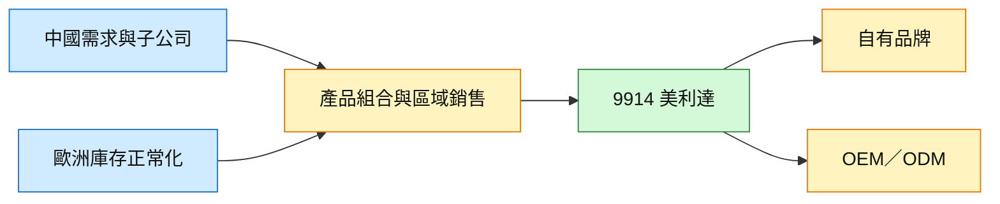

# 9914_美利達（市）

## 基本資料

美利達（9914.TW，Merida）為台灣自行車製造商，產品涵蓋一般自行車、電動自行車與 OEM/ODM 服務，主要市場包括中國、歐洲、台灣與美國。2026 年核心業務受中國需求回溫、歐洲庫存正常化與產品組合改善支撐，但 OEM 與電動自行車出貨仍在調整。

## 核心技術／競爭優勢

- **品牌與通路**：自有品牌搭配區域子公司與經銷通路，能以產品組合管理 ASP 與庫存。
- **跨區製造與銷售**：中國與台灣據點可配合不同市場需求；Citi 2026-08-14 指出中國 1H26 銷量年增 13%。
- **產品組合調整**：入門車款支撐中國需求，高階與新產品上市則是歐洲及電動自行車回復的觀察點。

## 產品與應用

| 產品／服務 | 應用 | 相關市場 |
|---|---|---|
| 傳統自行車 | 通勤、休閒、運動 | 中國、歐洲、台灣 |
| 電動自行車 | 城市移動、運動 | 歐洲、美國 |
| OEM／ODM | 品牌客戶代工 | 全球自行車市場 |

## 圖片 / 架構圖

圖說：美利達的短期復甦取決於中國與歐洲區域需求改善能否轉化為較健康的產品組合與品牌／OEM 銷售。

## EPS 預估

| 年度 | Citi EPS／方向（報告日：2026-08-14） | 備註 |
|---|---|---|
| 2026E | 上修 3–5% | 集團銷售仍預估年減低雙位數 |
| 2027E | 上修 3–5% | SBC 獲利改善為重要假設 |
| 2028E | 上修 3–5% | 仍需觀察電動車與 OEM 復甦 |

## 目標價與評等

| 券商 | 報告日 | 評等 | 目標價 | 評價基礎 | 來源 |
|---|---|---|---|---|---|
| Citi | 2026-08-14 | Neutral | NT$93 | 15.5x NTM P/E | [[報告_Citi_美利達_20260814]] |

## 時間軸

| 時間 | 事件 | 類型 | 重要性 | 備註 |
|---|---|---|---|---|
| 2026 | 中國出貨目標 70 萬台 | 出貨 | ⭐⭐ | Citi 引述公司展望，2025 年為 63 萬台 |
| 2026 | 台灣踏板車出貨目標 16 萬台 | 出貨 | ⭐⭐ | 公司展望；電動自行車則預估降至 12 萬台 |
| 2026H2 | 新產品上市與 SBC 獲利驗證 | 驗證 | ⭐⭐ | 復甦能否延續的關鍵 |

跨公司催化劑對照：[[時程_2026記憶體與AI催化劑]]。

## 供應鏈位置

- 上游：車架、變速器、電池與馬達等自行車零組件供應商。
- 下游：品牌通路、經銷商與 OEM 客戶；中國與歐洲為本批報告的主要觀察市場。

## 相關公司

目前本批來源未明確揭露需建立 wikilink 的上下游上市公司，維持 `related_companies: []`。

> [!warning] 風險與注意事項
> - 電動自行車與 OEM 出貨仍在調整，2026 年集團銷售可能年減低雙位數。
> - SBC 獲利能見度低，美國營運虧損與稅負可能抵銷本業改善。

## 來源

- [[報告_Citi_美利達_20260814]] — Citi Research，2026-08-14。
