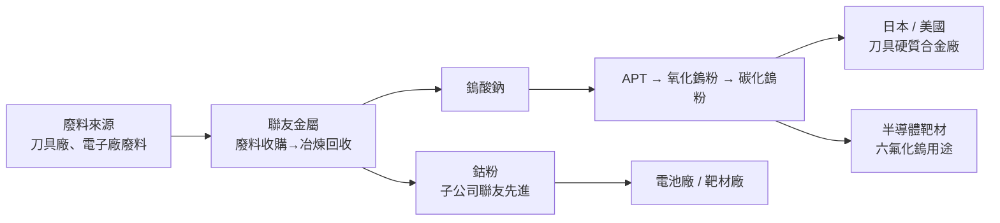

# 聯友金屬-創（興）

> [!warning] 股票代號待驗證
> 聯友金屬目前掛牌興櫃，代號未確認，ticker 欄位留空。請查詢興櫃市場確認正式代號後更新檔名、title、H1、ticker 欄位。

## 基本資料

聯友金屬（興櫃，代號待驗證）為台灣鎢、鈷回收冶煉公司，核心業務為廢料收購→冶煉→高純度金屬粉末生產，走循環回收路線。公司在屏東、屏南及屏科園區建有廠房，已完成中石化及中鋼子公司的收購與交割，強化原料供應垂直整合。

**主要產品**：
- **鎢系列**：鎢酸鈉（初級品）→ 仲鎢酸銨（APT）→ 氧化鎢粉 → 碳化鎢粉（最終下游）
- **鈷系列**：初製碳酸鈷、初製硫酸鈷 → 氯化鈷 → 鈷粉（高附加值）
- **副產品**：鉭、鈮、銀等（成本接近零）
- 無銅合金（研發中，量產尚未開始）

**核心競爭標語**：目前全球唯一能同時單獨回收鎢和鈷並生產成品的廠商（公司自稱）。

**子公司**：聯友先進（鈷生產），公司宣稱全球第四大鈷生產商（前三名：南京韓瑞、湖北格林美、比利時 Umicore）。

**轉型路線**：從製造業逐漸轉型為 B4B 循環回收服務業，自有銷售比例從 2020 年約 7% 提升至 2026 年約 48–50%（以出貨量計）。

**認證**：已取得 UL、RMI、BS 認證，完成碳足跡驗證（無酸鈉產品碳排放較原礦生產少 60%）。

*來源：法說 2026-05-28 + 法說 2026-06-23（AlphaMemo.ai，兩場次資訊合併整理）。*

---

## 核心技術／競爭優勢

- **全球最大廢料買家地位**：公司主動從市場購入廢料（原料採購自主決定），在中國限制鎢出口環境下，廢料回收是目前全球鎢供給缺口（8,000–10,000 噸/年）的最佳補充方式；全球唯一能同時處理鎢鈷回收的廠商
- **中國出口管制直接受益**：中國自 2025 年 2 月起限制鎢出口，2026 年 4 月起嚴格執行；日本今年 Q1 僅進口 11 噸（去年同期 1,400+ 噸），缺口極大；聯友在中國以外市場成為稀缺供應商
- **廠區垂直整合**：屏東、屏南、屏科園區三廠布局，加上中石化與中鋼子公司收購，形成從廢料收購到高純度粉末的一體化垂直整合製造能力
- **ESG 與碳足跡認證**：無酸鈉產品碳排放較原礦少 60%，歐盟 CBAM 碳邊境稅（2027 年正式施行）與美國 NDAA 國防採購法規（禁用中俄原料，2026 年 12 月 31 日起）均將對未認證廠商構成壁壘，聯友已提前佈局

---

## 產品與應用

| 產品 / 服務 | 應用 | 相關客戶 / 下游 |
|-------------|------|-----------------|
| 碳化鎢粉 | 工具刀具、硬質合金、切削工具 | 日本、美國刀具廠；富士金工 |
| 氧化鎢粉 / APT | 鎢合金材料中間品 | 冶金廠、半導體靶材廠 |
| 鎢酸鈉 | 初級鎢原料 | 冶煉廠 |
| 鈷粉（高純度，認證中） | 半導體製程、鈷靶材、電池材料 | 台積電生態（六氟化鎢用途）、電池廠 |
| 硫酸鈷 / 氯化鈷 | 電池正極材料前驅體 | 電池廠、材料廠 |

---

## 圖片 / 架構圖

> 聯友金屬以廢料回收→高值化金屬粉末路線，切入受地緣政治保護的關鍵原料供應缺口。

---

## EPS 記錄

*目前無法說中明確揭露季度 EPS 數字，毛利率資訊亦未直接揭露，待年報確認。*

| 項目 | 說明 |
|------|------|
| 自有銷售比例 | 2020年 7% → 2026年 48–50%（以出貨量計） |
| 毛利管理 | 移動平均線管理庫存，不追求極高毛利，注重風險控制 |
| 自有加工 vs 代工 | 獲利差距約 60 倍 |

---

## 時間軸（催化劑）

| 時間 | 事件 | 類型 | 重要性 | 備註 |
|------|------|------|--------|------|
| 2025-02 | 中國限制鎢出口（嚴格執行從 2026-04） | 外部催化 | ⭐⭐⭐ | 日本 Q1 進口量從 1,400 噸跌至 11 噸 |
| 2026-07-15 | 鈷粉認證正式啟動 | 新產品 | ⭐⭐⭐ | 認證完成後開放量產 |
| 2026-12-31 | 美國 NDAA 禁用中俄鎢原料實施 | 法規利多 | ⭐⭐⭐ | 推動美日客戶轉向聯友 |
| 2027Q3/Q4 | 屏南廠擴廠完成，產能 +100% | 產能 | ⭐⭐⭐ | 毛利率同步大幅提升（高值化產品） |
| 2027-01 | 歐盟 CBAM 碳邊境稅執行（待觀察） | 法規 | ⭐⭐ | 無認證廠商面臨稅負，聯友已認證 |
| 持續 | 富士金工（日本大廠）減產 30% | 同業 | ⭐⭐ | 對中國以外供應商是大利多，聯友訂單正面受益 |

---

## 供應鏈位置

- 上游：各類工業廢料來源（刀具廠、電子廠、礦產廠），中石化、中鋼子公司（已收購）
- 下游：日本/美國刀具硬質合金廠、半導體材料廠（六氟化鎢→台積電製程）、電池廠（鈷）
- 無直接對應的現有供應鏈頁；最接近 [[供應鏈_被動元件]] 或半導體材料段，但無精確對應頁
- # 無對應供應鏈頁（關鍵礦材回收為獨立利基，暫無對應 lib/3.supply_chain 頁面）

---

## 相關公司

| 公司 | 關係 | 說明 |
|------|------|------|
| 聯友先進（未上市子公司） | 子公司 | 全球第四大鈷生產商（公司宣稱） |
| 中石化 / 中鋼子公司 | 收購對象 | 已完成收購交割，強化廢料原料供應 |
| 格林美（中國） | 同業 / 競爭 | 全球最大回收廠，但業務多元；聯友專注鎢鈷利基 |
| 富士金工（日本） | 下游客戶 / 間接受益 | 富士金工減產 30%，市場缺口對聯友正面 |
| Umicore（比利時） | 同業 | 全球鈷回收業者前三名 |

---

> [!warning] 風險與注意事項
> - **中國出口政策反轉風險**：若中美貿易談判達成協議（如 2026-05 美中會面），鎢出口管制放寬，全球缺口縮小，聯友訂單與定價優勢將大幅下降
> - **產品認證週期長、客戶開發不確定**：鈷粉、高純度鎢粉進入半導體供應鏈認證週期通常 1–2 年以上，客戶導入時程存在不確定性
> - **興櫃流動性風險**：興櫃市場交易量與流動性遠低於上市/上櫃，大額持有者退出難度高；轉板時程未確認
> - **原料採購成本波動**：廢料收購價格隨國際鎢鈷價格波動，若鎢價中國端大幅下跌（如已跌 60% 後反彈），廢料成本跟漲但客戶售價談判存在時間差，影響短期毛利

---

## 來源

- [[活動_聯友金屬-創法說_20260528]]
- [[活動_聯友金屬-創法說_20260623]]
