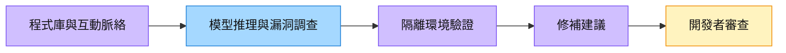

# OpenAI（未）

## 基本資料

OpenAI 為美國 AI 模型公司，開發並運營 ChatGPT、GPT-4o、o3 等大型語言模型，為全球最大 AI 模型消費方之一，也是 AI 算力基礎設施的主要採購驅動力。

- **主要產品**：GPT-4o、o3（reasoning）、DALL-E、Sora
- **算力採購**：Stargate 計畫（與 Microsoft、SoftBank）；向 Cerebras 採購推理算力
- **供應鏈地位**：AI 推理算力需求方，驅動 NVIDIA GPU、Cerebras WSE 等需求
- **資料來源**：報告_MS_Cerebras_CBRS_初始覆蓋_20260608（2026-06-08）；公開揭露

## Codex Security 的資安工作流（2026-09-29 券商轉述）

[[報告_EvercoreISI_OpenAIDevDay資安影響_20260929]]（Evercore ISI，2026-09-29）稱 Dev Day 介紹 Codex Security 的跨程式庫推理、漏洞調查、隔離環境驗證、開發者審查修補建議與排程掃描。它比較 LLM 對程式互動與上下文的推理，與傳統以已知特徵／規則掃描的差異。此為報告轉述／fact／中信心，未另作產品實測。

Evercore 認為近期直接競爭壓力集中在漏洞／安全態勢管理、程式碼安全與攻擊路徑分析；runtime 的遙測、偵測、政策執行與深度部署仍重要（thesis／中信心）。這不構成新具名客戶、收入或與 runtime 廠商的合作關係揭露。詳見 [[分析_DevSecOps_AI安全衝擊]]。

## 圖片 / 架構圖

圖說：依 Evercore ISI（2026-09-29）文字描述整理的 Codex Security 工作流；本份無產品架構來源圖，使用概念圖補位。修補建議仍由開發者審查，不解讀為可完全自主替代生產環境防護。

## 關鍵算力合約

| 供應商 | 合約規模 | 類型 | 說明 |
|--------|----------|------|------|
| [[CBRS.US(cerebras)]] | 750MW，~$30B | take-or-pay（3 期） | 低延遲推理容量；最長延至 5 年；+1.25GW 選擇權 |
| [[NVDA.US(nvidia)]] | 大規模 GPU 採購 | 硬體 | 訓練與主流推理基礎 |

## 相關公司

| 公司 | 關係 | 說明 |
|------|------|------|
| [[CBRS.US(cerebras)]] | 主要算力供應商 | 750MW take-or-pay 推理算力合約 |
| [[NVDA.US(nvidia)]] | GPU 供應商 | 訓練叢集主力 |

> [!warning] 風險與注意事項
> - 未上市，財務資訊不完整；客戶資訊來自供應商揭露
> - Stargate 計畫執行延遲風險；資本配置可能調整供應商組合

## 來源

- [[報告_EvercoreISI_OpenAIDevDay資安影響_20260929]] — Evercore ISI，2026-09-29。

- 報告_MS_Cerebras_CBRS_初始覆蓋_20260608（2026-06-08）

- [[AI_Coding_Agent_Buyi_856492_ndx]]（2026-09-02）
- [[AI_Vendor_Race_Cons_854892_ndx]]（2026-05-27）
- [[Avoid_AI_Budget_Blow_846413_ndx]]（2026-05-15）
- [[CEREBRAS_20260608_0419]]（2026-06-08）
- [[Market_Share_Analysi_854123_ndx]]（2026-05-20）
- [[Nvidia in Talks to Back OpenAI Lease of $500 Billion]]（2026-07-28）
- [[報告_Daiwa_MiniMax啟動覆蓋_20260811]]（2026-08-11）
- [[報告_Daiwa_中國基礎模型產業啟動覆蓋_20260811]]（2026-08-11）
- [[報告_JPM_GLM5.3與DeepSeek重新定價_20260816]]（2026-08-16）
- [[報告_Jefferies_中國AI_Token支出與模型效率_20260810]]（2026-08-10）

## 相關頁面

- [[0100.HK(minimax)]]
- [[2513.HK(z.ai)]]
- [[分析_中國基礎模型_Token經濟與算力瓶頸_20260905]]
- [[技術_大模型推理經濟學]]
- [[分析_Anthropic與OpenAI_PreIPO_TokenEconomics算力ASIC估值]]
- [[分析_生成式AI商業化與TokenFinOps_20260906]]
- [[分析_Gartner生成式AI模型市場與Token效率_20260906]]
- [[AI_Vendor_Race_Cons_854892_ndx]]
- [[AI_Coding_Agent_Buyi_856492_ndx]]
- [[Avoid_AI_Budget_Blow_846413_ndx]]
- [[NBIS.US(nebius)]]
