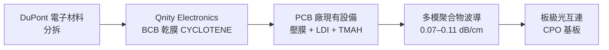

# Qnity Electronics（未）

## 基本資料

Qnity Electronics 是 **DuPont 電子材料事業分拆**成立的獨立公司，主要產品是 BCB（苯並環丁烯，benzocyclobutene）乾膜聚合物波導材料，品牌名 **CYCLOTENE**。核心戰場是「低成本、PCB 製程相容、短距板級光互連」，而非衝最高速率或最長距離。

ECTC 2026 發表 BCB 乾膜多模聚合物波導研究（Ross Johnson et al.），展示在 PCB 廠現有設備上做出 0.07–0.11 dB/cm 的低損耗波導，並通過回流焊與高溫高濕可靠度測試。

資料來源：[[research_simpletechtrend_CPO矽光子ECTC2026_20260629]]（2026-06-29）

## 核心技術／競爭優勢

### BCB 乾膜多模聚合物波導（ECTC 2026）

| 參數 | 值 |
|------|----|
| 傳播損耗（玻璃基板）| **0.07 dB/cm** |
| 傳播損耗（PCB 基板）| **0.11 dB/cm** |
| 製程相容性 | PCB 廠標準壓膜 + LDI 曝光 + TMAH 顯影 |
| 回流焊可靠度 | 10/20 次無顯著變化 |
| 85°C/85%RH 1000 h | 損耗只增 ~0.02 dB/cm |
| 彎曲 S-bend R=5mm | 透射降至 ~46%（限制佈線密度）|

**Supermode 串擾警示**：250 µm 間距下仍有 ~1% 功率耦合（15 對 supermode）——BCB 乾膜路線適合中速、短距、佈線寬裕的場景，非衝最高密度。

### 商業定位

- **優勢**：PCB 廠現有設備就能做，導入門檻極低
- **適合場景**：低成本短距板級、CPO 基板內波導、PCB 光互連
- **對比**：對上 DNP 壓印（更高密度）、慶應大學 Mosquito（更低損耗），Qnity 走工程可行性路線

## 圖片 / 架構圖

`[待補來源圖]` 需官方技術白皮書或展覽實拍 BCB 乾膜或聚合物波導元件佐證；上方為自製供應鏈示意圖。
## 相關技術

- [[技術_聚合物波導]]（BCB 乾膜路線詳細分析）
- [[技術_CPO]]（板級光互連應用）

## 來源

- [[research_simpletechtrend_CPO矽光子ECTC2026_20260629]]（Ross Johnson et al., ECTC 2026，2026-06-29）
