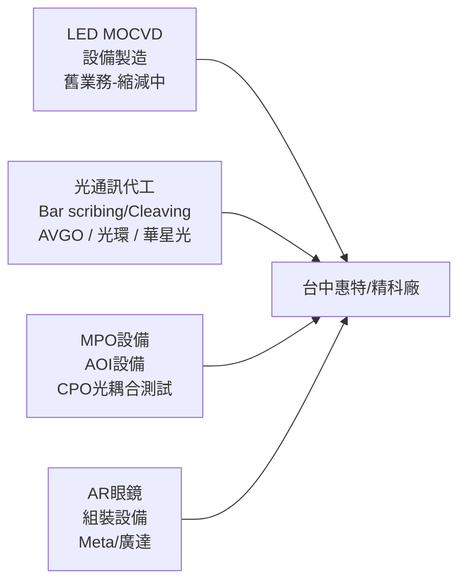

> [!warning] Ticker 待確認
> 惠特為 TW 上市/興櫃公司，但目前尚未確認正確股票代號。確認後請更新 ticker 欄位、更名為 `{代號}_惠特（市/興/櫃）` 並移至 `lib/1.company/TW/`。

# 惠特（TW-ticker待確認）

## 基本資料

惠特（ticker 待確認）是台灣光電測試設備與代工廠，台中雙廠（總部+精科廠），主要業務：
1. **LED/MOCVD 設備製造**（歷史核心，現逐步縮減）：曾為三安光電等中國 LED 廠供應設備，遭遇 15 億款項糾紛（仲裁中）
2. **光通訊晶片代工**（成長業務）：對 EML/CW/PD 等光通訊雷射晶片進行 bar scribing（畫線）、cleaving（劈裂）代工服務，主要客戶 AVGO（博通）
3. **光通訊測試設備**：MPO 設備（200–500 萬/台），AOI 設備，CPO 相關光耦合測試
4. **AR 眼鏡組裝設備**：為 Meta/廣達供應 AR 眼鏡組裝自動化設備（200–1,500 萬/站，3–12 站/套）

**精科廠**：台中代工廠，面積 <2,000 坪，原為 LED 設備場地，逐步清空轉型光通訊代工。

資料來源：[[活動_惠特私訪_20260701]]（私訪，2026-07-01）

## 核心技術／競爭優勢

- **Bar scribing & cleaving 高良率**：公司負責段良率 99.3%（客戶來料 Wafer 整體良率約 50%），AVGO 依出貨量收費
- **自製機台能力**：單台設備組裝期 2–3 週；240 台設備自製計畫（3.75 億 capex），生產效率優化後成本降至 3 億即達 8KK 月產能
- **MPO 設備需求最明確**：CPO 前端矽光子需 MPO 多纖維連接，複雜度高（一對多），MPO 設備比 AOI 更強勁，預計率先進大量量產
- **AR 眼鏡設備高毛利**：客製化程度極高，GM 4–8 成，相較 LED 設備（GM 3 成）大幅提升

## 客戶進度（截至 2026-07-01）

| 客戶 | 業務類型 | 狀態 | Forecast |
|------|----------|------|----------|
| 博通（AVGO） | 光通訊代工（EML/CW 晶片）| 量測試批，約 1KK+/月（受限基板） | 3Q26 達 3KK/月 |
| 光環 | 光通訊代工 | 6月約 1.2KK，下半年上修 | 年底上看 7–8KK/月，月營收 7,000–8,000 萬 |
| 華星光 | 代工（從設備轉） | 最快 Q3 進入 | — |
| 環宇 | 代工（CW→PD 轉向） | 可能 Q4 | forecast > 博通，< 光環 |
| Coherent | 代工（洽談中） | 送測樣本 | — |
| Lumentum | 代工（洽談中） | 送測樣本 | — |
| Meta（AR眼鏡） | 組裝設備（透過廣達） | 進行中 | — |

## 財務概況（截至 2026-07-01）

| 指標 | 數值 | 備註 |
|------|------|------|
| 合約負債 | 6.25 億 | 超過 3 億來自三安訂金 |
| 三安應收款 | 15 億 | 仲裁中，地方法院已扣款 |
| Q1 營收結構 | 代工 65% / 設備 35% | — |
| 設備 GM | 40%+ | LED 設備 GM 已降，光通設備 GM 40–80% |
| 代工 GM（Q1） | 9–13%（LED 主導） | LED 折舊提列完，後續改善 |
| 月度損益兩平 | 月營收 1 億 | Q3 2026 目標達標 |
| 月產能（2026年底目標） | 11–12KK | 從現在 8KK 擴至 |

## 產能擴張計畫

- 2025 年底通過 3.75 億 capex（240 台自製設備），原規劃月產能 6KK
- 效率優化後：投入 3 億即達 8KK，Q3 2026 起顯現折舊（5 年攤提）
- 年底目標：11–12KK/月（視 Q3 投片結果決定是否加速擴）
- 精科廠 <2,000 坪為瓶頸，逐步清空二樓 LED 設備擴大光通空間

## 圖片 / 架構圖

## 風險與注意事項

> [!warning]
> - **三安光電應收款 15 億風險**：仲裁結果不確定，若無法收回則有大額呆帳壓力
> - **基板供應瓶頸**：AVGO 訂單進展受限於基板不足，1KK/月遠低於預期 2KK/月
> - **缺工問題**：台中精科廠嚴重缺工，外包商 鴻勁 人數比惠特兩廠還多，影響產能爬坡速度
> - **設備驗收延遲**：R&D 設備規格頻繁變更，去年已出貨設備至今未驗收，認列時間不確定

## 時間軸

| 時間 | 事件 | 類型 | 備註 |
|------|------|------|------|
| 2026 Q3 | 月損益兩平目標（月收 1 億） | 財務里程碑 | 代工放量 + 設備訂單進帳 |
| 2026 Q3 | 華星光代工進入 | 客戶 | — |
| 2026 Q4 | 環宇 PD 測試代工 | 客戶 | — |
| 2026 年底 | 月產能擴至 11–12KK | 產能 | — |
| 近期 | 三安仲裁判決確定 | 財務 | EPS 回沖 5–6 元（若勝訴） |

## 供應鏈位置

- 所屬供應鏈：→ [[供應鏈_CPO]]（光通訊晶片代工 + MPO 設備環節）
- 上游客戶來料：AVGO 送 EML/CW Wafer（已切條 Bar）
- 下游出海口：馬來西亞封裝廠（AVGO 完成後送馬封）

## 相關公司

| 公司 | 關係 | 說明 |
|------|------|------|
| [[AVGO.US(broadcom)]] | 最大代工客戶 | 光通訊晶片 bar scribing/cleaving |
| 光環（TW，待建頁） | 代工客戶 | 光環 forecast 年底 7–8KK/月，月收貢獻 7,000–8,000 萬 |

## 來源

- [[活動_惠特私訪_20260701]]（私訪，2026-07-01）
